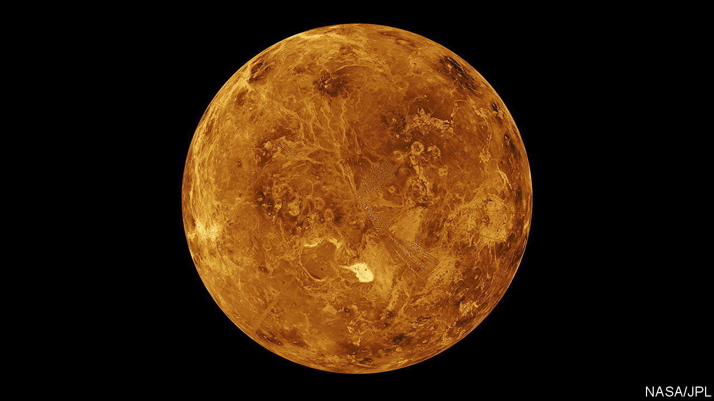

###### Venus’s LIPs

# Unlucky LIPs may explain Venus’s hostile environment 

##### Huge volcanoes may have wrecked the Venusian climate—and may yet do the same to Earth’s 

 

> Oct 19th 2022 

Venus and Earth are of almost equal size and grew from the same mixture of raw materials, yet while Earth has been wet and temperate for most of the 4.5bn years it has existed, Venus is a bone-dry 450°C pressure cooker.

This has only a little to do with Venus being closer to the Sun. Though it receives about twice as much sunshine as Earth, its slow rotation (from sunrise to sunrise its days last for 117 terrestrial ones) means that if Venus magically got as wet as Earth, those long, hot days would let thick cloud cover form. This would shield its surface, making it not much warmer than Earth is. Its oceans would not boil away. 

Yet the evidence suggests they have. There are, for example, traces of erosion by water on some of the planet’s older features. And the Venusian atmosphere is ridiculously rich in deuterium, a heavy isotope of hydrogen. This is thought to have come from a vanished ocean tens or hundreds of metres deep, the water of which evaporated. Molecules of the resulting vapour were then broken up by sunlight and the normal hydrogen in them escaped into space, leaving its heavier cousin behind. 

Based on this idea, Michael Way of NASA calculated in 2016 that Venus could once have had a stable, temperate climate. Something bad must have happened to bring it to its present sorry state. And if Richard Ernst, of Carleton University in Ottawa, Canada, is correct, that bad thing might one day happen to Earth, as well.

Dr Ernst outlined his theory of what occurred—which he developed jointly with Dr Way and Jeffrey Scargle, also of NASA—at a recent meeting in Denver of the Geological Society of America. It depends on the fact that, from time to time, Earth experiences huge volcanic eruptions which form basalt-covered areas called large igneous provinces (LIPs). These eruptions also burp vast amounts of CO into the atmosphere. 

One of the biggest of them, 252m years ago, caused the greatest mass extinction of animal life on Earth. Another, 66m years ago, probably helped do for most of the dinosaurs (though Earth’s collision at this time with a large space rock is reckoned to have delivered the ). But smaller LIP-forming eruptions also upset Earth’s equilibrium. The greenhouse effect caused by the COreleased can increase the planet’s temperature by 10-15°C.

In the long term, that is a blip. But Drs Ernst, Way and Scargle wondered what would happen if two or more LIP-forming events occurred simultaneously. 

By itself, a double LIP would serve only to make things hotter than a single one, before they then returned to normal. A triple LIP, however, or even a double one that occurred during a period with an already-hot climate, would raise the temperature past a tipping point. All surface water would evaporate—and water vapour is, itself, a greenhouse gas, so this would raise the temperature even further. 

With no rain, no rivers and no oceans, there would be no erosion of rocks—a process that allows them to react with and sequester atmospheric CO. Plate tectonics would also grind to a halt, for it depends on the rocks of the ocean floor being waterlogged, and therefore heavy enough to sink into the underlying mantle. This buries carbon fixed in those rocks for aeons. If that no longer happened Earth, like Venus, would remain hot and dry indefinitely.

But could such a coincidence realistically occur? The trio think so. The hundreds of LIPs found on Earth formed over a period of about 2.8bn years. Those numbers are large enough for them to have carried out a statistical analysis.

First, they established that LIP-formation occurs at random. There is thus no reason why two or more events should not happen simultaneously. Given their average frequency—once every 15m years—the chances that, were history rerun, multiple simultaneous LIPs would have wrecked Earth’s climate look to be about one in five.

Earth, then, has been lucky—and Venus perhaps unlucky. There are features on Venus which look like LIPs, but extensive volcanism about 700m years ago has made the planet’s earlier history hard to read. That volcanism may, on the other hand, be a sign of the multiple LIPs that the trio reckon should be there.

For proof of their theory, Dr Ernst pins his hope on three probes which should visit Venus in the 2030s—EnVision, to be launched by the European Space Agency, and NASA’s DAVINCI and VERITAS. These will look in detail at both surface features and the composition of the atmosphere.

There might also, Dr Way reckons, be another way to add confidence to their idea. If the search for extraterrestrial planets turned up two like Earth and Venus that were in the same system, but with the one nearer to its star having oceans and the one farther away being in a runaway-greenhouse state, it would suggest that, one day, Earth’s luck could run out as well. ■


