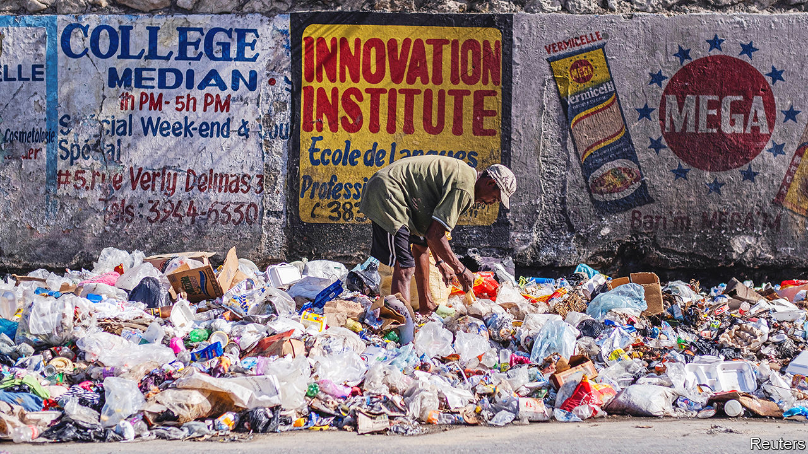

###### A modern inferno

# An American-backed foreign force may be sent to Haiti 

##### Cholera, hunger and gang violence are plaguing the island 

 

> Oct 20th 2022 

Few countries have experienced as much foreign meddling as Haiti. After winning independence from France in 1804, it lived through a two-decades long occupation by the United States. Since 1994 the United Nations has sent forces to the country twice. After an earthquake in 2010 aid organisations flocked there. Now another intervention seems imminent. On October 19th the United Nations was due to vote on two resolutions backed by the United States and Mexico to send a force into the country and to impose sanctions on gang members. The vote was delayed, but expected imminently.

The proposals followed a request made 12 days earlier by Ariel Henry, the Haitian prime minister, for foreign help. The force may involve armed troops, to try to break the grip that gangs have on the country. They have cut off fuel and blocked humanitarian aid. But President Joe Biden’s administration appears unwilling to send its own people. Speaking at the UN on October 17th, America’s representative to the UN spoke of “a partner country” sending a “limited, carefully scoped, non-UN mission”. The targets of the second UN resolution, on sanctions, would include Jimmy Chérizier, known as “Barbecue”, the head of the G9 coalition, the most powerful criminal group in the country. He and others involved with gangs will have their assets frozen, and will face a travel ban and an arms embargo.

Foreign boots are controversial. The most recent UN mission, from 2004 to 2017, did make Haiti safer. But peacekeepers also inadvertently introduced cholera to the country, which killed nearly 10,000 people. Some sexually abused girls. But today even some Haitians, notoriously anti-intervention, would welcome outside help. “Depending on the objective, this could be a good thing,” says Jean Robinson Pierre-Louis, an artist and English teacher. There is no other way out, reckons Robenson Dormezil, a construction worker. “To come out of the crisis, a foreign force is necessary. Unfortunately the police are under-equipped,” he says.

Haiti’s 11.5m people have long struggled with poverty and insecurity, which covid-19 only worsened. But the situation has deteriorated rapidly since the assassination of Jovenel Moïse, who was then president, in July last year. Gangs have proliferated. They find plenty of recruits among young men with no job or prospect of one, and they easily outgun the police. The number of murders has doubled since 2017. The UN has documented gang rapes of children aged as young as ten and of elderly women. The usually bustling streets of Port-au-Prince, the capital, are quiet, and eerily empty after 7pm.

The current crisis was sparked when Mr Henry ended fuel subsidies in September, as his government could no longer afford them (they cost $400m, or a quarter of government expenditure). Young Haitians, frustrated by the lack of work and rising prices, took to the streets. The G9 coalition dug trenches to block access to the country’s largest fuel terminal, where it says it will stay until subsidies are reinstated. 

As a result, fuel has run out. Schools have not reopened after the summer holidays. Only three ambulances are working in Port-au-Prince. The UN reckons a record 4.7m Haitians do not have enough to eat. An outbreak of cholera—for the first time in three years—has already killed at least 22 people. For the past month the building site where Mr Dormezil works has been shut because of the insecurity and lack of cement. He eats barely once a day. 

A domestic political solution seems unlikely. The country has had no parliament, no president and no elections since Mr Moïse’s death. He ruled by decree for much of his time in power from 2017. Mr Henry has an even weaker democratic mandate and little support. But it would be tricky to hold elections in Haiti in its current state. Mr Henry has dismissed a plan proposed by a group of respected civil-society figures, known as the Montana Accord. It proposed a two-year transition period, with an interim president and prime minister, before any new elections are called.

Mr Biden’s government was slow to act, says Robert Maguire of George Washington University in Washington. Its main concern is the rising number of migrants. Some 50,000 were apprehended in the United States between September last year and this August, 12 times as many people as the same period two years ago. The administration has backed Mr Henry, largely ignored those behind the Montana Accord and has failed to appoint a special envoy to Haiti. “People in power who are involved in massive human-rights violations...are the interlocutors for the international community,” argues Rosy Auguste Ducena, a Haitian human-rights lawyer. 

American attitudes are starting to change. Earlier this month the United States sent a coastguard vessel to patrol Haitian waters (though it is unclear what it will do, other than deter migrants). On October 15th the United States and Canada delivered armoured vehicles to the Haitian police. Mr Biden’s administration also says it will increase its training and equipping of the Haitian police and block visas for Haitian officials and people involved in funding or supporting gangs. 

At the UN, China or Russia are likely to veto the proposals. And not all Haitians are keen. The group behind the Montana Accord are against foreign troops. Some Haitians have taken to the streets to protest at the idea. Yet such is the chaos and desperation that many reckon some form of armed intervention is necessary. Without it, a dire situation is likely to worsen. ■

