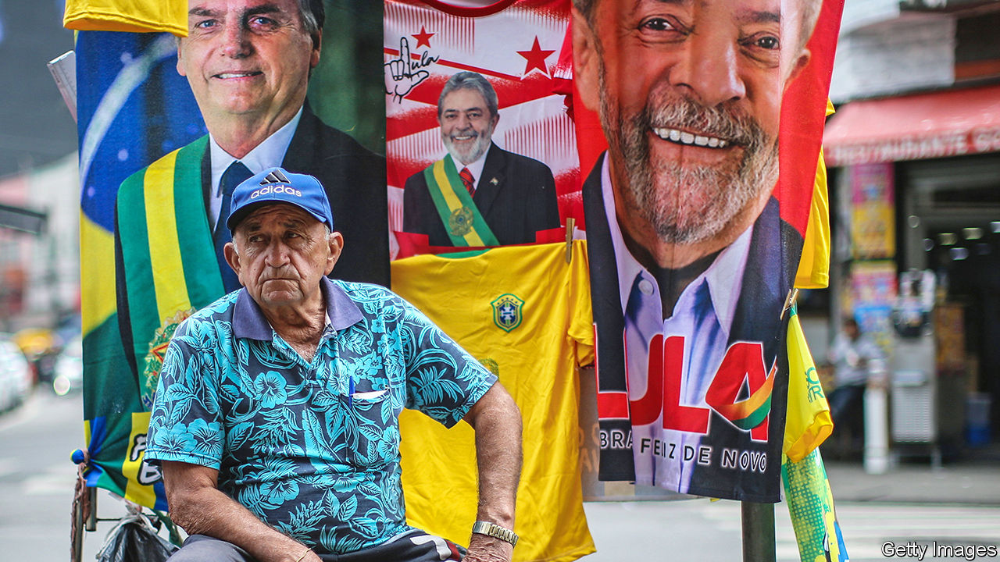
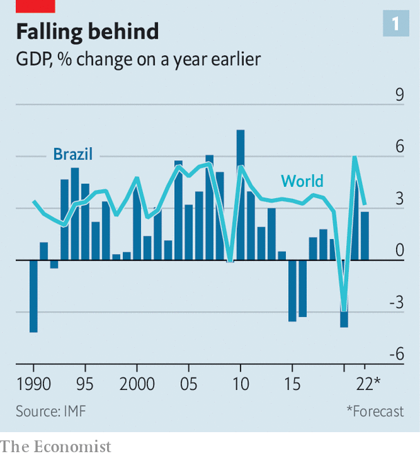
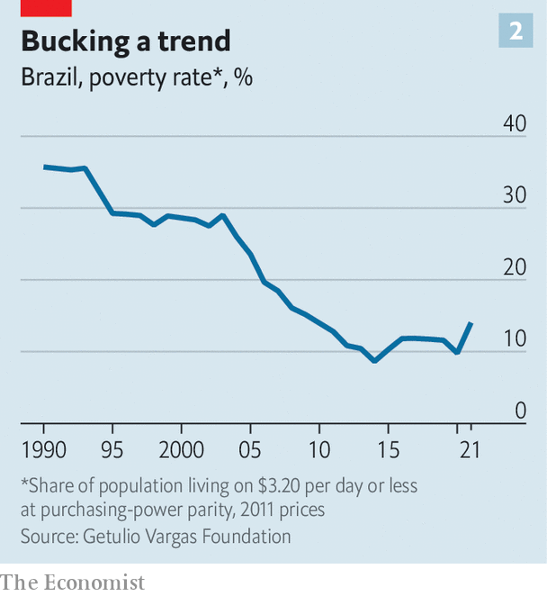
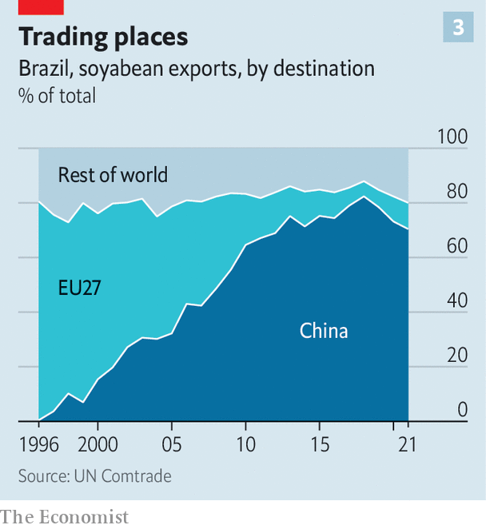

###### Missing the samba beat

# Brazil’s next president will face a big, tricky in-tray 

##### Despite the booming agribusiness sector, the country has lost its way 

 

> Oct 20th 2022 

Hemmed in by houses on one side and the Anchieta highway to the coast on the other, the Mercedes Benz factory in São Bernardo, a suburb of São Paulo, is the company’s biggest assembly plant for trucks outside Germany. Founded in 1956, it is being modernised. As a result, it plans to almost halve its workforce of 7,400, mainly by outsourcing parts of its operations. For Mercedes, this is part of a global strategy. For São Bernardo, the heartland of Brazil’s car industry, it is a body blow. 

In 2019 Ford shut its factory, next door to Mercedes, with the loss of 2,700 jobs. Toyota has gone too. A decade ago the metalworkers union based in São Bernardo represented 108,000 members. Now that figure is 70,000, says Moisés Selerges, its president. “This government doesn’t have a policy for industry,” he laments of Jair Bolsonaro, Brazil’s president. “Its policy is to cut down trees and plant soyabeans.”

The union’s woes illustrate one side of a dramatic shift in Brazil’s economy. Manufacturing now accounts for just 10% of the country’s GDP, down from 15% in 2004 and 26% in 1993. In contrast, revenues from agribusiness, broadly defined, now represent 28% of the economy, according to calculations by the University of São Paulo. That is a success story. Brazil has become the world’s third-biggest exporter of agricultural products, behind the United States and the European Union, with shipments worth $125bn last year. Productivity in Brazilian agribusiness is growing at 3% a year, compared with 0.5% for services and zero for manufacturing, says Marcos Jank of Insper, a business school. 

This structural shift has political, cultural and foreign-policy implications. But it is taking place in a context of overall decline, a diminished international profile and fierce political conflict exemplified by an ill-tempered presidential contest. The campaign will culminate in a run-off on October 30th between Mr Bolsonaro, a hard-right populist, and Luiz Inácio Lula da Silva of the leftist Workers’ Party (PT). 

When de-industrialisation began in the 1990s, it coincided with the opening and modernisation of the economy. Some of the factories that shut had been protected by tariffs and import prohibitions, and were inefficient. The Real Plan of 1993, which involved a new currency and fiscal reform, ended four decades of high inflation, the consequence of the distortions accumulated under “national developmentalism”, the ugly jargon for a policy of state-promoted industrialisation. It gave a renewed boost to the economy. Poverty began to fall and income gaps to narrow. 

Fernando Henrique Cardoso, the president from 1995 to 2003, liked to say that Brazil had found “a sense of direction” again. That progress continued under Lula, who governed from 2003 to 2011. By 2011 the country boasted the world’s sixth-largest economy. He promoted Brazil on the world stage, symbolised by the country’s playing host to the 2014 World Cup and the 2016 Olympics in Rio de Janeiro. 

 


Some critics say the turning-point came in Lula’s second term, when he gave up on reforming the economy and the public administration, preferring to expand the state and surf a commodity boom which included big, new offshore-oil discoveries. Others put their finger on the election of 2014, when Dilma Rousseff, Lula’s chosen successor and a more dogmatic leftist, spent her way to a second term, only for the economy to slump a year later. Over the past ten years economic growth in Brazil has averaged just 0.3% a year, less than half the rate of population growth (see chart 1). Poverty is rising and income distribution is getting more uneven in an economy that is now just twelfth-biggest in the world (see chart 2). The rest of the economy is not providing alternatives for those well-paid jobs being lost in industry.

Brazil seems to have lost its way. Mr Bolsonaro is both a consequence and a further cause of all these changes. A core source of his support is in agribusiness. In the election’s first round, he swept the centre-west and the states of São Paulo and Paraná, the heartlands of commercial farming. His culture war against the left is a symptom of a country divided against itself. , or Brazilian country music beloved of conservatives, is booming. Farmers have bought radio stations in São Paulo state and samba artists are now rarely aired, notes Miguel Lago, a political scientist. 

 


Mr Bolsonaro and his economy minister, Paulo Guedes, claim to want to boost the economy by shrinking the state. But they did relatively little of this beyond partly privatising electricity generation and allowing private investment in water and sewerage. Their manifesto for a second term includes more privatisation, an attack on bureaucracy and pledging investment to digitise public administration.

Lula in some ways represents the older, industrial Brazil. He first came to prominence during a military government in the late-1970s as a strike leader of the São Bernardo union. But he, too, has become a divisive figure, adored by poorer Brazilians as a symbol of social justice and abhorred by others for the large-scale corruption that flourished under the PT’s rule. He was himself convicted of corruption, and spent 19 months in jail, before his sentence was annulled by the Supreme Court in 2019.

There are signs that Lula knows that there can be no return to “national developmentalism”. Ms Rousseff’s attempt to revive it, by raising tariffs and coddling private-sector “national champions”, merely accelerated de-industrialisation. Lula has opposed privatisations. But he would not reverse them. He “is not talking about making the state bigger but improving its quality”, says Gabriel Galípolo, an economist who is advising him. A Lula government would promote private investment in infrastructure, says Mr Galípolo. 

Brazil is “big enough to have everything”, including manufacturing, argues Arminio Fraga, who ran the Central Bank under Mr Cardoso. But getting back on a track of faster growth with a changed economic structure requires reforms. Three things stand out: education and training, reform of the state and the budget, and better environmental policy.

For the first 160 years or so of its life as an independent country Brazil neglected education. In 1980 the average worker had less than four years of schooling. That period had more than doubled, to 9.3 years, by 2018, according to the statistics institute. But quality remains a problem. In the PISA standardised international tests in 2018 Brazil ranked 66th out of 77 countries. Brazilian 15-year-olds lagged behind on reading, science and especially maths. Improvement seems to have stopped in 2009. 

Mr Bolsonaro handed the education ministry over to people linked to evangelical Protestant churches, another core part of his support base. They have been more interested in incorporating conservative values in the curriculum than in improving quality, and have cut budgets. The president also scorns science, as his denial of the gravity of covid-19 and of climate change have highlighted. Similarly, vocational training has been neglected. There is a shortage of places, and courses tend to be geared to an industrial economy.

A more diverse economy needs a more agile government. “The Brazilian state is profoundly incompetent,” notes André Lara Resende, an economist who previously served in Mr Cardoso’s government. Administrative reform has been a pending assignment since those days. So, too, is tax reform. Mr Selerges, the union president, complains that manufacturing is more heavily taxed than are services.

The state’s problems are partly fiscal. Public spending is close to 40% of GDP. That is a similar share to that in many rich countries, but Brazilians get far poorer services and overall the state does little for the poor. Almost 80% of spending goes on payroll and pensions, compared with less than 60% in most countries, notes Mr Fraga. Public investment is just 2% of GDP. In 2016 Michel Temer, an interim president, introduced a rigid cap on spending. Both Lula and Mr Bolsonaro want to scrap it (indeed, in practice, the president already has). Investors will expect the new government to come up with a new fiscal rule to replace it. Mr Bolsonaro yielded control over much discretionary spending to Congress. Clawing back government control over the budget will involve a tough political fight.

Breadbasket blues

Under Mr Bolsonaro, Brazil has attracted international obloquy because of his gleeful destruction of the Amazon rainforest. Ricardo Salles, his environment minister until last year, dismantled the agencies responsible for enforcing the laws against deforestation. Lula has said he would reinstate his environmental policy, under which deforestation slowed. 

 


Even Mr Bolsonaro, and his new minister, now seem to accept the need for more control. So do many in agribusiness. Because of China’s growing appetite for soya, the European Union takes only 16% of Brazil’s farm exports, compared with 41% in 2000 (see chart 3). “The big incentive for better environmental policy isn’t trade. It is reputation and the attraction of investment,” says Mr Jank. 

Brazil still has great strengths. Its abundant food and energy are wanted by the world. Its government mainly borrows from local investors, and not in foreign currency. Its fiscal situation is less dire than Argentina’s, for example. “Under every government for the past 25 years we have taken at least one step in the right direction,” says Carlos Simonsen Leal, the president of Fundação Getulio Vargas, a university. But there have been false steps as well. If Mr Bolsonaro wins and continues to practise the politics of confrontation, Brazil will continue to drift. Lula has a rare chance for personal redemption. The question is whether he would use it to carry out the reforms Brazil needs to become a successful 21st-century economy. ■

