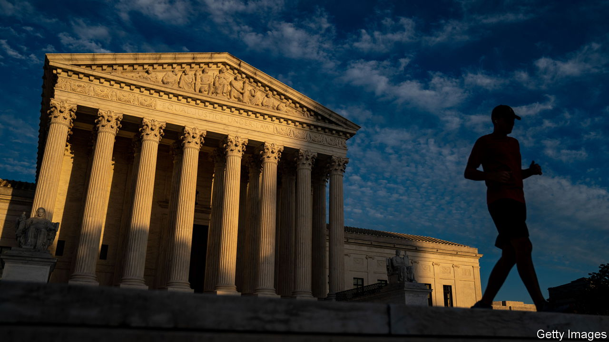

###### The Economist explains

# How America’s midterms could reshape the courts 

##### Abortion rights and fair electoral maps are at stake 

 

> Oct 20th 2022 

AS AMERICA’S , congressional and gubernatorial races are the focus of attention. But judges are on the ballot, too. President Joe Biden’s ability to seat federal judges hinges on his party’s retaining control of the Senate. And hundreds of state judges are up for election on November 8th, including 86 supreme-court seats at the state level. State jurists handle 100m cases a year—roughly 95% of all those filed across the country. The federal Supreme Court has tossed critical issues, including abortion rights, to the states. As a result, the individuals who wield the gavel on local courts matter more than ever. How does America select these judges, and how might upcoming elections shift the balance of power?

Jurists on the Supreme Court, as well as on the lower federal courts, are appointed by the president and confirmed by a simple majority in the Senate. All serve during “good behaviour”—meaning for life or as long as they wish, provided they do nothing to merit impeachment. The Democrats control the Senate by a wafer-thin majority thanks to the vice-president’s deciding vote. This has allowed Mr Biden to seat federal judges at a brisk pace: 84 so far,  had successfully appointed at this stage in his presidency (though Mr Trump had nominated two Supreme Court justices, to Mr Biden’s one). If Democrats lose control of the Senate in November, 58 judicial nominations currently working their way towards confirmation will hang in the balance.

Then there are the state courts. The mechanisms for judicial appointment vary across the country, and there is no lifetime tenure to protect judicial independence. In two states, supreme-court judges are selected by the legislature; in ten, it is the governor’s prerogative. The other 38 states use popular elections to select justices for their highest courts. Of those, 22 pick judges through direct election (whether partisan, where “Republican” or “Democrat” appears next to their names on the ballot, or non-partisan). In another 16, the governor appoints judges to their first term before citizens get to decide (via a “retention” election, in which they run unopposed) if they will continue to serve.

One state to watch is Michigan, where Democratic state supreme-court judges hold a 4-3 edge over Republicans. The chief justice, Bridget Mary McCormack, will retire by the end of 2022. Michigan’s Democratic governor, Gretchen Whitmer, will pick her replacement, who will serve until 2024, when voters will get their say. But two other seats on the state’s supreme court, one held by a Democrat and another by a Republican, are up for election already on November 8th. Michigan’s midterm ballots will also ask voters whether they wish to enshrine abortion rights in state law. But regardless of the outcome, the future of abortion access looks hazier if Republicans flip the court. Gun control, too: in 2018 Michigan’s high court ruled that school districts had the authority to bar weapons on school grounds. A more conservative court could be less friendly to such policies. Litigation disputing the result of the next presidential election would also become more likely.

The stakes are similar in several other states, including Iowa, Ohio, Montana and North Carolina. In Ohio, for instance, three judges are on the ballot for a supreme court with a 4-3 Republican edge. The mandatory retirement of Ohio’s chief justice, Maureen O’Connor, a Republican who has sided with Democrats to strike down gerrymandered electoral maps, will add to the turbulence. A 4-3 Democratic majority on North Carolina’s state supreme court has also been a bulwark against gerrymandering. But two seats held by the Democrats are up for grabs on November 8th.

When Alexis de Tocqueville toured America in the 1830s and noticed that many states elected their judges, his forecast was grim. “These innovations will sooner or later have disastrous results,” he wrote. Some years after retiring from the Supreme Court, Justice Sandra Day O’Connor sounded the alarm, too. “A judge’s sole constituency should be the law,” she said, not pandering to voters. 


