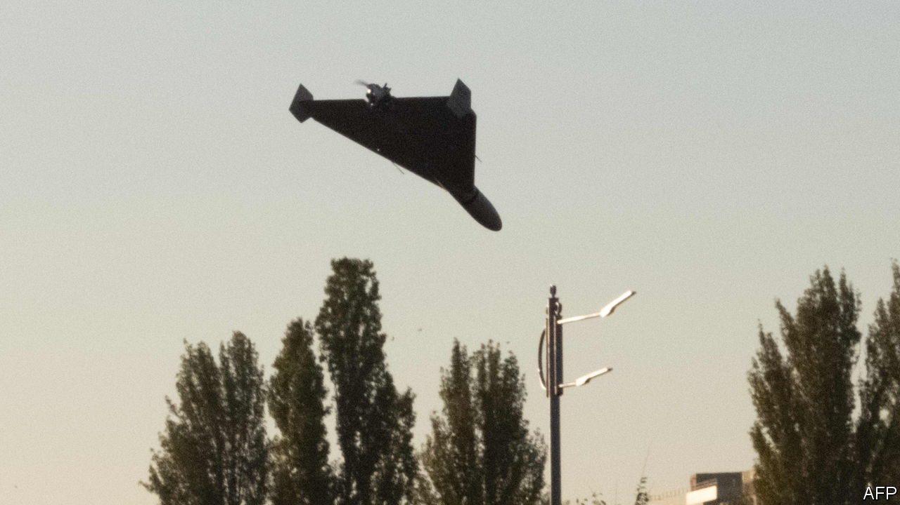

###### The Economist explains

# Will Russia’s drone attacks change the war in Ukraine? 

##### Probably not in the way Russia hopes 

 

> Oct 19th 2022 

UKRAINIANS SAY the drones buzz like flying mopeds or chainsaws. In recent days Russia has unleashed a deadly wave of  on Ukrainian cities, including Kyiv, the capital. Most of the drones appear to have been the Iranian-made Shahed-136, a “kamikaze” model that detonates on impact. They have only recently made an appearance in Ukraine but quickly left their mark. Volodymyr Zelensky, Ukraine’s president, claims that Russia has ordered 2,400 Iranian drones. What impact might they have on the war?

Kamikaze drones, also known as loitering munitions or “suicide” drones, have proliferated in recent years. Their effectiveness varies. Switchblade 300s, a bomb-carrying drone supplied by America to Ukraine, are among the best. A live video stream allows a remote operator to hit moving targets or call off an attack likely to cause collateral damage. The drone and all its gear weighs just 2.5kg, fits in a backpack and takes minutes to launch. Though relatively slow, the Switchblade is quiet, thanks to its electric motor. Its range is roughly 10km and the operator can adjust the attack trajectory to tweak the amount of damage caused on impact.

Iran’s drones are a blunter tool—but deliver a bigger blast. The Shahed-136 is equipped to carry around 50kg of explosives for around 2,000 kilometres. That is well beyond the range of the  America provides to Ukraine, so taking out Shahed launching sites will probably be difficult. But the drone has big weaknesses too. With a top speed of 185kmh, it is faster than the Switchblade but still slow enough to be picked off by rifles or machineguns. And it seems to have been used only against stationary targets. The drone’s engines are sold online and experts reckon its electronics are also civilian-made. This means its satellite guidance system is probably more susceptible to electromagnetic jamming than more high-tech models. Ukraine says most of the incoming Shahed drones have been destroyed. 

Even so, at around $20,000 a pop, Shahed-136 drones are cheap enough to be used in huge numbers. Hundreds have already been launched. Russia’s decision to target Ukraine’s energy infrastructure has proved effective: Mr Zelensky says a third of power stations have been hit. Another Russian objective might be to deplete Ukraine’s limited supply of pricey air-defence missiles by provoking their use. And by striking cities Russia will hope to demoralise Ukrainians.

But this is a dangerous gambit for Russia. The images of civilian casualties being pulled from smashed buildings will stoke anger beyond Ukraine’s borders. On October 18th an Israeli minister called on his own government to start sending Ukraine military gear. Israel has maintained a working relationship with the Kremlin, but on October 19th it offered to help Ukraine develop air-attack warning systems. This shift hints at the degree to which Russia’s brutality could harden attitudes to its war of aggression in thus-far neutral countries. Ukraine’s allies will send even more weapons. America is soon due to deliver Switchblade 600s, which boast warheads powerful enough to destroy tanks. And Ukraine’s resistance so far suggests that Russia’s terror from skies will steel its opponent’s will to fight. ■


