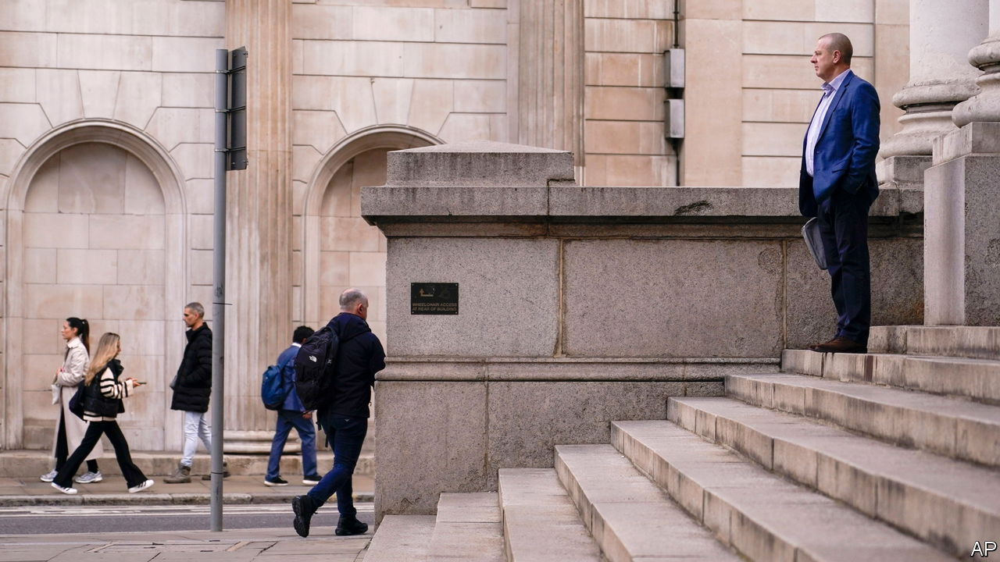
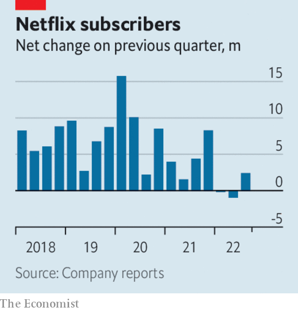

###### The world this week

# Business 

#####  

 

> Oct 20th 2022 

Markets reacted positively to the British government’s decision to scrap most of its . The yield on 30-year gilts fell back to around 4.2%, still higher than it was just before the mini-budget spooked investors in late September. The pound traded around $1.12, not far off its lows in recent days. Jeremy Hunt, the new chancellor, is reportedly mulling windfall taxes on banks and energy companies to help plug a fiscal gap still worth tens of billions of pounds. Big cuts to public spending are also in the offing. 

The  said it would start selling the bonds it has accumulated through its quantitative-easing programmes on November 1st, but only short- and medium-dated gilts and not bonds with a maturity of more than 20 years, which saw the sharpest sell-off in the recent turmoil. The central bank started buying longer-maturity bonds in late September to calm markets, but after two weeks that programme has now ended. 

Food for thought for Mr Hunt

 annual inflation rate rose in September, hitting 10.1% (the level it was at in July). Food prices made the largest contribution to inflation between August and September. They have risen by 14.6% over the past year. Although that was the biggest jump since 1980, staples like milk and butter were up by even more, some 30%. Energy costs were up by 70%, as gas prices nearly doubled over the year. There is no sign of the cost-of-living crisis receding for British households.

A raft of earnings from America’s big banks showed a decline in profits as rocky markets took a toll on their lucrative investment-banking business. But at , where net income was down by 43%, year on year, another problem is its expansion into retail banking. Its boss, David Solomon, announced another reorganisation of the bank, splitting up its consumer business by rolling its savings and wealth products into asset-management and putting lending into a new division called Platform. 

Swiss Re estimated that its claims from  would come in at $1.3bn, causing a quarterly loss of $500m. The reinsurance company reckons the total insured market loss from the storm, which hit west Florida in September, would be between $50bn and $65bn. That could make it the second-most costly hurricane for insurers, behind Katrina in 2005. 

The International Energy Agency said that, “defying expectations”, global  are expected to grow by only 1% this year. The increase would have been much larger, it said, if it were not for the take-up of renewable energy and electric cars. 

 reported quarterly revenues of $21.5bn, its most ever, and a solid profit of $3.3bn. The company has delivered fewer cars than it had forecast, but raised their price as the cost of parts for the vehicles increased. Investors wonder whether this could continue in a recession. 

, an electronics contract manufacturer known for assembling the iPhone, said it hopes to do the same for electric vehicles, and perhaps take half that market. Liu Young-way, the chief executive, even hoped that “one day we can do Tesla cars for Tesla”. 

 


 gained a net 2.4m subscribers in the third quarter, more than twice the number it had forecast and reversing six months of customer losses. The streaming service now has 223m users, far more than rivals, such as Disney+. To entice viewers Netflix is soon to roll out a cheaper subscription plan supported by advertising. 

America’s two largest supermarket chains,  and , agreed to merge in a $24.6bn deal. Both companies said they “expect to make store divestitures” to satisfy competition regulators, who will question consolidation in the industry. 

 is cutting its workforce by a fifth. The plant-based meat industry was flavour of the month a few years ago, but consumers are now tightening their belts and have lost an appetite for pricier alternative-meat products. Longer established food companies have responded to inflation by pushing up prices.  is the latest to report surging revenues, even though sales volumes fell. 

 has reportedly pulled out of Russia completely, because the Russian government expropriated its 30% stake in the Sakhalin-1 oilfield. In March Exxon said it planned to pull out of the project. 

No news is good news

The Chinese government postponed the publication of figures on  and trade data, perhaps because it did not want potentially bad economic figures to detract from the crowning of Xi Jinping for a third term as leader. Officials didn’t sign off on the trade data because of covid restrictions, apparently. 

