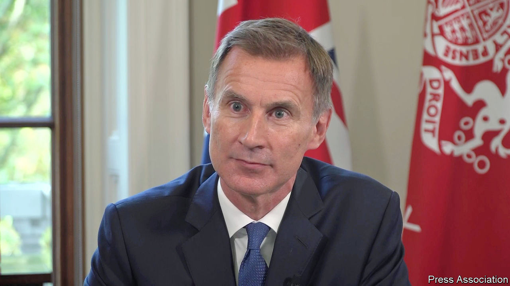

###### The world this week

# Politics 

#####  

 

> Oct 20th 2022 


,  new chancellor of the exchequer, ditched almost all of the unfunded tax cuts in the government’s mini-budget; the cuts had helped cause mayhem in the markets when they were announced on September 23rd. Mr Hunt was appointed to the job after Kwasi Kwarteng was unceremoniously sacked as chancellor by Liz Truss, the prime minister. Mr Hunt, a former foreign secretary, has put the Treasury firmly back in control of policy, a humiliation for Ms Truss, who had promised to rip up “abacus economics”. Amid chaotic scenes in Parliament, speculation swirled about how long Ms Truss could last. 

Adding to the tumult  resigned from her job as  after just 43 days. In a parting shot, Ms Braverman, who is on the Tory right, laid into the government’s lack of direction.

As winter approaches

Russia once again pounded  with waves of cruise-missile and , aimed at the country’s electrical infrastructure in the hope of freezing Ukraine into submission. Russia seems to have acquired huge stocks of cheap Iranian drones. But Ukraine has been able to shoot down many of the drones and missiles and has so far been quick to restore power to affected areas. Overall capacity is suffering though, so rationing seems increasingly likely.

Ukraine’s counter-offensive in the south appeared to be gaining momentum as the Russian occupation authorities in the city of  started to evacuate civilians and move administrative offices across the Dnieper river. Adding to the sense of crisis, Vladimir Putin announced that martial law was being imposed in the four provinces that Russia has partially occupied. Kherson, one of the most significant gains for the Russians since the invasion began, may soon be back in Ukrainian hands.


Mr Putin suggested that his  drive to bolster army numbers was nearly over, and that 220,000 men had been drafted. Gunmen opened fire at a training ground for new recruits in , close to the Ukrainian border, killing 11 people. The gunmen are reported to be Tajik nationals who had been recruited to fight in Ukraine and had got into a row over religion. 

Elon Musk reversed course, and promised that SpaceX, a rockets and satellites company that he runs, would continue to fund electronic communications in Ukraine through its . Starlink has become a vital strategic tool for Ukrainian forces fighting Russia. 

The head of  cyber-security authority, Arne Schönbohm, was sacked for allegedly having close ties with Russian intelligence officers. A Russian firm linked to a former KGB officer was a member of a private cyber-security organisation that Mr Schönbohm established a decade ago. The interior ministry is carrying out an investigation. 

Germany’s chancellor, Olaf Scholz, extended the lifespan of the country’s three remaining  until mid-April, in the hope of averting an energy-supply crisis over the coming winter. 

 parliament confirmed Ulf Kristersson as prime minister, more than a month after an election ousted the Social Democrats from power. His Moderate Party heads a centre-right governing coalition that includes the Christian Democrats and the Liberals, with support in parliament from the anti-immigration Sweden Democrats. 

In  41 miners were killed by an explosion at a coal mine in Amasra, 400km east of Istanbul. The mine is owned by the state. Recep Tayyip Erdogan, the president, suggested the blast was caused by “fate”, adding that an investigation would reveal the cause. 

The UN discussed possible responses to the . A pair of resolutions have been drafted by the United States and Mexico. They would impose sanctions against gang members and their backers and leave open the possibility of sending a security force to the country. Russia and China may still veto the resolutions.

As protests against the regime persisted across , a fire broke out in the notorious Evin prison on the outskirts of Tehran, where many political prisoners are held. The authorities said the death toll had risen from four to eight, with dozens more injured, but independent sources were unable to verify the figure.

At least 600 people, most of them in  southern state of Bayelsa, have died this year in one of the worst flooding seasons to have hit the country, according to the minister of humanitarian affairs. More than a million people are said to have been displaced from their homes. 

 government forces captured Shire, a key town previously held by rebels in Tigray, according to diplomats. The civil war is being waged as intensely as ever. A five-month truce was broken in August. 

 Congress party, the main national opposition, elected Mallikarjun Kharge, who is 80 years old, as its new leader. It is the first time in 24 years that the post has been held by a person who is not a member of the family led by Sonia Gandhi, whose son Rahul Gandhi is a perpetual prime-ministerial hopeful. Mr Kharge is said to have been the choice of the Gandhis. 

In   won six of the seven parliamentary seats he contested in by- elections. Mr Khan turned the vote into a referendum on his popularity, to put pressure on the government to call an early general election. Pakistan faces soaring inflation, a cash crunch and damage from flooding that submerged a third of the country. 

 new left-wing government said it would no longer recognise Jerusalem as the capital of , reversing the decision of the previous government. Just a handful of countries, including America, recognise the disputed city of Jerusalem as the Israeli capital, rather than Tel Aviv. 

Showtime in Beijing

 


 leader, Xi Jinping, opened the  with a speech that celebrated his first ten years in power. He said his “zero-covid policy” had saved lives and signalled that it would continue. He vowed to pursue peaceful unification with Taiwan, but did not rule out the use of force. Mr Xi, who will be granted a third term as party chief after the event, did not mention problems such as China’s sputtering economy, though he did warn of “choppy waters” ahead. Days before he spoke banners were hung from a bridge in Beijing calling for his dismissal. Such protests are extremely rare in China. 

