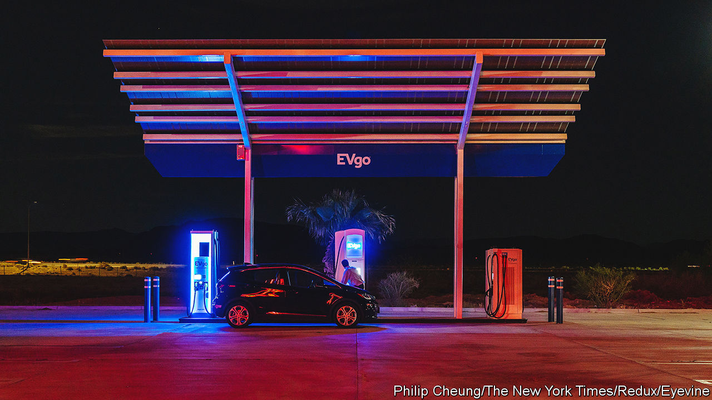
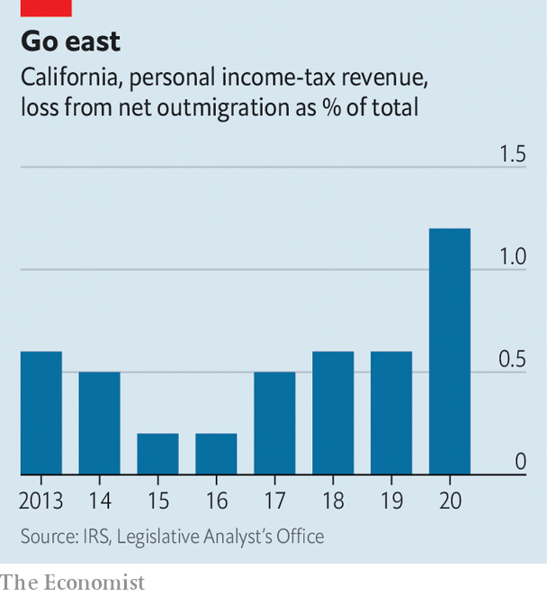

###### Tax max

# Californians may tax the rich more to subsidise electric cars 

##### A fight over the proposal exposes three larger problems facing the Golden State 

 

> Oct 17th 2022 

Gavin newsom, California’s Democratic governor, presents himself as an environmental champion, pushing for aggressive rules to reduce greenhouse-gas emissions and ban the sale of petrol-powered cars from 2035. So when Mr Newsom recently began appearing in television adverts encouraging voters to reject Proposition 30, a ballot initiative to increase taxes on the wealthy in order to fund electric-vehicle expansion, it turned heads. In the advert, Mr Newsom describes Prop 30 as “a Trojan horse that puts corporate welfare above the fiscal welfare of our entire state”.

Proposition 30, which will appear on the ballot on November 8th, has a motley crew of critics. Whereas the state’s Democratic Party and a couple of mayors have endorsed it, seeing this as a sensible way to raise funds to fight climate change, Mr Newsom has instead taken the side of the California Republican Party and California Teachers Association, the teachers’ union, in opposing it. “There has never been a coalition like this,” says David Crane of Govern for California, a good-governance group that opposes the bill.

 


The diverse opposition is especially striking because the ballot initiative sounds so innocuous. Prop 30 promises to raise taxes on those earning $2m a year or more by 1.75 percentage points, potentially generating $3.5bn-$5bn in additional state revenue a year. This would then be used to fund the roll-out of electric vehicles through tax rebates and charging stations. It would also provide more money for wildfire prevention. Why is the push to tax the rich in order to fight fires and carbon emissions so controversial?

Some of it has to do with how Prop 30 has been bankrolled. Its biggest backer is Lyft, a ride-hailing firm, which has spent around $35m to support the measure (and has already committed to moving all of its fleet to electric vehicles by 2030). Critics, including Mr Newsom, say that Prop 30 is a way of getting taxpayers to foot the bill for Lyft going green. (Uber, which is larger and better capitalised than Lyft, has neither funded nor endorsed Prop 30.) Starting in 2030, California will require 90% of miles travelled by drivers for ride-sharing firms to be in electric vehicles. Prop 30 would help pay for that transition by offering rebates to drivers to buy electric vehicles.

Lyft and tuck

It is not clear that this is necessary. California has already allocated $10bn to ease the transition to greener vehicles. The federal government’s Inflation Reduction Act also contains more tax credits and other incentives to switch to electric cars. A further criticism is that the new tax money would bypass the state’s “general fund”, which pays for education, health care and other basic services, setting up competition for tax dollars between electric vehicles and Californians’ many other needs. This explains why the mighty teachers’ union has come out against it.

While Prop 30 might seem a niche issue, it is anything but. The fight over it exposes three larger issues facing the Golden State. The first is California’s attempt to be a pioneer on environmental and climate issues by pursuing tougher policies on emissions than the rest of the country. The state’s policies may be good for the rest of humanity, but the result is that petrol prices there are the highest in the country, running about 56% higher than the national average, because California requires a unique formulation of cleaner fuel that only a handful of refineries can produce.

Second, Prop 30 highlights the drawbacks of direct democracy. California allows citizens to bring forward ballot initiatives if they collect enough signatures to qualify for the ballot (equivalent to 5% of the number of people who voted for the governor, which this year is around 623,000 signatures). “We can have the best legislature in the world, and then some company can go around us and raise taxes,” says Mr Crane. Ballot initiatives have taken big fiscal tolls on the state before. Prop 13, passed by voters in 1978, limits the amount by which a home can rise in taxable value each year, narrowing the state’s tax base and making it reliant on volatile personal income tax receipts.

Third, Prop 30 also tests California’s status as a home for innovators and entrepreneurs at a time when no-income-tax states like Texas and Florida are wooing new residents. California relies on personal income tax for around 59% of state tax revenue, compared with an average of 47% in the 41 states and Washington, dc, that collect personal income tax, according to the Tax Foundation, a think-tank.

One way to think about California’s tax structure is as a bear balanced on a wine bottle. The state relies heavily on the support of a narrow group. In 2019 only 35,000 people earned $2m or more a year, with a total tax liability of $27bn, around 33% of the statewide total. Already California’s top earners face the highest income-tax rate of any state, at 13.3%. Since 2009, the state has raised taxes on top earners twice. 

Increasing the rate further could be risky. In 2020 California had a net outflow of 260,000 taxpayers, up nearly 58% from 2019 and representing about 1% of total state-income tax collections. “A depressing number of California’s wealthiest have already left,” says Michael Moritz, a venture-capitalist who opposes Prop 30. By Mr Moritz’s calculation, around 20 Californian billionaires have moved out of the state recently, depriving it of around $15bn-20bn in lifetime taxes.

Since it needs a yes vote from a majority of Californian voters to pass, Prop 30’s fate is also balanced precariously, as if on a wine bottle. So, some feel, is California’s appeal for its wealthiest taxpayers. ■


