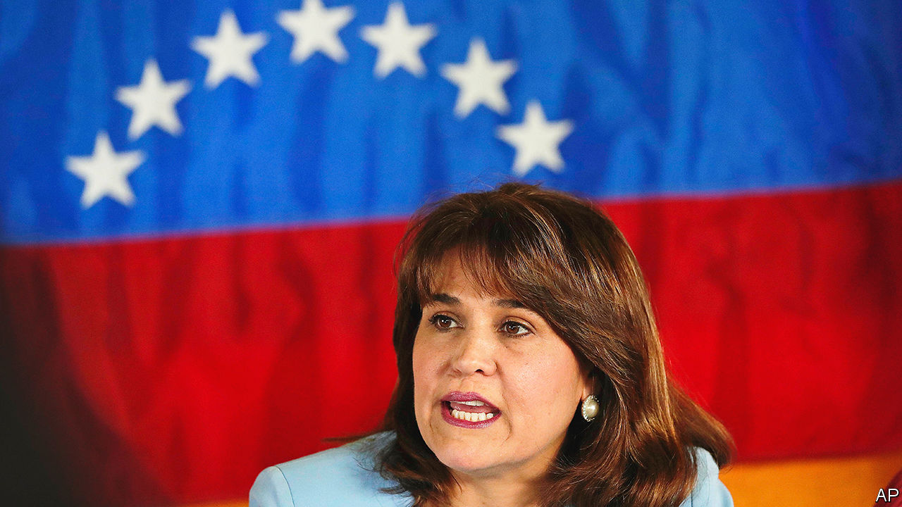

###### What’s in a name?

# Florida Democrats have taken to calling Republicans socialist 

##### Americans of all stripes are confused about what socialism is 

 

> Oct 20th 2022 


To the voters in a South Florida congressional district, the political advertisement lays out a stark choice: “This election will determine if we remain a beacon of freedom or we become a socialist dictatorship.” Surprisingly, though, the candidate speaking—with a bejewelled American flag on her lapels—is the Democratic candidate, who casts herself as the warrior for freedom and her opponent, a Trump-supporting Republican, as a socialist menace. What is going on?

“Socialist in the language of Miami-Dade [County] is very different from the dictionary definition,” explains Annette Taddeo (pictured above), the Democratic candidate in question and a current state senator, sitting in a windowless office at her campaign headquarters. “Republicans have used the word ‘socialist’ against us effectively many times through numerous elections…but we are seeing so many of our freedoms being taken away, and government intervention and government telling us what we can and cannot do,” she explains. “So, I’m flipping the script.”

Antipathy to socialism is indeed one of the most potent political forces in southern Florida. It is one that Democrats ignored to their cost as self-described democratic socialists, such as Bernie Sanders and Alexandria Ocasio-Cortez, gained prominence in 2018 and 2020. Between 2016 and 2020 Donald Trump improved his vote share in Miami-Dade by an astonishing 22 percentage points. Among majority-Hispanic precincts in the county, the shift towards Mr Trump was as high as 20 points. “Many voters have come from countries that don’t have law and order. They don’t want to defund the police,” says Kevin Cabrera, who ran Mr Trump’s campaign in Florida, and is standing himself for the post of county commissioner. “Democrats think that all Hispanics care about is immigration.” 


In 2020 Democrats were slow to respond to successful messages about socialism, admits Jose Parra, a consultant for the Florida Democratic Party for Hispanic votes. “You don’t just say, ‘I’m not a socialist’. That’s like saying, ‘I don’t beat my wife.’ You have to pick spokespeople like Annette Taddeo whose father was kidnapped by farc [the Colombian left-wing terrorist organisation],” he says.

Democrats are, belatedly, pushing back. Campaign operatives are circulating videos of María Elvira Salazar, Ms Taddeo’s opponent and a former Spanish-language anchorwoman, interviewing Fidel Castro—who would probably lose a popularity contest in the area to Satan. They are angrily pointing out it was a group of mostly Venezuelan asylum-seekers fleeing the regime of Nicolás Maduro whom Mr DeSantis flew to Martha’s Vineyard in a stunt meant to boost his eventual presidential run.

The pushback is muddled, however, both by President Joe Biden’s attempts to seek rapprochement with Mr Maduro over petrol prices, and by a national party that seems more socialist-curious than communist-bashing. A survey from the Pew Research Centre, a public-opinion think-tank, conducted in August found that significantly more Democrats have a favourable impression of socialism than they do of capitalism—57% for the former, and 46% for the latter. Young Democrats, those under the age of 30, are twice as likely to have a positive impression of socialism as of capitalism.

When asked to compare the two systems, Democrats overall say that socialism does a better job than capitalism in giving all people an equal opportunity for success and providing basic needs such as housing and health care. Only 46% of partisans say that socialism restricts individual freedom; slightly more, 52%, say that capitalism impinges on individual liberty.

That reflects the fact that, in America, the word socialism is remarkably malleable. In Miami, it means something like “authoritarian”, but is an all-purpose pejorative. Among Republicans, it is a synonym for out-of-touch and extreme (Senator Ted Cruz, a Republican from Texas, recently labelled the opposing party a bunch of “transgender, wacko socialists”). Among generic Democrats, it denotes the aspiration for something Scandinavian in style—welfare-statism without actually seizing the means of production—like the democratic socialism practised in Europe by most self-described socialist parties.

Confusingly though, the actual Democratic Socialists of America, an influential pressure group whose rose logo can be spotted in hipster-ish corners of Brooklyn and Washington, dc, aspire for a future of “popular control of resources and production, economic planning [and] equitable distribution”. It is not a message tailored to win in Miami. ■


