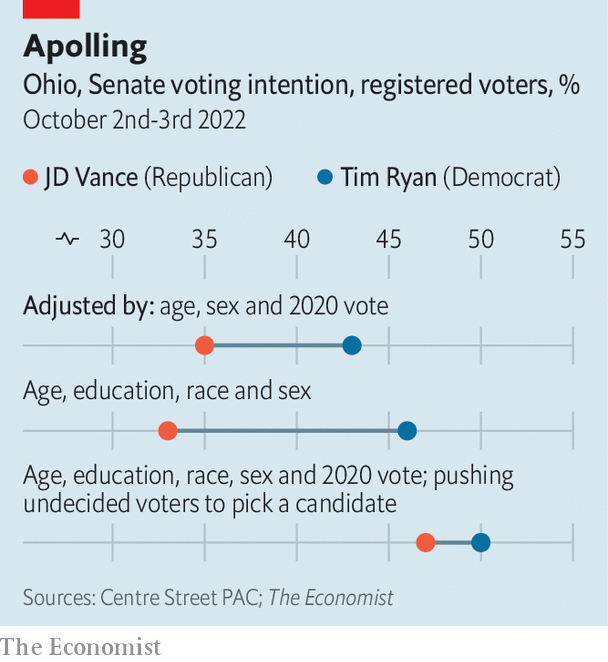

###### Midterm maths

# How to spot a wonky poll 

##### Why a Democrat-aligned Super PAC is publishing funny numbers 

 

> Oct 20th 2022 


One thing is assured in political polling: you will eventually be wrong. Elections can turn on a knife’s edge and polls are imprecise. But pollsters also fall short by failing to account for bias in their data. Is there any way to know if a poll is going to be wrong before an election occurs? 

One way is to compare a survey to other polls taken in the same race and interrogate outliers. Another is to peer under the hood and look at a pollster’s assumptions and processes. Either way, polls by Center Street pac, an allegedly non-partisan political action committee, look off.

 


The pac was formed in 2021 to support centrists. Center Street has endorsed Tim Ryan, a Democratic congressman from Ohio in the state’s Senate race, and published polls in an array of other competitive races. Their surveys routinely find much higher support for Democratic candidates than other polls do. 

In Ohio, Center Street’s polls show Mr Ryan winning 43% of registered voters versus 35% for JD Vance, his Republican opponent. That is surprising in a state that Donald Trump won by eight points in 2020. In Pennsylvania, Center Street puts John Fetterman, the Democrat, at 50%—16 points ahead of Mehmet Oz, the Republican, on 34%. ’s aggregate of publicly released polls show the Democrats tied in Ohio and up six in Pennsylvania.


What explains the difference? Center Street balances its polls by age and gender. Yet best practice is to account for race and educational attainment too, lest a pollster miss non college-educated whites, who lean Republican. Kurt Jetta, who runs its polls, reckons the step is unnecessary because he adjusts his polls by past vote, too.

 analysed the pac’s polling data from Ohio and found that if Mr Jetta had adjusted his sample to be representative of Ohioans by age, sex, race, education and past voting, Mr Vance’s support would have risen to 37% (to Mr Ryan’s 43%). Yet that six-point margin is still an outlier. What explains the rest of it?

When respondents to the poll say that they are undecided in a given race, Mr Jetta does not push them to pick a candidate, as other pollsters do. But 52% of undecided voters say they voted for Mr Trump in the last presidential election. They may well come home to Republicans. According to our analysis, if undecided voters pick the same party as before, Mr Ryan’s lead drops to 3 points—well within the survey’s margin of error. “It bothers the crap out of me,” Mr Jetta says, that his method may be off.

Center Street gets its data from an online panel that is not representative of the population and so needs to be heavily adjusted. That means higher uncertainty. And the pac‘s main job is to raise money for candidates. Mr Jetta says that Center Street uses its polls to show “high net-worth” donors that the committee can make a difference in key races. Outlier polls may convince them to give more. ■


