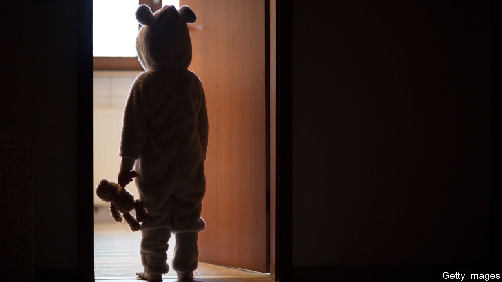

###### Bizarre school fights

# No, American schools are not encouraging pupils to identify as cats 

##### Or use litter boxes. But the accusation shows what partisans will believe about political opponents 

 

> Oct 20th 2022 

As if there were not enough other threats to American civilisation to consider, the national epidemic of furries, or children who identify as animals, in schools has been getting a lot of attention. Popular social-media accounts, including Libs of TikTok, which highlights daft things liberals are supposedly doing, spread the idea that schoolchildren are self-identifying as cats, and teachers are placing litter boxes in school bathrooms so that they may defecate comfortably. This is not actually true. But the speed with which this idea became mainstream illustrates how social media can confirm partisans’ wildest ideas about the other side, as well as how hard such fantasies are to dislodge once they have taken hold.

In January the superintendent of Midland Public Schools in Michigan, where the rumour began, addressed community members on Facebook: “Let me be clear in this communication. There is no truth whatsoever to this false statement/accusation! There have never been litter boxes within [our] schools.” Several other schools followed, denying that their districts were providing special accommodations for furries. Yet almost a year on, politicians are still repeating the furry claim. Two weeks ago a Republican candidate for governor in Colorado said she had received over 100 messages from parents about furries in schools. The idea has, naturally, been repeated by Republican Congresswoman Marjorie Taylor Greene.

Partisans do not just disagree with their political opponents—they despise them. In 2017, a poll by Nathan Kalmoe of Louisiana State University and Lilliana Mason of the University of Maryland found that 55% of respondents believe that people in the opposing party are a serious threat to the country. Nearly two out of five said the opposing party is “downright evil.” Once one group has decided the other is evil, fantasies about their behaviour follow.

This mental habit afflicts Democrats too. In 2021 Arizona became one of only five states to require parents to opt their children into sex education, rather than automatically enrolling them as is the case in most states. A school district in Chandler, a town outside Phoenix, adopted a new policy based on the state law which some parents interpreted as too conservative, says Lindsay Love, a school-board member. Then an image circulated online of a “chicken-breast permission slip.” A teacher was seemingly asking for parents’ permission for pupils to use chicken breasts in a culinary class. A picture of the permission slip circulated on social media. This is “the inevitable result of voting for r’s [Republicans] in az,” concluded one poster. The “chicken-breast permission slip” appears to have been a joke. A po-faced official from the district described it as a misinterpretation of district policy.

Around the same time, about 30 minutes north in Scottsdale, Arizona, another controversy was brewing. In November a group of conservative parents claimed that the school board had compiled a “secret dossier” on them. Specifically they claimed that the father of the school-board president, Jann-Michael Greenburg, Mark Greenburg, had collected photos, Social Security numbers, divorce decrees and other private information on nearly 50 parents in a Google Drive folder.

The Scottsdale Police Department concluded a month later that the online folder included only publicly available information, and an independent forensic investigation found no evidence that the folder was created using the district’s computers or email server. Mark Greenburg is suing two parents, Amanda and Daniel Wray, for defamation. Ms Wray and other parents are suing the Greenburgs back. The incident has received plenty of media attention. Kari Lake, a Republican candidate for governor, featured the parents in a campaign ad.

Partisan fantasies are also a gift to grifters. A man in Minneapolis claimed his van had been set on fire and graffitied with “Biden 2020” and “blm” because he was flying a Trump 2020 flag. This was not true. The man later pleaded guilty to wire fraud for filing over $300,000 in fraudulent insurance claims (and receiving $61,000 from the insurance company and $17,000 in donations through a GoFundMe page). ■


