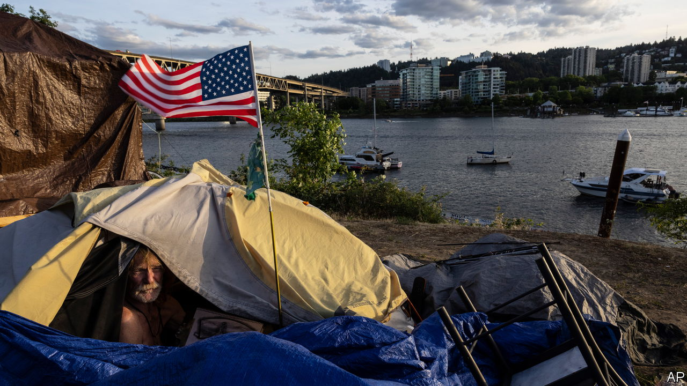
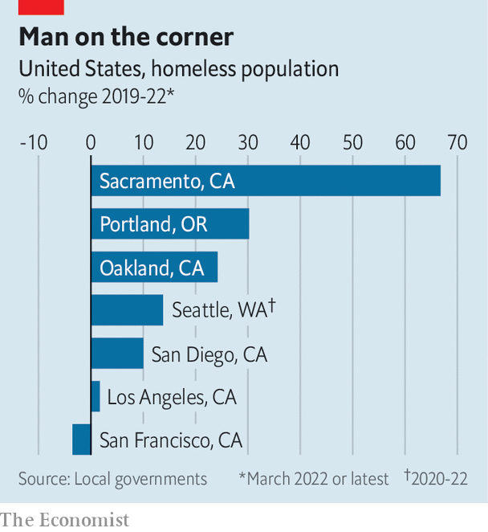

###### Not so rosy

# Oregon’s close governor’s race is a referendum on Portland 

##### Worsening homelessness in Democratic strongholds is becoming a political liability 

 

> Oct 20th 2022 


IT WOULDN’T BE an election year in America without fearmongering campaign ads. Some candidates have elevated them to an art form. A recent one for Christine Drazan, the Republican running for governor in Oregon, opens with a woman recounting how she was held at knifepoint by a homeless man in Portland. It was only thanks to the police that she survived, she tells the camera, before warning that Kate Brown, the current Democratic governor, and Tina Kotek, the Democratic candidate to replace her, are “releasing criminals” and making Oregonians “less safe”. 

Portland, the state’s biggest city, is an avatar of the Pacific north-west’s particular brand of progressive. Yet the governor’s race is surprisingly close for a state that Joe Biden won by 16 points. Polls suggest that Ms Drazan, formerly the top Republican in Oregon’s House of Representatives, has a slight edge over Ms Kotek, that body’s former Speaker. Ms Drazan could become Oregon’s first Republican governor since Ronald Reagan was president. 

There are two main reasons for this. First, a third candidate, Betsy Johnson, is splitting the vote. Before renouncing her party to run as an independent, Ms Johnson spent 15 years as a conservative Democrat in the state legislature. Her politics resemble those of Joe Manchin, the senator for West Virginia. She supports abortion rights, but annoys more-liberal Democrats by arguing for gun rights and blocking environmental regulation. Ms Johnson has benefited from the beneficence of Phil Knight, co-founder of Nike and Oregon’s richest man, who poured nearly $4m into her campaign (he recently donated $1m to Ms Drazan too). Ms Johnson’s campaign is pulling votes from Ms Kotek, as she courts Oregon’s many unaffiliated voters and Democrats looking for a change. 

Second, the race has become a referendum on Portland, which is struggling with violent crime, street homelessness and drug addiction. Ms Drazan’s campaign ad is a ploy to whip up fear and resentment towards Democrats, who run all levels of state government. But it plays on the real worries of Oregonians about Portland’s deterioration. Nearly three-quarters of likely voters polled by the  in September said they view the city negatively. Ms Brown, the outgoing governor, is the least popular governor in America. Ms Johnson and Ms Drazan are trying their best to paint Ms Kotek as her political doppelganger. 

 


Worsening homelessness, which voters say is the most important problem facing the state, has made change more appealing to habitual Democrats. The homeless population of Multnomah County, which includes Portland, grew by 30% between 2019 and 2022, to roughly 5,200 people. Most of the growth has been among those who sleep outside. Rising housing costs and the closure of shelters during the pandemic have pushed more people onto the streets. 

The proliferation of tent encampments in Portland’s Old Town neighbourhood near the city centre has blocked pavements, scattered rubbish and made people’s struggles with addiction more visible. Portland Clean and Safe, a programme that employs formerly homeless people to clean downtown, disposed of more than 180,000 needles in 2021, up from 5,000 in 2014. Anthony McDougald, one of the programme’s cleaners, often visits his brother who still lives on the street. “At one point you couldn’t get through the sidewalk because of everybody’s tent,” he says. 

This has changed the argument about street homelessness. “Portlanders have a lot of compassion for the circumstances that led people to the streets in the first place,” says Portland’s mayor, Ted Wheeler. “But that compassion has definitely been tempered by the impact it is having on the rest of the city.” Residents see litter and graffiti, says Mr Wheeler, “and for a lot of people that’s very dystopian.” 

That has prompted a policy change. Mr Wheeler is planning to ban unsanctioned encampments, a move that would have seemed radical only a year ago. Rather than allowing tents to be pitched anywhere, people will be directed to official campsites where they can get help finding housing or treatment for drug addiction. Where to put the camps, and how to enforce the ban, are yet to be worked out. 

Oregon’s Democrats are seeing what happens when elected officials demote public safety to a secondary concern. Local Democrats took chants to “defund the police” to heart in 2020, cutting the police department’s entire gun-violence and recruiting teams. The cuts came at a particularly inopportune time. For decades Portland was one of America’s safest cities. But the murder rate spiked there in 2020, as it did in cities across the country. 

The cuts worsened a staffing shortage caused by the retirement of baby-boomers and the loss of many officers following the city’s violent protests in summer of 2020. As in many other cities, peaceful demonstrations erupted in Portland after George Floyd was murdered by a police officer in Minneapolis. Unlike in other cities, left- and right-wing extremists flocked to Portland to stir up trouble. Antifa clashed with Proud Boys, buildings were set on fire and at least one person was shot dead. The federal troops Donald Trump sent to Portland to quell the riots (and bolster his own law-and-order campaign) inspired more riots. 

The political violence that tarred Portland’s peaceful protests is still on voters’ minds. About 70% of Portland voters say the demonstrations damaged public safety, and fully half suggest that they actually harmed racial unity. While Oregon mulls whether a Democrat or Republican is best-suited to help fix its flagship city, Portlanders are hoping for a government overhaul of their own. Residents will vote on a bumper ballot measure that would change the way officials are elected, the size of the city council and its responsibilities. 


Portland’s struggles matter beyond state lines. West-coast cities from San Diego to Seattle seem unsure what to do about sky-high housing costs, tent encampments and open-air drug markets. These are also political problems for Democrats, who run America’s big cities. Unsheltered homelessness is visible evidence that government is not working as it should. The growth of encampments is a rebuke to progressive politicians out to prove that their policies make life better and more equal for everyone. It is also fodder for Republicans who argue that Democrats can’t be trusted to run the country if they can’t solve the problems in their own backyards.

Mr Wheeler hopes that his encampment ban can be exported to other cities if it proves successful. “I predict two years from now every city in America will be confronting this issue,” he says. Nationally, though, homelessness is not on people’s minds. Only 4% of Americans polled by Gallup in September chose hunger, poverty and homelessness as the top issue facing the country. The governor’s race in Oregon will test whether a left-leaning state will punish Democrats for problems that have mushroomed on their watch. If Mr Wheeler’s prediction is right, liberals elsewhere may want to pay attention.■


