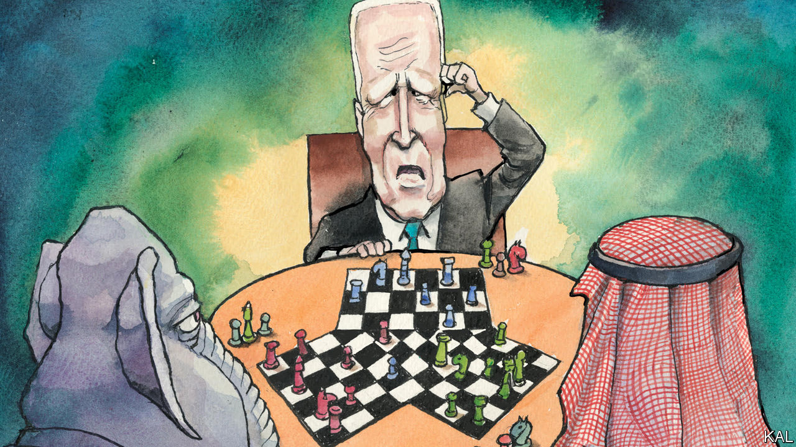

###### Lexington

# The blow-up with Saudi Arabia reveals a new American strategic weakness 

##### One party’s adversary is becoming the other party’s friend 

 

> Oct 19th 2022 

“W e are all Semites together,” the Saudi minister for foreign affairs smoothly replied, after President Richard Nixon informed him that while his envoy, Henry Kissinger, was Jewish, “a Jewish-American can be a good American.” Mr Kissinger was angry at the president but pleased the Saudi made no mention of oil during that meeting at the White House in October 1973, as the Arab-Israeli war raged. According to “The Prize”, by Daniel Yergin, Mr Kissinger concluded the Arabs were unlikely to use oil as a weapon against America, despite its support for Israel. But within three days, Saudi Arabia had stopped shipping oil to the United States, and other Arab states were following suit. 

Semites or not, American leaders seem fated to be blindsided by Saudi Arabia. They are unable even to resolve whether the Saudis misunderstand them in return or in fact understand them all too well. The latest source of American consternation is the decision earlier this month by opec+, a group of oil-producing countries led by Saudi Arabia and Russia, to cut production, ostensibly to prevent a drop in the price of oil. Joe Biden plans to “re-evaluate” the partnership, his aides say; he told cnn, “There’s going to be consequences for what they’ve done with Russia.”

The 80-year alliance between Saudi Arabia and America is not in imminent peril. Shared interests in security and stable energy prices will hold them together for now, as after the 9/11 attacks, when most of the terrorists proved to be Saudi. Yet this uproar is different, in part for reasons that expose an emerging, dangerous American vulnerability in world affairs.

Mr Biden promised in his campaign to treat Saudi Arabia like “the pariah that they are”. By waging gruesome war in Yemen and, according to American intelligence, presiding over the dismemberment of a  columnist, Saudi Arabia’s crown prince, Muhammad bin Salman, had heightened the contradictions in America’s foreign policy past Mr Biden’s breaking point. He wanted to put new emphasis on human rights and democracy. 

Then the pandemic waned and the war in Ukraine began. Petrol prices surged. “Pariah” started to seem like too strong a word. After much debate within his administration, Mr Biden decided to travel to Saudi Arabia, where he fist-bumped the crown prince and then met with him. 

There was a warning sign: Mr Biden later said he raised the murder of the journalist, Jamal Khashoggi. That provoked Saudi Arabia to starchily disclose that the prince responded by noting Americans’ abuses of Iraqi prisoners at Abu Ghraib. Still, the relationship appeared to be back on track. 

Then came the production cut and fears of a jump in oil prices that would benefit Russia and also upset American voters just before the midterms. “It was a slap in the face,” says Representative Ro Khanna, a California Democrat. Mr Khanna has introduced a bill to stop arms sales to Saudi Arabia. Senator Dick Durbin of Illinois, the Democratic whip, has called for letting the Justice Department sue opec members for antitrust violations. As America grows self-sufficient in energy and impatient with its Middle Eastern entanglements, the alliance makes less sense on Capitol Hill. Mr Khanna notes the rising generation of Congressional leaders has little experience of Saudi Arabia as a reliable partner. The Saudis, he warns, are risking the relationship over the longer term.

Yet at the moment only Democrats seem to be upset with the Saudis. Republicans are upset at Mr Biden. The reason is that Saudi Arabia disclosed that the Biden administration had requested the cut be postponed for a month. Biden administration officials insisted they were asking the Saudis to wait to see if the price of oil would indeed fall. But a delay would also have averted the danger of a sharp price rise at the pump before voters went to the polls. 

Representative Elise Stefanik of New York, the third-ranking House Republican, told the  that seeking the delay was “a very egregious, inappropriate and illegal action by the president”. She suggested Republicans may try to impeach him for it.

Democrats believe the Saudis are the ones playing politics, to return Republicans to power. Donald Trump made the first overseas visit of his presidency to Saudi Arabia and defended Prince Muhammad. (“I saved his ass,” Mr Trump boasted to Bob Woodward of the .) Mr Trump’s son-in-law, Jared Kushner, struck up a prince-to-prince relationship with Prince Muhammad, and on leaving the White House secured a $2bn investment from the Saudis for his investment firm. 

The American game

The Middle East has long been a spawning ground for conspiracy theories. America has become one, too. That does not mean the dark suspicions are wrong. Perhaps everyone is playing politics. Or perhaps, as is often the case in life, motives are so mixed that even the players themselves cannot disentangle them. 

Prince Muhammad was more angered than mollified by Mr Biden’s visit, the  reported. But Saudi Arabia has complex interests of its own, and he may have viewed the production cut in the context not of American politics or of the Ukraine war but of his own expensive domestic investment programme. 

What seems clear is that, whether Saudi Arabia is playing one political party off the other or not, it is becoming child’s play to do so. If the adversary of one party can so easily become the other party’s friend, America has developed a new strategic weakness, one that will ensure its future unreliability on the world stage. 

As prime minister of Israel, Binyamin Netanyahu jeopardised bipartisan support for its objectives by campaigning against Barack Obama’s nuclear deal with Iran. Mr Netanyahu got what he wanted from Mr Trump, only to see Mr Biden try to resurrect the deal. Endless head-snapping oscillation of that kind will be one price of a foreign policy captive to America’s tribal politics. That is in the interests of no one, except democracy’s real enemies. ■


