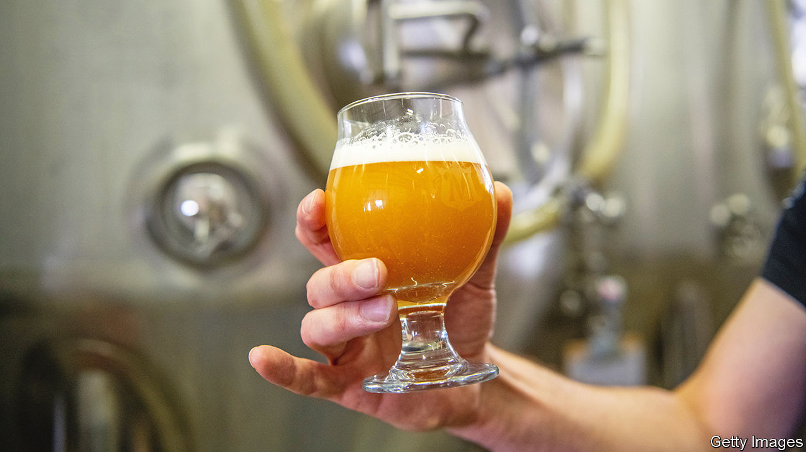

###### Beer sommeliers

# The growth of the “cicerone” shows how craft beer is thriving 

##### More complex brews require guides who can tell customers what to drink 

 

> Oct 20th 2022 

Neil Witte, from Kansas City, Missouri, has two degrees, in philosophy and in German. Yet he says that the toughest exam he has ever taken was the one he did to be qualified as a “master cicerone”—that is, an expert in beer, roughly equivalent to a master sommelier. (The word comes from an Italian term for guide.) The exam is organised by a firm based in Chicago, and takes over two full days. It involves a three-hour written essay question, a multiple-choice test, as well as a blind tasting test and an oral examination. Mr Witte, who passed only on his third attempt, is now one of just two dozen or so fully qualified “masters” on the planet. But there are around 4,500 qualified cicerones (which also requires an in-person exam), as well as almost 150,000 people qualified as “certified beer servers” via an online multiple-choice exam.

The growth of the “cicerone” reflects the ever increasing complexity of American beer. In recent decades, the overall consumption of beer has lost market share to wine, spirits and alcopops. Yet “craft beer” has thrived. In 1982, there were just 93 breweries across the entire country. Last year, there were 9,247, according to the Brewer’s Association, an industry group. The number continued to expand (though more slowly) even when the covid-19 pandemic shut bars. Craft beer now accounts for 13% of total beer output, and is growing at a hoppy rate of 8% per year, while sales of traditional brews are flat. More complicated beers require better-educated bartenders to sell them, says Ray Daniels, who first invented the concept of the cicerone.

Some brewers are even trying to compete with wine and spirits for prestige. Samuel Adams, a craft brewer from Boston, Massachusetts, sells a beer it calls “Utopias.” The latest version is aged with cherries for nearly 30 years in bourbon and wine casks, and contains an alcohol level of 28%. Your correspondent tried some, and to his uncultured taste buds, it tastes less like beer and more like an intriguing sort of sherry. But it sells for $300 a bottle. Goose Island, a brewery in Chicago, also sells a beer aged in bourbon barrels, for a somewhat more modest price (around $50).

Both Mr Daniels and Mr Witte admit that beer will never have quite the elitist draw as fine wine. For one thing, even the most exciting beer does not store well, making it a poor speculative investment. But Mr Witte says becoming a master cicerone has cracked the possibility of tasting pairings with meals at fancy restaurants. And though few restaurants yet employ in-house full cicerones, there is stout demand for the qualification from distributors and marketing types. Customers are getting ever more demanding, about types of beer but also things like cleaning draught lines. The untapped market for beer expertise gets lager day by day.■


