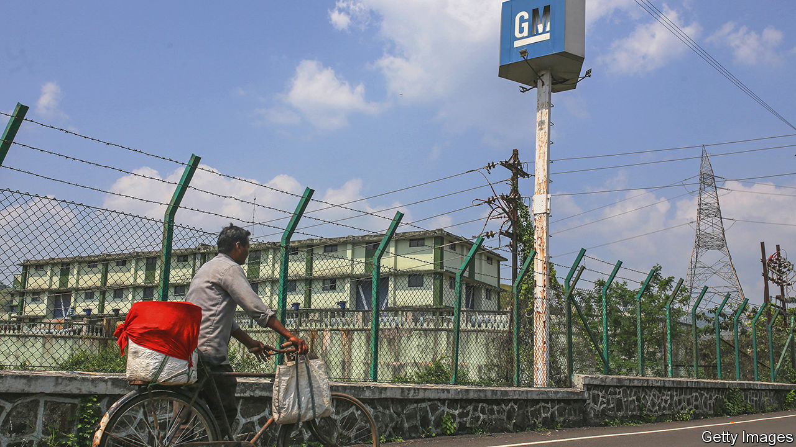
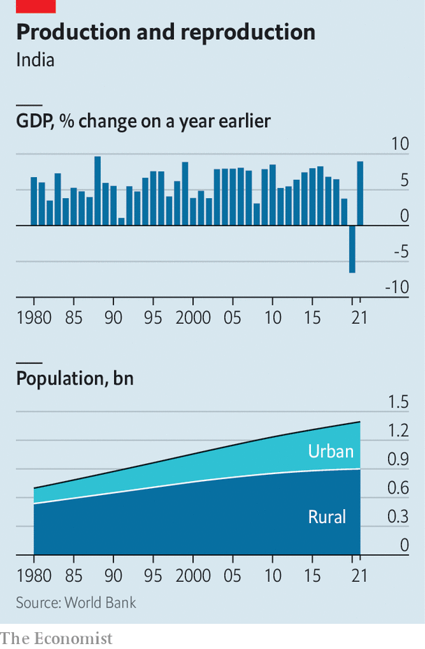
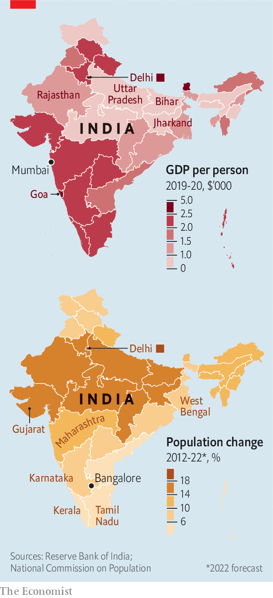

###### Latitude is everything

# India’s regional inequality could be politically explosive 

##### The southern states make more money while northern states make more babies 

 

> Oct 27th 2022 

Goa, on India’s western coast, is famed for its endless beaches, plentiful prawns and high quality of life. Bihar, along the fertile Indo-Gangetic Plain in the north, has a less savoury reputation. It is thought of by many Indians as a land of deprivation and lawlessness. Neither stereotype is entirely accurate, but they hint at a deeper truth. In terms of economic development, the difference between Goa and Bihar is like that between southern Europe and sub-Saharan Africa. 

If the two states were countries, Goa’s annual output per person would put it among upper-middle-income economies; Bihar, by contrast, would still be years away from leaving the low-income category. The average Goan is ten times richer than the average Bihari. That disparity is much more striking than in China, also a large emerging market, where the richest province has annual output five times higher than the poorest. America, that famous beacon of egalitarianism, has nothing on either Asian country. New York, the wealthiest state, is just over twice as rich as Mississippi, the poorest. 

 


India is one of the big development  of the past few decades. Since 1980, its GDP per person has grown at an annual average rate of nearly 7% (see chart), a performance matched by only a handful of other countries. But a combination of persistent regional inequality (20 years ago the average Goan was only 6.5 times richer than the average Bihari), fractious state politics and stark differences in population growth threatens to reinforce, and potentially worsen, the country’s political divisions. That, in turn, could hurt future economic growth and make it ever harder to bridge the divide.

Rising geographical inequality is a normal—some would say essential—part of economic development. In countries on the lowest rungs of the ladder, most people tend to eke out a living by farming or selling things, perhaps running corner shops or chai stalls. As the economy begins to develop, new jobs appear in industry or services, which lure workers away from the countryside to faster-growing urban areas. The gap in incomes and living standards between opportunity-rich cities at the frontier of development and the poorer hinterland can grow to staggering levels, until the exodus away from rural areas leaves labour scarce enough to push up wages there as well.

Most of India’s economic development in the past four decades has come from the southern and western states (see map), which have become hubs for manufacturing and high-tech industries. But the heartland states of the Gangetic Plain have shown little sign of catching up. While recent decades have seen convergence between the incomes of poorer countries and richer ones, within India “this process of convergence has failed”, note Rohit Lamba of Penn State University and Arvind Subramanian of Brown University in a recent paper.

 


The economic gulf is matched by . India is vast and divided by differences of language and culture. The regional parties that tend to dominate politics in the richer south resent the diversion of their hard-earned gains into welfare programmes for the poorer north. By contrast, much of the north is governed by the Bharatiya Janata Party (BJP), which for the past eight years has also run the central government under Narendra Modi, the prime minister (most redistributive policy is made in Delhi, the capital). 

The situation is further complicated by demography. The poorer states in the north, north-west and east—Bihar, Jharkhand, Rajasthan, West Bengal and Uttar Pradesh—are collectively home to nearly 600m people, or more than 40% of Indians. Their populations are also growing much faster than those of the southern and western states. During the 2010s, the population of Bihar, the third-largest state, grew by an estimated 16.5%, while that of Uttar Pradesh, the most populous, rose by 14%. In contrast, the populations of Maharashtra (which includes Mumbai, the commercial capital), Karnataka (home to Bangalore, a tech hub), Kerala and Tamil Nadu (both at the southern tip of the country), all rose by under 10% over the same period. 

It’s grim up north

The huge numbers of young and poor people along the northern plain might seem attractive to manufacturers searching for cheap labour. After all, Bangladesh has had considerable success in luring low-wage factory work from China. But companies, especially in more advanced industries, tend to go to places where there are already suppliers and skilled workers. 

Moreover, the Indian development story is unusual in its limited reliance on industrialisation. Manufacturing generates just 14% of Indian GDP, compared with 21% in Bangladesh and 27% in China. What industry India does have tends to cluster in the south and west. Uttar Pradesh is home to about 17% of India’s population, but has only 9% of its industrial jobs. Indeed, more than half of all factory jobs in India are in just six states, five of which are on the peninsula (Gujarat, in the west, is the sixth). Of the 11 companies that make products for Apple in India only one is in the north. Six, including the manufacturer of the new iPhone 14, are in Tamil Nadu alone.

With large and growing numbers of young people in the north unable to find good jobs, the mismatch between population growth and economic prowess across regions is politically explosive. Constitutionally, constituencies for parliamentary seats are supposed to be determined by population and adjusted every ten years. But in the 1970s the government froze the number of constituencies in each state to help encourage population control. The freeze was last extended in 2002. The matter will come up for debate in 2026, two years after the next general election. 

The redrawing of boundaries is up to an independent committee. But some observers worry that if the BJP wins a third term in 2024, as is all but certain, it will use its power to undo the freeze. That would tilt the distribution of parliamentary seats so far in favour of the northern states, where the BJP is dominant, that it might in effect become impossible for any other party to gain a national electoral majority. Along with ramping up welfare spending in the northern states, as well as the BJP’s attempts to align the south ideologically and linguistically, this would further aggravate tensions with the southern states, which have long resented what they see as the north’s imposition of an alien culture. 

Migration would bring some balance. Recent work by Sriram Balasubramanian, Rishabh Kumar and Prakash Loungani, who are economists at the iMF, concludes that one-third of the variation in living standards across India is down to location alone. In other words, a worker with the same education, caste and ability would earn a lot more simply by moving. 

Go south, young man

Yet the rate of internal migration in India is among the lowest in the world. India’s large cities are much smaller than typical patterns of urbanisation suggest they should be. China, which imposes limits on where citizens can collect state benefits in order to discourage rural-to-urban migration, also suffers from very low rates of internal migration and from under-urbanisation, yet less so than India.

Investments in road, rail and air connections are improving links across the country. The adoption of a comprehensive goods and services tax in 2017, though criticised as , helped knit widely divergent state tax regimes into something resembling a single domestic market. Conscious of the need to provide better jobs for the country’s poor masses, the government is developing an industrial strategy, which includes manufacturing subsidies for some sectors. A massive —with a national identity system, slick mobile payments and online government services—ought to make it easier for people to move around.

Yet all these efforts will take years, maybe decades, to pay dividends. That will be much too late for underemployed young people in the north—and perhaps for the south’s political heft. Not just the prosperity, but the cohesion of India rest on the government’s ability to fix the problem. ■

