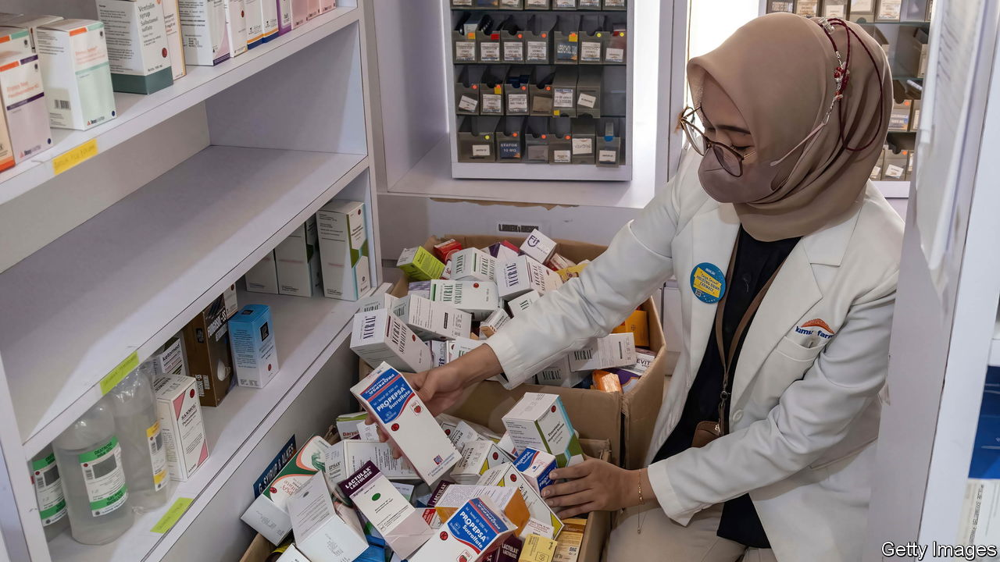

###### Joining the dots

# Kidney failure kills scores of children in the Gambia and Indonesia 

##### Are two disasters, 15,000km apart, connected? 

 

> Oct 27th 2022 

The food and drug agency of Indonesia, known as BPOM, had a grim mystery on its hands. Until recently, cases of small children suffering acute kidney injury (AKI) were vanishingly rare in the country of 276m people. But in August the number began to rise sharply and nobody was sure why. The health minister, Budi Gunadi Sadikin, says his team wondered at first whether a new variant of covid-19 might be to blame. But then came a clue from the other side of the world. 

The World Health Organisation announced on October 5th that 66 children with AKI had died in the Gambia, in west Africa. It believed those deaths were linked to the consumption of contaminated cough syrup. BPOM officials soon realised that many Indonesian victims had taken similar drugs. The government suspended the sale of all syrup and liquid medicine, pending a review, and scrounged abroad for fomepizole, a treatment. At least 241 children, nearly all under the age of five, have been diagnosed with AKI. The death toll is shocking: 141 have died so far.

BPOM stresses that the link between the deaths and the syrupy drugs is not yet proven, and notes that AKI has other causes, too. But the signs are ominous. On October 22nd BPOM identified five syrups for fevers and coughs, from three different drugmakers, all of which contained ethylene glycol and diethylene glycol, the same chemical culprits found in syrups in the Gambia.

Those glycols are alcohols with industrial uses such as antifreeze. But they sometimes make their way into the human body in adulterated pharmaceutical products. Upon consumption, they can produce oxalic acid, which forms into crystal clumps that induce AKI. A similar tragedy occurred in Bangladesh between 1990 and 1992, when tainted cough syrup killed 236 children. Unscrupulous drugmakers looking to save money use these chemicals in place of pricier thickeners for liquid medicine, such as glycerine.

Whether the two tragedies are connected remains unknown. The four Gambian products that may be linked to children’s deaths were manufactured by an Indian firm, Maiden Pharmaceuticals. (Its products are already banned in some Indian states and in Vietnam. The firm says it is co-operating with investigators from the Indian government.) No Maiden drug has ever been registered or sold in Indonesia. The country’s tainted products were all made domestically, says Keri Lestari of the Indonesian Pharmacists Association. But its pharmaceutical industry imports most raw materials from India and China. It is conceivable that these bundles of bad drugs, 15,000km apart, shared a supplier at an earlier link in the supply chain. 

If so, that might present an awkward problem for India. The country makes 20% of generic drugs globally and cherishes its reputation as . But its small-name suppliers have a growing reputation for shoddy quality control and dodging regulations. Most often this results in drugs that are ineffective rather than fatal. Either way, the harm is real. 

No matter what the origin, Indonesia is supposed to abide by international standards that keep drugs . Even in the rich world regulators cannot test every drug before it goes on sale. Indonesia, like America, relies on random inspections. But importers and manufacturers who handle chemicals such as glycerine are obliged to check for nasty knock-offs before they start production. A probe is under way to determine whether rules were followed and what went wrong.

The two months that BPOM took to crack the mystery exacted a cost. Hundreds of grieving parents now believe they have unwittingly fed poison to their children. Faith in the regulatory system is shaken. Even now, rumours fly. Online sceptics wonder why authorities have allowed doses of the covid-19 vaccine to contain polyethylene glycol, a similar-sounding and related but non-toxic chemical. The health minister has rushed to assure Indonesians once again that the covid-19 vaccine is completely safe. ■

