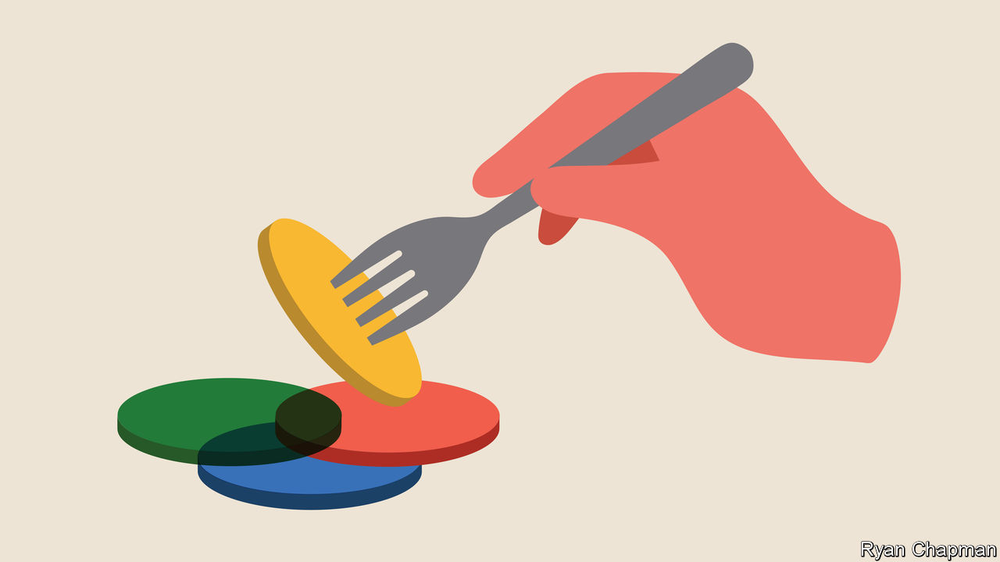

###### Circles of life

# What Japan makes of ikigai 

##### Western career coaches promote it as a guiding philosophy, to the bemusement of Japanese 

 

> Oct 27th 2022 

NORM TAM spent most of his life climbing up the corporate ladder. In his early 40s he was earning a hefty salary as an executive at a global shipping firm. But he could not help feeling a bit empty. He started Googling terms such as “meaning” and “purpose”. Eventually, he stumbled upon a Venn diagram showing four circles labelled “what you love”, “what you are good at”, “what the world needs”, and “what you can be paid for”. His eyes fixed on the peculiar foreign word at the intersection of the circles:.

Mr Tam, who lives in Canada, is one of many Westerners to have discovered the Japanese term, which loosely translates as “reason for being”. The diagram, created in 2014 by Marc Winn, a British entrepreneur, has gone viral online, especially on LinkedIn. A self-help book by two Spanish writers, “Ikigai: The Japanese Secret to a Long and Happy Life”, has been translated into 63 languages, sold more than 3m copies and helped globalise the concept. “The Eastern, Asian approach is inspirational,” says Paul Donkers, a career coach in the Netherlands. He dispatches more than 100 licensed (by himself) coaches worldwide “to help people find meaningful careers”. There are now  weight-loss pills and crypto companies.

Mr Tam, too, launched a business inspired by the concept: IKIGAI Coaching. “When I first saw the diagram, I was terrified…I knew I was not living my ,” he says. Ever since, those circles have guided him “like the lights on an airport runway”. At his workshops, he helps corporate leaders and executives fill in the diagram’s prompts. He advises meditation to help “unlock” their potential, he says.

Yet few in Japan give much thought to the idea. When tED, a conference, staged several talks on the concept, a tweet by a baffled Japanese observer went viral: “Apparently, there’s an ancient Japanese philosophy called ‘’…huh? What’s that?”. Native speakers seldom use the term. If they do, it is in the context of small joys, such as spending time with family or enjoying hobbies, says Kanda Nobuhiko, a psychologist at Bunkyo University near Tokyo. “If I decide to sneak out of a lecture to have a beer, that counts as my .”

 thus joins a long list of Japanese words that have been repurposed to lend an aura of ancient wisdom—and exoticism—to banal ideas.  has been peddled as the “Japanese art of saving money” (in practice, keeping a notebook to track finances). , or the Japanese art of “forest bathing”, is really just going for a nice stroll in nature.  describes an interior design trend that embraces minimalist decor and natural materials. In Japan, it refers to an aesthetic philosophy of appreciating imperfection. (, a Danish word meaning something like “cosiness”, has suffered a .)

Yet the difference in interpretation also owes something to the passage of time. In 1966, Kamiya Mieko, a Japanese psychiatrist, published “Ikigai-ni-Tsuite” (About Ikigai), a thoughtful memoir based on her experience of treating leprosy patients at a sanatorium on the small south-western island of Nagashima. Her message, that individuals can overcome hardships so long as they have something to look forward to, resonated during a period of soaring living standards and corporate drudgery. 

Some Japanese experts have been all too happy to capitalise on ’s global appeal. In “Awakening Your Ikigai: How the Japanese Wake Up to Joy and Purpose Every Day”, Mogi Kenichiro, a neuroscientist in Tokyo, claims that  is “highly immersed in Japanese culture”. He makes his case through figures familiar to foreigners, such as Ono Jiro, a sushi chef made famous by a Netflix documentary, and Miyazaki Hayao, a much-loved  filmmaker.

Others would like to see the concept make a comeback inside Japan. Despite its reputation as a land of healthy, long-lived people, Japan is hardly a utopia. It has the highest suicide rate in the G7, a club of rich countries. Its demanding corporate culture has led to cases of , or . The government has tried to legislate its way to a healthier work style, with limited effect. Perhaps Japan, too, could do with a bit more. ■

