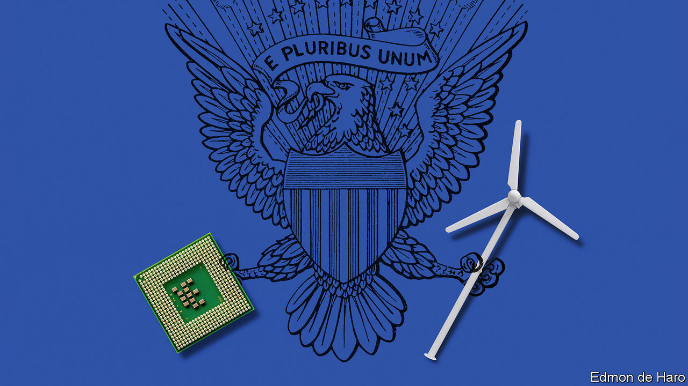
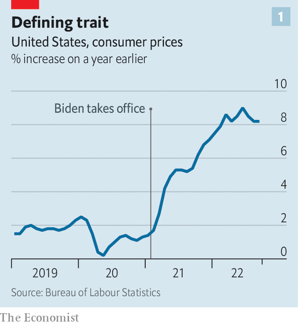
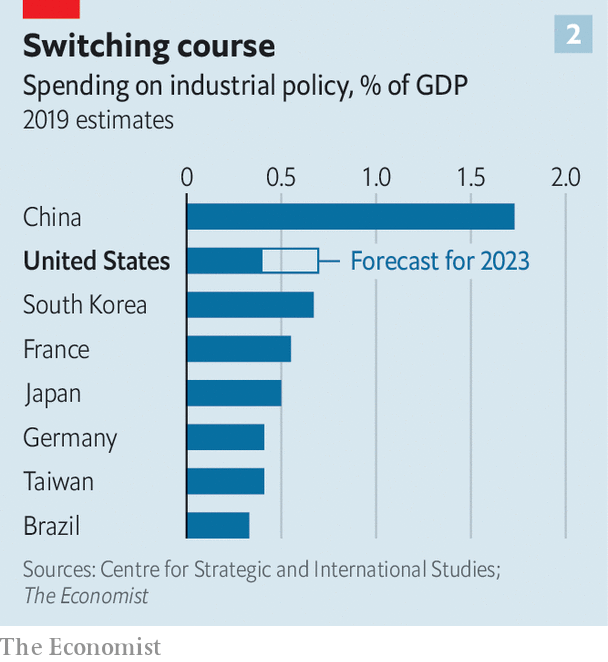
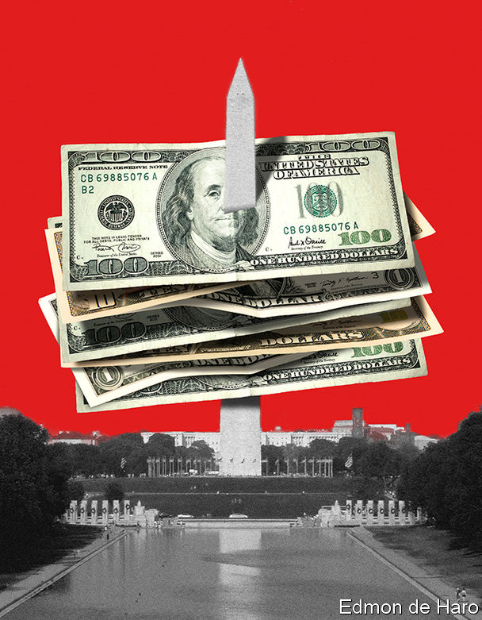

###### Adieu, laissez-faire

# Joe Biden attempts the biggest overhaul of America’s economy in decades 

##### He is using industrial policy to create jobs, cut emissions and boost manufacturing 

 

> Oct 27th 2022 

On a snowy day in January Joe Biden was due to visit Pittsburgh to talk about his plans for upgrading America’s infrastructure. Just hours before he arrived, a bridge in the city collapsed. Five cars and a bus fell into the ravine below it. Mercifully no one died.

On October 20th Mr Biden returned to the site of the accident. Reconstruction would normally take at least two years. But thanks in part to a $1.2trn investment in infrastructure that he signed into law, Mr Biden could boast that this time the bridge would be back up by Christmas. “For too long, we talked about building the best economy in the world,” he said. “We didn’t do it, but we’re finally getting to it. We’re getting it done.”

 


That is most assuredly not the public’s view. As the midterm elections draw near, negative perceptions about the economy may be the decisive factor in shifting control of Congress from Democratic to Republican hands. Poll after poll shows that the state of the economy is voters’ number-one concern. The recent surge in inflation, or “Bidenflation”, as some attack ads have dubbed it, shows no sign of dissipating (see chart). Meanwhile, much of Mr Biden’s agenda has fallen by the wayside: promises of universal pre-kindergarten, fatter family subsidies and an overhaul of health insurance have been undone by congressional gridlock.

It is easy therefore to conclude that, on the economic front, Mr Biden’s first 20 months in the White House have been, at best, a missed opportunity or, at worst, a failure. That, however, is to overlook the changes that he has ushered in with three big pieces of legislation: the $1.2trn infrastructure law, a $280bn semiconductor-and-science act and a $390bn climate-spending package. The three are framed as spending bills in part because bitter partisanship makes it almost impossible to get any other measures through Congress. But their intention is sweeping: to foster American manufacturing, succour the middle class and make the economy greener, among other things. To achieve those ends, the laws seek to re-engineer America’s growth model by according the state a crucial role in guiding investment at home and managing commerce abroad. 

Inevitably, it has been dubbed Bidenomics. For decades American politicians and executives were highly sceptical about state intervention in the economy. They believed that industrial policy was inefficient and self-defeating, even if they resorted to it on occasion. America was instead the leading apostle of globalisation, seeking to cut tariffs and win its businesses unfettered access around the world. Donald Trump repudiated this view, scorning free trade and vowing to revive American manufacturing. But his policies were often half-baked and his administration chaotic.

 


It is under Mr Biden, therefore, that the shift has taken full effect (see chart 2). The debate within government circles is no longer about whether to pursue industrial policy at all, but about how to make it most effective. By the same token, the administration is not seeking to revive untrammelled globalisation; instead, it wants to isolate rivals and recraft commercial ties with allies.

It is an ambitious agenda, rivalling that of any president in recent decades. If it succeeds, it will change America dramatically, although there are many potential pitfalls. Even so, it is unlikely to help the Democrats in the midterms; inflation is too big a millstone around their necks. 

The White House tries to deflect complaints about galloping inflation by pointing out that it is a global phenomenon and that, anyway, it is the job of the central bank to wrangle it. That is true, but ignores the part Mr Biden has played in spurring it. In July economists with the Federal Reserve estimated that fiscal policy had added about 2.5 percentage points to America’s annual inflation rate. In other words, nearly half of America’s “extra” inflation, relative to its pre-pandemic norm, is attributable to the government’s profligacy.

Mr Biden is not the only spendthrift. Donald Trump signed into law more than $3trn in stimulus in 2020, to counteract the pandemic. Mr Biden’s contribution was the $1.9trn American Rescue Plan (ARP), passed in March 2021, which included cheques for households, more generous unemployment benefits and funding for state governments. 

But whereas Mr Trump’s stimulus arrived when America was suffering the economic equivalent of cardiac arrest, Mr Biden’s came as it was staging a healthy recovery. He injected so much money into the economy (a deficit of more than 10% of GDP for a second straight year) that demand for goods swelled massively—and with it, inflation.

Mr Biden’s advisers counter that the great inflation is better viewed as a great job recovery. The numbers are indeed impressive: America has swung from an unemployment rate of 15% in mid-2020 to just 3.5% now, matching its lowest in 50 years. Yet it is wrong to think that Mr Biden’s stimulus was needed in order to achieve this. The recovery in the job market was well under way before he took office, mirroring the economic improvements in other countries as they put covid-19 behind them. The more salient fact about the American labour market is how extraordinarily tight it is: there are roughly two job openings for every unemployed person. This imbalance, the worst in decades, is yet more evidence that Mr Biden’s stimulus helped overheat the economy.

The passage of the ARP also proved to be a pyrrhic victory. As inflation picked up, enthusiasm for big new spending commitments waned. Joe Manchin, a Democratic senator from West Virginia who in effect wielded the deciding vote in the evenly divided Senate, objected to most of Mr Biden’s social policies, from government-funded day care to heftier tax credits for families with children. Mr Biden’s “Build Back Better” bill, which once carried a price tag of $3.5trn, was shorn of its social content, whittled down to less than $1trn and renamed the Inflation Reduction Act (ira), although over half the money was for climate-related investments. 

In total, the three Bidenomics bills (infrastructure; semiconductors and science; and climate) mandate about $1.7trn in investments over the next decade. Relative to America’s giant economy, that is unspectacular: on an annual basis, they represent less than 1% of GDP.

Multiplying multipliers 

But the public purse is a powerful thing. It has a unique capacity to catalyse private investment. Take the spending devoted to semiconductors. Some $39bn will go towards incentives such as tax credits for new manufacturing facilities. The ink on the subsidies is barely dry, but they have already prompted an investment boom. Intel talks of spending $100bn in Ohio and Micron $100bn in New York, while other firms such as Qualcomm and Wolfspeed are also opening their wallets. 

The coming splurge on clean energy is likely to be even bigger. In total, encompassing the three big bills, America now has a climate budget of roughly $500bn. “Together, these bills give the federal government an unprecedented set of tools,” John Podesta, the Democratic operator managing the climate funds, said in a speech this month.

Some of the pot will provide incentives for the manufacture of lithium batteries, offshore-wind installation vessels, carbon-capture facilities and more. Most tantalising, though, is the portion that will go into research and development. Even those sceptical about America’s capacity to implement a successful industrial policy are more optimistic about the government’s role in supporting innovation. After all, the Defence Advanced Research Projects Agency (DARPA), an arm of the Pentagon, has a spectacularly good record of doing just that, having helped develop such ubiquitous technologies as GPS and the internet.

Bidenomics can be seen as an attempt to mimic DARPA’s approach in fields other than defence, especially clean energy. The Biden administration has doubled funding for research, created institutions to demonstrate how novel technologies work and started to exploit its procurement power in order to gin up demand for them. In short, it is working to foster a chain from innovation to adoption for cutting-edge products.

The various subsidies and incentives will be integral to getting American businesses and consumers to opt for cleaner sources of power. Before the IRA and the infrastructure law were enacted, America’s emissions of greenhouse gases were on course to fall by 30% from the level of 2005 by 2030. Now, the Department of Energy estimates and independent researchers concur, they will drop by about 40%. The increment is equivalent to about two years’ worth of emissions from Britain.

If the Democrats (and economists) had their way, America would have imposed a price of some sort on carbon—a much more efficient way to achieve the same goal. But they failed repeatedly to get such a measure through Congress and paid an electoral price for trying, as Republicans painted them as anti-growth. The lavish spending on clean energy is a more politically palatable alternative. It so happens that the two states adding the most new-energy jobs carry political weight. One is Michigan, a perennial battleground; the other is Texas, a Republican bastion that Democrats dream of flipping.

By the same token, Bidenomics’s industrial policy can be seen as a way of counteracting the decades-long erosion of well-paid, blue-collar jobs that has been a source of dismay for Democrats, in particular. For manufacturers to obtain tax credits in full, they will have both to pay workers well and to provide apprenticeship programmes. The IRA, for instance, requires apprentices to do at least 15% of the work on construction sites it funds by 2024.

Democrats believe that these requirements will help generate both a bigger pool of skilled workers and a bigger supply of well-paid jobs. Even if the change is only marginal, a few high-profile investments in the rustbelt offer voters a glimmer of hope. Ohio is getting electric-vehicle battery factories; West Virginia wind farms and Pennsylvania robotics manufacturers.

Bidenomics does not stop at America’s borders. The White House has also been working to recraft the terms of America’s commerce with the world. There is a tricky balance to strike. On the one hand, the president has tried to repair relationships with allies that were neglected or damaged by Mr Trump. On the other hand, a slightly more sanitised version of Mr Trump’s America-first worldview animates many of Mr Biden’s policies. He has all but shut the door to conventional trade talks. He has strengthened “buy American” commitments in federal procurement rules. And some of the tax credits offered under the new industrial policy will only be available to firms that meet thresholds for domestic content and production, much to the ire of America’s trading partners.

But the Biden administration is establishing ways to co-operate with allies short of trade agreements. With Europe it launched a Trade and Technology Council (TTC), a forum to ensure that the West follows a consistent approach in its technological rivalry with China. In Asia it created the Indo-Pacific Economic Framework, a forum to promote co-operation on everything from border checks to decarbonisation, although most notable for its exclusion of China. To their detractors these all look rather underwhelming. Katherine Tai, the United States Trade Representative, insists that they will yield concrete benefits. “We’re designing them to be platforms that can evolve as the global economic situation evolves,” she says.

The Biden administration talks of “friend-shoring”, a desire to strengthen trade with allies and steer it away from adversaries. America’s trading partners, however, complain that the emphasis has been more on shoring than friendship. Their companies have little choice but to invest in production facilities in America if they want a slice of its subsidies. This may wind up as the first real test of the TTC: European diplomats have indicated that they intend to raise their grievances at their next ministerial meeting in December. If that fails, they may make a formal complaint to the World Trade Organisation.

For friend-shoring to work, the White House will have to make its buy-American rules more flexible. Promisingly, it has adjusted domestic-content requirements for electric vehicles to include parts made in Canada and Mexico, although not other countries with which America has free-trade deals. One way to dispel objections elsewhere would be for America to resume and expand free-trade talks with the European Union and Asian allies, although the Biden administration has so far shown little interest in that. Ms Tai is unapologetic about Mr Biden’s focus on investment at home. But she is also optimistic that America and its allies can work together to strengthen (meaning China-proof) their supply-chains. 

Mr Biden does seem to be having some success in fusing security and economic objectives, especially regarding China. China has made this easier for America in two ways: its support for Russia’s war on Ukraine has deepened distrust in Europe and its zero-covid policy has shaken the faith of business globally. This has allowed the Biden administration to tighten its rules on technology transfers. Its latest export controls, announced on October 7th, bar anyone with American citizenship or residency from supporting the development of advanced chips in China—an expansive measure that could hobble China’s leading semiconductor firms. The impact on the Chinese economy is likely to be bigger and more lasting than that from Mr Trump’s helter-skelter trade war.

So far, at least, America appears to have the acquiescence of allies, including the Netherlands and Japan, the two countries that produce the most sophisticated chipmaking equipment. In part that it is because they are simply unwilling to end up on the wrong side of American laws. But an absence of carping also points to another conclusion: that the Biden administration is working well with its friends where it matters most.

 


The thread running through Bidenomics is a belief that a more interventionist state can shape economic outcomes, both at home and abroad. This was evident in the giant stimulus package at the outset of Mr Biden’s presidency, and has underpinned the administration’s fondness for industrial policy and its attempts to redraw the lines of international trade. Although politics stripped Bidenomics of much of its social policies, it has still gone further than many thought possible even a few months ago in reshaping both domestic industry and global commerce.

Yet there are plenty of reasons to think Bidenomics may go wrong. Despite all the successes of DARPA, recent American history is littered with examples of state-backed industrial initiatives that have sputtered, from Solyndra, a government-supported solar company that went bust, to lavish tax subsidies that failed to secure a big investment in Wisconsin from Foxconn, an electronics manufacturer. Electronics firms are spending record sums on lobbying, a bad sign. And convincing allies that America can both subsidise domestic industries and remain an open and fair trading power will not be easy.

Venture bureaucrats

Doing so much at once will also be a huge practical challenge for the government. It will need to hire lots of experienced managers to oversee its sprawling industrial plans, on public-sector wages. They in turn will have to choose worthy recipients for subsidies, monitor their progress and cut them off if necessary. The ever-growing web of domestic incentives, meanwhile, might spark a wasteful and inefficient global subsidy war.

Politics will add to the complexities. Should either chamber of Congress come under Republican control in the midterms, progress on Bidenomics may slow to a crawl. About $200bn of its funding for R&amp;D will need to be approved as part of the annual budget process. And Republican-led committees will gleefully start investigating any money that has been poorly spent under Mr Biden’s three acts.

But Bidenomics may also exceed expectations. Its industrial policy is not as heavy-handed as some: it aims to create incentives for firms to enter certain industries rather than to pick corporate winners. As an administration official says, the White House is full of “reluctant generals”, wary of the pitfalls of government intervention but persuaded that it is the best way forward. The fact that they approach industrial policy with healthy scepticism rather than unbridled enthusiasm may help ensure that programmes are better designed.

There is a degree of bipartisan support for the infrastructure and semiconductor laws, as well as for a tough stance against China, which should give those policies more heft and durability. And crucially for the rest of the world, all the new spending on renewable energy and electric vehicles is likely to make America’s growth greener. 

In the final days before the midterms most talk about the Democrats’ performance in power will focus, understandably, on inflation. But the effects of Bidenomics are likely to be more lasting. At stake is nothing less than the nature of America’s economic model. ■


