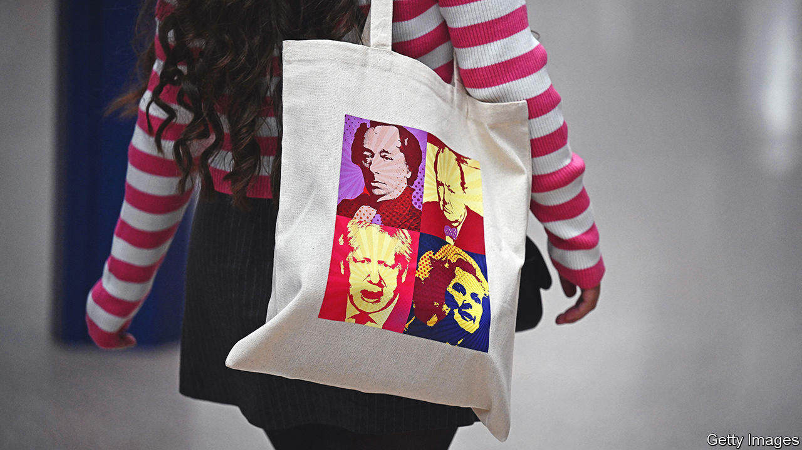

###### Conservative leadership contests

# Boris Johnson’s return to British politics crash-lands 

##### Big Dog has no bite 

 

> Oct 27th 2022 

In 1917 Lenin opted for a sealed carriage. In 2022 Boris Johnson chose British Airways flight ba2156 from the Dominican Republic. Liz Truss’s abrupt departure after six weeks as prime minister had left a power vacuum at the top of British politics. To show his willingness to serve, he cut short a holiday to the Caribbean, cramming himself into economy class, to canvass Tory mps. 

The return of “Big Dog”, Mr Johnson’s nickname when he was in Downing Street, started smaller dogs yapping. Brendan Clarke-Smith, the mp for Bassetlaw, was  about Mr Johnson’s return. “My reaction when the left are panicking, spitting feathers and frantically sending me abusive messages because we want to #BringBackBoris,” he wrote in a tweet. It was accompanied by a clip of Shaun Williamson, best known as a character on “EastEnders”, a soap opera, singing “Something Inside So Strong” and repeating the phrase: “We’re going to do it anyway.”

Unfortunately, Big Dog did not have the Big Mo. Candidates required the endorsement of 100 mps to be nominated. , the man whose resignation helped tip Mr Johnson from office, flew past that mark. Mr Johnson amassed only 61 supporters willing to call publicly for his return. Journalists were puzzled why they would keep quiet. “It’s because they don’t exist,” said one mp.

A return was always Mr Johnson’s plan. Dominic Cummings, still an astute observer of British politics if not always a reliable narrator, claimed Mr Johnson had offered Ms Truss tacit support in the knowledge she would probably blow up, clearing the way for a comeback. If true, the plan worked too well. Ms Truss exploded too soon; memories of Mr Johnson’s slapstick tenure were too fresh. 

Mr Johnson admitted defeat on the evening of October 23rd, having been back in Britain for only a few hours. He claimed (unverifiably) that he had 102 supporters, not even a third of Conservative mps. Although that would have been enough to get on the ballot, and probably to win among the Conservative Party’s membership, it would not have been enough to ensure his survival in Parliament. Tail between legs, he will have to wait for another opportunity.

