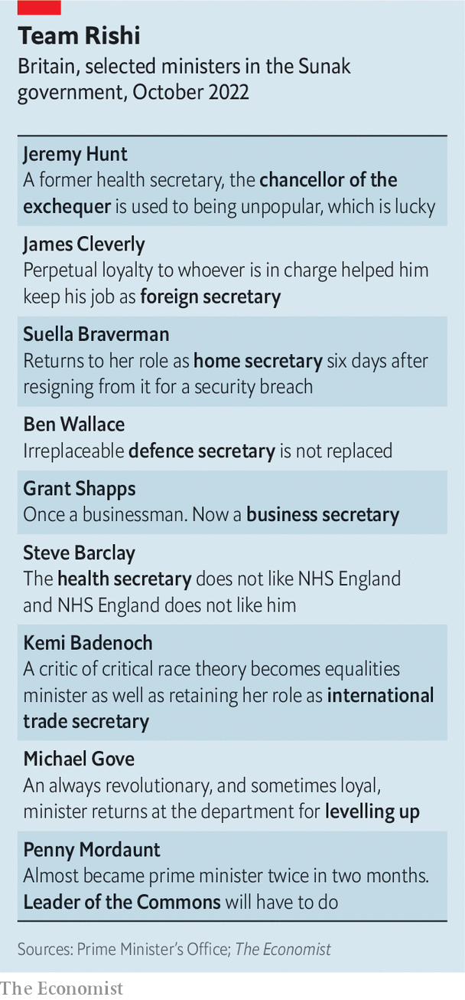

###### The man atop the rubble

# Rishi Sunak, Britain’s new prime minister, starts on the defensive 

##### After what happened to his predecessors, that is little surprise 

 

> Oct 27th 2022 

Britain has had a run of new prime ministers with bold agendas. From Theresa May to Boris Johnson to Liz Truss, each has announced plans to restitch the fabric of Britain by government edict. Each has been felled in short order by some combination of crisis, scandal and the Conservative backbenches. On October 25th  became the fifth Tory prime minister during their 12 years in power—and the third of 2022. He promised no such transformation. 

Instead Mr Sunak’s twofold task is to repair Britain’s public finances and to patch up Britons’ broken trust in the Conservative Party. His first address to the country from Downing Street was elegant but modest: shorn of ideological flair and fine rhetoric, short-termist in its goals and defensive in its posture. No longer does the government have a grand plan to remake Britain. Its own survival will be a victory of sorts. One poll, conducted just before Mr Sunak took office, gave the opposition Labour Party a 26-point lead.

 


The circumstances of his appointment explain these . Ms Truss announced her resignation as prime minister on October 20th, making her stint in charge the shortest in British history (see chart 1). The bond markets’ rejection of her mini-budget had shredded her authority. Mr Sunak was named as her successor as Conservative Party leader four days later without a ballot being cast, the only candidate to get the 100 nominations of MPs to enter the party’s contest. 

The next day, he accepted King Charles III’s invitation to form a government. The child of a doctor and a pharmacist of Indian descent, Mr Sunak is a first in a country that has never had a black or Asian prime minister. At 42 years old, he is also the youngest prime minister in two centuries, and has had the shortest parliamentary career of any since at least 1900 (see chart 2). Yet this is not the time for youthful idealism. Britain, he said on taking office, is “facing a profound economic crisis,” which he blamed on covid-19, the war in Ukraine and the “mistakes” of . It fell to him to fix them. 

 


On November 17th Jeremy Hunt, who remains chancellor, will unveil a package of tax cuts and spending rises designed to make good the post-Trussonomics hole that remains in the public finances. That hole has become a little smaller now that Ms Truss has gone: by October 26th the cost of government borrowing was close to the level it was at before her mini-budget, reducing the amount being shelled out on interest by the Treasury. But billions still need to be found to balance the books.

Mr Sunak describes these as “difficult decisions”. Yet they will also be a vindication. He spent the summer leadership contest warning that Ms Truss’s unfunded tax cuts were dangerous fairy tales. He approaches debt as a moral issue: Britons cannot leave their children “with a debt to settle that we were too weak to pay ourselves”. Although Mr Sunak added somewhere in the range of £310bn-410bn ($360bn-477bn) to government spending during the pandemic, his instincts are to shrink the size of the state. He believes the health service’s principal problem is poor management and inefficiency. Defence spending, foreign aid and working-age benefits are all on the table, as is the inflation-proof state pension. 

As he and Mr Hunt crunch the numbers, Mr Sunak must avoid being consumed by a party that, like some ancient civilisation, has developed a taste for sacrifice. His immediate predecessors used cabinet reshuffles to appoint loyalists. Mr Sunak’s top table is drawn from across the party’s factions. It is also experienced: 24 of 29 ministers attending cabinet have previously sat around that table; 15 have been given posts they held under Ms Truss or Mr Johnson.

 


The aim is to bring nous and stability, says Mr Sunak’s office. No bad thing, perhaps, after the merry-go-round of ministers this year (Gillian Keegan is the fifth education secretary of 2022). But it is a defensive move by a young prime minister whose party has become nigh-on ungovernable. It may also backfire.

As his fixer he has appointed Sir Gavin Williamson, fired from cabinet three years ago for leaking from the National Security Council. He returned Suella Braverman, a tribune of the populist right, to the role of home secretary, days after she was forced out of that role by Ms Truss for breaching the ministerial code. Ms Braverman had also declared that the government should commit to an old goal of reducing legal migration in absolute terms. By promoting her, Mr Sunak risks damaging his own reputation for integrity and surrendering control of his agenda. He has put unity before competence, and may get neither.

Mr Sunak’s own ability is less in doubt. His former colleagues at the Treasury confirm he is clever and fastidious. He will be courteous to the leaders of devolved governments in Scotland and Wales (Ms Truss never picked up the phone). During the summer campaign, he declared his greatest weakness to be perfectionism. That sounded like false modesty but it reflected a real flaw, says a cabinet minister: whereas a chancellor has time to prepare immaculate statements, a prime minister is permanently juggling imperfect decisions. 

But Mr Sunak’s greatest vulnerability lies in the fact that he is one of the winners from globalisation at a time when his party, and the country, have become much more animated by the fate of its losers. He met his wife, Akshata Murty, whose father founded Infosys, an Indian technology giant, while studying for an mba at Stanford University. He has worked at Goldman Sachs, a bank, and tci, a hedge fund. 

Earlier this year it emerged that Ms Murty was “non-domiciled” for tax purposes and that Mr Sunak had until recently held an American green card, allowing permanent residency in that country. His critics found both incidents politically naive. His response to scrutiny of his family’s financial and business interests was surprisingly thin-skinned. “Both Will Smith and me having our wives attacked—at least I didn’t get up and slap anybody,” he said at the time, a nod towards the actor’s assault of Chris Rock, a comic.

He is sometimes imagined as a social liberal, perhaps because of his youth, affection for “Star Wars” and millennial vibes (in a recent interview he described eating “a lot of gluten” as one of his “vices”). Yet his cv is straight from Tory central casting: Winchester College, Oxford University and the true-blue farming constituency of Richmond, in North Yorkshire. He owes his swift rise in part to backing “Leave” in the Brexit referendum of 2016. “Brexit became a test of faith that he passed, and his ascendancy was more rapid than it could or should have been,” says Tim Bale, a political scientist at Queen Mary, University of London. 

As his polling faltered in the summer’s contest against Liz Truss, he further embraced the right of the party. “I want to take on this lefty woke culture that seems to want to cancel our history, our values and our women,” he would say. He has given the job of equalities minister to Kemi Badenoch, a critic of critical race theory. 

Ms Truss’s downfall came about in part because she failed to account for the shallowness of her support within the party. Her dash for growth was unpopular among Conservative MPs representing seats in suburban and rural England. Mr Sunak will make no such mistake. Her plan to permit onshore shale-gas extraction has already been ditched, along with much of her supply-side agenda. During the summer, Mr Sunak promised to tighten Britain’s already-restrictive planning laws and to oppose onshore wind farms. 

He will instead govern according to the manifesto of 2019 on which Mr Johnson won his majority—a bright and inoffensive prospectus of more nurses and more policemen. This manifesto, Mr Sunak says, gives his party all the mandate they need to govern. That is an orthodox understanding of Britain’s parliamentary system, and one that means no election is strictly necessary before January 2025. 

But it is a contested one. Mr Sunak was compelled to rebuke Mr Johnson’s claim that he possessed a quasi-presidential mandate to return to office, saying the mandate of 2019 was “not the sole property of any one individual”. Sir Keir Starmer, the Labour leader, insists a general election is needed if he wishes to govern with authority. “The only time he ran in a competitive election, he got trounced by the former prime minister, who herself got beaten by a lettuce,” Sir Keir said on October 26th, a nod to Ms Truss’s absurdly short tenure. 

Polls suggest voters agree. As the work of repairing the public finances begins, and the Conservative Party’s brief moment of unity is tested, those calls for an election will get louder. The stability Mr Sunak seeks will be fragile. ■

