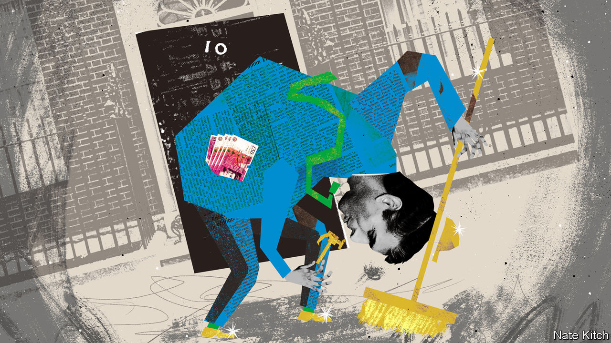

###### Bagehot

# Rishi Sunak’s first job? Clearing up the mess he helped make 

##### A clever man with a penchant for bad ideas 

 

> Oct 25th 2022 

Rishi Sunak entered Downing Street clutching an invisible dustpan and broom. “Mistakes were made,” declared the new  on October 25th, all but rolling up his sleeves. “I have been elected as leader of my party…to fix them.” The voice was passive but the identity of the culprit was clear—, Mr Sunak’s hapless predecessor, who managed just 49 days in the job. It is the morning after the night before in the Conservative Party. The grown-ups have returned to find the house has been trashed. Now Mr Sunak must start .

There is just one problem with this narrative. Mr Sunak is a cause of the problem as well as the solution. The new prime minister is helping tidy up a mess that he helped create. 

When the Conservative Party has erred in recent years, Mr Sunak has nearly always been in favour of the mistake rather than the fix. There were many reasons to support Britain leaving the eu. Mr Sunak, however, picked the worst one: he thought it was a cracking idea. Britain will be “freer, fairer and more prosperous outside,” wrote Mr Sunak in 2016. It was a pragmatic decision, not a romantic one. The fundamental problem at the heart of his own government will be a policy for which he long campaigned. Likewise, Mr Sunak was comfortable with a “no deal” Brexit so long as Britain actually left the EU. Mr Sunak has pledged a more constructive relationship with the bloc. Better not to have broken it at all.

After the  triggered three years of political deadlock, Mr Sunak supported an extraordinary solution to the mess: . That decision can be put down to cynicism. Mr Johnson was likely to win regardless of whether he was endorsed by Mr Sunak, at the time a junior minister in the department for local government. But intellectual contortions were required to join the bandwagon. Theresa May was competent and diligent yet also a total failure, ran Mr Sunak’s logic, so it did not matter that Mr Johnson was neither competent nor diligent. In July Mr Sunak resigned from his position as chancellor of the exchequer, prompting a cascade of ministerial departures that ended Mr Johnson’s reign. But why put him in Downing Street in the first place?

Mr Sunak embodies the tension between the Tories’ lust for low taxes and their habit of making big-state promises. Colossal spending programmes during the pandemic made Mr Sunak briefly the most popular politician in the country. Yet these were also the decisions he most resented; he tried to curtail schemes such as furlough prematurely in a bid to save cash. In the spring of this year, Mr Sunak similarly dragged his feet on offering support for ballooning energy bills. He is, at heart, a small-state Conservative, even if he has shown a commendable ability to overcome his natural instincts when urgent need arises.

If fiscal conservatism comes first for Mr Sunak, what comes after is much more erratic. As an ambitious backbencher Mr Sunak supported low-tax “freeports”, which shuffle economic activity around rather than generating it. As chancellor Mr Sunak championed the “Eat Out to Help Out” scheme, when the government in effect paid unvaccinated people to sit together during a pandemic and infect each other. Mr Sunak pushed the Royal Mint to issue a non-fungible token this summer, just as the market for these digital assets crashed. Support for quixotic policy is the norm for Mr Sunak rather than the exception.

In politics, however, luck sometimes masquerades as judgment. Losing the  to Ms Truss this summer was a big stroke of fortune. During that campaign Mr Sunak predicted that Ms Truss would be a disaster, and she was. He warned that reckless spending commitments would force mortgage rates higher; his campaign team even put together a calculator, pointing out the high bills that would hit households if rates hit even 5%. Yet mortgage rates were heading up regardless of Ms Truss’s rash budget. Her errors have obscured the fact that, had Mr Sunak won in the summer, rising interest rates would have left him with tricky questions to answer. Instead he can pin it all on Ms Truss. 

During the , and throughout his time on the front benches, Mr Sunak has taken a path long followed by the Conservative Party, which has governed in its narrow political interest rather than the national one. Pledges to curtail onshore wind and solar development please a few zealots but make it harder for Britain to reach its climate goals. Slashing fuel duty as chancellor provided a few days of positive headlines, but failed to put much money in people’s pockets and did not help the environment. There is little evidence that Mr Sunak will take on the vested interests, often in his own party, that hold back Britain’s economy. 

Standing on the shoulders of dwarves

The prime minister is a cut above most of his peers. But this is as much a function of a Conservative civil war that killed off competent colleagues as Mr Sunak’s own talents. Elected only in 2015, Mr Sunak has not been doing the job very long. Inexperience, even with copious intelligence, is always a problem. Yet the Conservative Party had nowhere else to turn. It would be comforting to think of Mr Sunak as a clever cynic, a gambler who bet big on Brexit and Mr Johnson and (with a helping hand from Ms Truss) became the youngest prime minister in two centuries. A more worrying analysis is that he is a bright and decent man with bad ideas.

On this reading Mr Sunak does not mark a change from the Tory policies that have left Britain in such a state. Rather he personifies them. The rot in the Conservative Party did not begin with Ms Truss. Britain’s departure from the EU, which Mr Sunak supported, is the thing that acts as a handbrake on the country’s economic prospects. Mr Johnson’s chaotic reign, which he also supported, caused even more ruin. It is the Conservative Party’s failure to take on its supporters that does so much damage to the country. Mr Sunak may be the only available man to fix the government’s errors. But he also helped make them. ■


