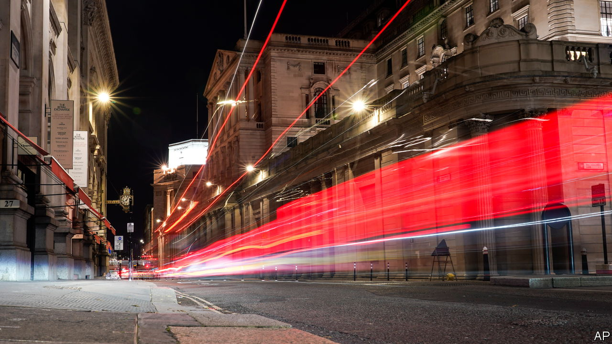
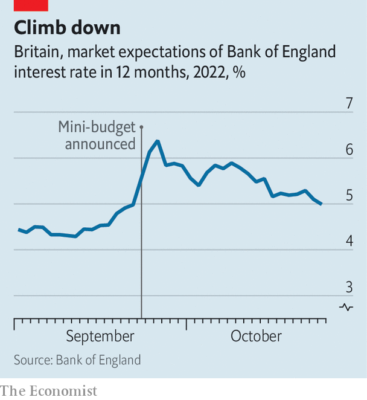

###### All in this together

# The Bank of England has seen off several threats 

##### But the path ahead remains perilous 

 

> Oct 27th 2022 

What a difference a month can make. On September 26th officials at the Bank of England were dealing with a toxic brew of high inflation, fiscal profligacy from a prime minister who wanted to revisit the bank’s mandate, and an incipient financial crisis. On October 26th a new prime minister was in place; the government was committed to; and calm prevailed in the financial markets. But the central bank, whose monetary-policy committee will meet on November 3rd, still faces daunting problems.

The bank’s biggest sigh of relief is over financial stability. After Liz Truss’s package of tax cuts was announced on September 23rd the price of long-term government debt, or gilts, fell sharply; that created havoc for pension funds and for managers of their money. By September 26th bank officials were seeing signs of a vicious spiral of falling asset values forcing asset sales, pushing values down further. An emergency bond-buying programme, which ended on October 14th, gave pension schemes a chance to get their house in order.

The bank also had to cope with the effects of Ms Truss’s expansionary fiscal policy. She had sought extra borrowing worth £72bn ($83bn; 3% of GDP) in the fiscal year up to April 2023, falling to £45bn in 2027-28 as the effects of energy-price support faded. That set up a tension between fiscal and monetary policy, one pressing hard on the accelerator and the other pushing down on the brake. 

 


Expectations that rate-setters would respond aggressively to the “mini-budget” helped to send mortgage rates higher. That rise—combined with the insistence of Andrew Bailey, the bank’s governor, that its bond-buying programme would not be extended—turned an economic problem into a political one. Ms Truss reversed most of her tax cuts, scaled back promises of help with energy bills and fell on her sword. Under , the new prime minister, fiscal policy will continue on that tighter path. Gilt yields have fallen as a result. Investors now expect the bank to raise interest rates from 2.25% to a peak of 5% by October 2023 (see chart). 

In a tumultuous set of circumstances, then, the bank has done pretty well. But the problem of rising prices is as testing as ever. Annual inflation in September was an eye-watering 10.1%. The government’s plan to scale back energy subsidies from April 2023 makes the outlook very cloudy. Even with recent falls in wholesale gas prices, Cornwall Insight, a consultancy, predicts that an uncapped annual average household bill in the second quarter of next year could be as high as £4,350, compared with around £3,500 now. 

The bank faces pressure from all sides. Sanjay Raja of Deutsche Bank says that questions linger among investors about its anti-inflation credentials, particularly since British policymakers have sounded more dovish than those in America and the euro area. If the bank does not raise rates as much as markets expect (a 0.75 percentage-point rise is anticipated in November), that could mean a weaker pound and more imported inflation.

The bank could also raise interest rates too sharply. Officials could be reasonably confident about the effects of a thumping fiscal stimulus, but the way a massive energy-price shock feeds through to domestic prices is less well understood. It is unclear how insistently workers will ask for wage increases, or how keenly companies will try to protect their profit margins. On October 20th Ben Broadbent, the Bank of England’s deputy governor, appeared to be trying to moderate expectations of hawkish policy, by suggesting that interest rates of over 5% would cause enormous damage to the economy.

A further problem is a tension between the bank’s inflation-fighting objectives and Mr Sunak’s quest for . Higher interest rates reduce the value of bonds that the bank bought to support the economy during the pandemic; that means losses when the bank starts selling those assets as part of its programme of “quantitative tightening”. As the Treasury has promised to cover any such losses, tens of billions of pounds each year will soon start flowing from the government to the bank. “That creates contractionary fiscal policy at a time when the economy is struggling most,” warns Chris Marsh of Exante Data, a research firm. 

As mortgages become more expensive and the economy weakens, the bank’s biggest challenge may be to persuade people that what they are doing to tame inflation is necessary. The point of central-bank independence is to take tough decisions without having to worry about political considerations. But if unelected rate-setters are seen to be imposing too much pain on the public, their autonomy may be questioned. The bank has passed several tests of its credibility in recent weeks. There are more to come. ■

