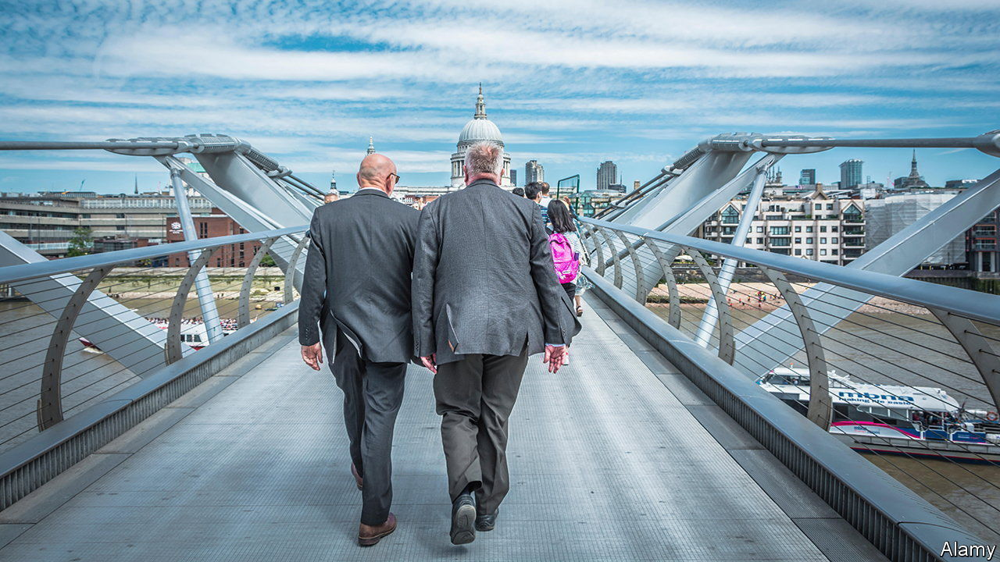
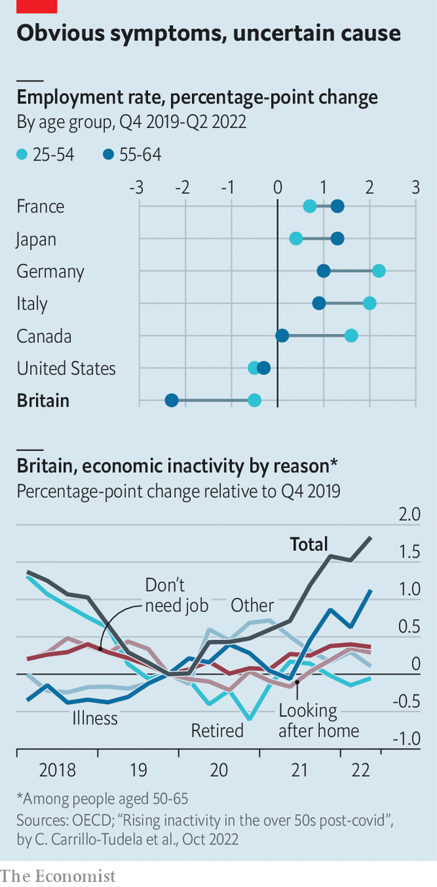

###### Different diagnoses

# Where did all Britain’s 50-somethings go? 

##### A debate rages about the relationship between health and economic inactivity 

 

> Oct 27th 2022 

THREE YEARS ago Brenda Pugh was at the zenith of a career in HR. Following a diagnosis of arthritis in February 2020, the nadir quickly followed. During an agonising wait for surgery Ms Pugh became housebound and was forced to give up the job she loved. By the time she had her second hip replacement 28 months later, it was too late to fix her twisted pelvis, “gammy knee” and plummeting confidence. The excruciating pain is gone, but so is the likelihood that she will return to work. 

 


Ms Pugh, who is now 62, is one of hundreds of thousands of British workers who have left the labour market in recent years. This exodus seems to be a peculiarly British problem; most other rich countries have seen their workforces rebound as they emerge from the pandemic (see top chart). The trend is particularly pronounced among . That is unwelcome news for policymakers: a smaller workforce means lower tax revenues and more pressure on inflation. But the question of what to do about rising levels of economic inactivity depends on what is causing it. And here debate rages.

Some reckon that Ms Pugh’s reasons for leaving work—ie, sickness—lie behind the broader trend. A recent study from the universities of Essex and Edinburgh, for example, finds that among 50- to 65-year-olds, more than half of the increase in inactivity since the end of 2019 is due to people reporting illness (see bottom chart). 

But if illness were forcing lots of people out of the workforce, it is hard to see why that might be. Some point the finger at covid-19 itself. Yet one survey of 50- to 64-year-olds suggests that long covid accounts for at most 1% of labour-force departures since the pandemic began. A more plausible theory is that the backlogs in the National Health Service (nhs) are to blame. Sprawling NHS waiting lists, which between February 2020 and August 2022 grew from around 4.4m to over 7m, mean that people like Ms Pugh are waiting years to start treatment. Yet of those over-50s leaving work since the pandemic started, only around one in five report that they are on an NHS .

Some think the finger is being pointed at the wrong culprit. On October 26th the Institute for Fiscal Studies, a think-tank, released research arguing that two separate phenomena, both of which have been at work since the pandemic, are being conflated. The first is that a growing number of older workers have been leaving paid work to take early retirement. The second is that an increasing proportion of 50- to 64-year-olds who were already out of work have recently been attributing their inactivity to sickness. Inactive people are falling sick, in other words, instead of sick people suddenly becoming inactive. 

Finding out where the truth lies is made harder by problems in the data. Researchers at the Bank of England have argued in the past that survey questions which compel respondents to choose either retirement or illness as the reason for leaving the labour force mask the true numbers of long-term sick. And when it comes to parsing the relationship between health care and employment, official NHS waiting-lists are only “the tip of the iceberg”, says Benjamin Ellis, a consultant rheumatologist at Versus Arthritis, a charity. 

Take heart problems, the most common health condition reported by workers who have recently become economically inactive. Britain is poor at rehabilitation for working-age adults, especially for pulmonary, neurological and cardiac conditions, says Nigel Edwards of the Nuffield Trust, a think-tank. Just 43% of NHS trusts meet the target of offering rehabilitation services to over 90% of their eligible patients who have suffered heart failures. In 2021 the numbers of people undergoing cardiac rehabilitation fell by a third; they are not on a waiting list but the prospects for their recovery are gloomier.

Whatever the reasons for people leaving the workforce in greater numbers, one thing that researchers do seem to agree on is that sickness is on the rise among the oldest working-age cohort. Even if ill-health is not causing people to drop out of the labour market, it is increasingly affecting their quality of life. ■

