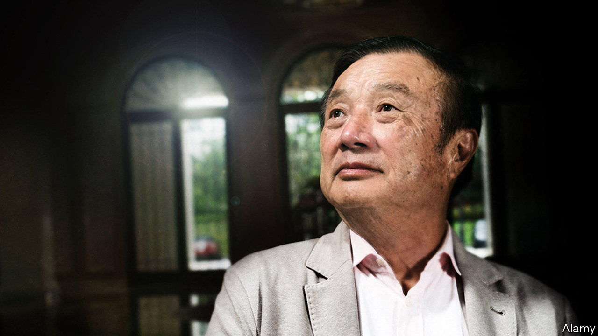
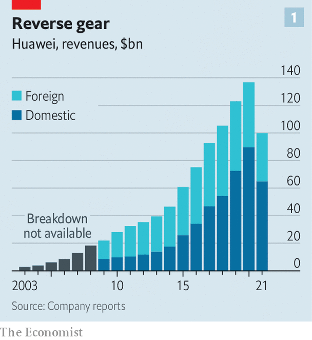
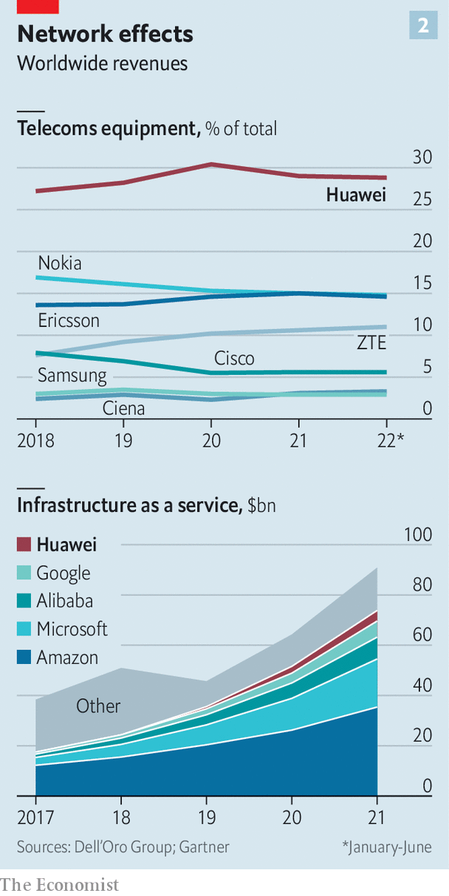

###### Ren-aissance

# Can Huawei thrive despite American sanctions? 

##### Ren Zhengfei, its boss, has big plans 

 

> Oct 25th 2022 

Huawei once looked unstoppable. Having begun life in 1987 selling phone switches from a flat in the southern city of Shenzhen, in 2012 the Chinese technology firm overtook Sweden’s Ericsson to become the world’s biggest maker of telecoms gear. By 2020 its market share topped 30%, roughly as much as Ericsson and Nokia of Finland, its two main rivals, combined. The same year it surpassed Samsung as the largest maker of smartphones. Its fast-growing software and cloud-computing businesses were beginning to compete with America’s ibm and Oracle.

The American government had other plans. Successive administrations have regarded Huawei as a national-security risk, claiming that it has deep links with the People’s Liberation Army and that its gear could be used for spying (allegations that have not been proven and that Huawei denies). The American government has banned Huawei’s wares at home and urged allies to ditch them from their 5g mobile networks. Most cripplingly, it used export controls to starve the company of American technology and products, including computer chips, on which many manufacturers rely. In the latest blow, on October 24th the Department of Justice said it had indicted two Chinese spies for attempting to obtain inside information about a federal investigation into Huawei.

 


All this has turned a company on track to be one of the world’s biggest into its most controversial. The results have been devastating. After years of uninterrupted growth Huawei’s sales collapsed by nearly 30% in 2021, from a peak of almost $140bn the year before (see chart 1). Huawei said on October 27th that the decline in the revenue of its devices business had slowed in the first nine months of 2022. Total revenue grew by about 6.5% in the third quarter, year on year. As countries across the globe roll out 5g, Huawei’s market share for telecoms networks—its main business—looks set to decline. Its international mobile-phone business is dead, insiders say. The company’s 78-year-old founder and boss, Ren Zhengfei, recently told employees in a leaked memo that the company was in a fight for survival. 

To prevail in that fight, Mr Ren is transforming the company from one laser-focused on a few core telecoms products to a provider of tech and services to a variety of industries, from carmaking to agribusiness. Whether this transformation can succeed matters not just for Huawei. America’s campaign to forestall China’s rise as a technological superpower is intensifying. This month Joe Biden’s administration announced new restrictions, covering more Chinese firms and more areas where Washington and Beijing are vying for dominance, such as artificial intelligence and supercomputing. Huawei is thus a case study in how effective American sanctions really are, how Chinese firms can adapt to the new world order and, ultimately, whether China has a shot at winning the tech race.

Immobile network

America’s first anti-Huawei weapon has been to block its global 5g roll-out. Geographically, the results have been mixed. America’s strategy is working in the rich Western markets of its allies. Australia, Canada, New Zealand and Sweden have followed America in banning Huawei gear outright. New rules in Britain force carriers to remove all Huawei technology from public 5g systems by 2027. France has asked operators to rip out Huawei gear from many parts of their networks. Other countries, such as Japan, have not barred Huawei but signalled that it is unwelcome. The constant risk of fresh restrictions has led many customers in places without bans to steer clear of Huawei. This has already happened in Italy and Portugal. 

The developing world still seems open to Huawei’s cheap equipment. The company is furnishing 5g networks in Indonesia, Saudi Arabia, South Africa and Turkey. Brazil, another potentially large market, has flip-flopped but does not appear poised to issue a ban. Huawei executives boast of more than 5,000 commercial 5g contracts globally, ranging from full deployment of 5g networks for national carriers to upgrading networks at ports. 

How many more such agreements it can sign depends in part on the effectiveness of American export controls, the second weapon deployed against Huawei. These restrictions, which since 2019 have limited the sale to the company of high-end chips and Google’s Android mobile operating system, have already obliterated the firm’s once-thriving smartphone business. Huawei’s own operating system, Harmony, is unattractive to consumers since it offers few apps, and it offers few apps because it lacks the consumer numbers that would make it worth developers’ while. The chip ban, meanwhile, means that even though it has built much of China’s 5g infrastructure, its phones lack 5g because the required radio chips rely on American tech. This forced Huawei to spin off its Honor smartphone brand in 2020. Revenues from Huawei’s remaining devices business fell by 25% in the first half of 2022, compared with a year earlier.

The impact of the chip ban on the carrier business is a closely guarded secret. The processors used in network gear are less advanced than those used in smartphones, and some of them could be produced locally by chipmakers such as smic, a state-controlled firm. But probably not all, at least in the near future. The Tiangang processor, designed by Huawei’s HiSilicon chip division for use in 5g networks, was fabricated by tsmc, a giant Taiwanese contract manufacturer that can no longer supply Huawei as a result of the American rules. Publicly, Huawei claims to be shipping units as normal, thanks to a stockpile. But that “will start to run out very shortly”, predicts Bill Ray of Gartner, a consultancy. 

The company’s behaviour in tenders for carrier contracts suggests as much. In the past 18 months Huawei has routinely bid the highest allowed price. This implies that it is trying to maximise profits while conserving its component inventories rather than seeking market share, says Edison Lee of Jefferies, an investment bank. According to disclosures on a large tender for China Mobile analysed by Jefferies, Huawei equipment accounts for 47% of China Mobile’s locally manufactured servers, down from 61% last year.

 


Globally, the company’s share of telecoms-gear revenues has so far declined by less than two percentage points from its peak of more than 30% in 2020, according to Dell’Oro, a research firm (see chart 2). But Huawei’s global sales of such equipment still fell by 7% last year. Much of its remaining revenue comes from China and, abroad, from less lucrative 4g networks, which are still being built in poorer countries. As investment in China’s 5g roll-out winds down, moreover, Huawei’s global market share may be eroded further, points out Stefan Pongratz of Dell’Oro. The idea of saving the foreign 5g business by selling its intellectual property to a Western owner, which Mr Ren entertained in an interview with  in 2019, appears to have been shelved. 

Mr Ren nevertheless remains undaunted. His leaked memo in late August, in which he asks staff to “feel the chill” brought on by gloomy economic conditions in China and abroad, should be read not as an act of despair but as his way of rallying the troops, insist some executives. And there is plenty for Mr Ren’s troops to rally round. He wants Huawei to become a purveyor of technology to a wide spectrum of industries. It has already sold 300m devices running on Harmony, including laptops, wearables such as smart watches and app-controlled home appliances. This month the  reported that it may attempt to relaunch the production of 5g phones using less advanced chips. 

And it is venturing beyond gadgets and telecoms. It is making sensors to monitor soil conditions to help farmers fine-tune irrigation systems and cut back on fertiliser. It is building a business in systems for clean-power generation. It has also become a big supplier of software and electronics for carmakers, with which it has teamed up to develop various bespoke systems, such as energy management for electric vehicles. Huawei says that in July alone it had sold more than 7,200 aito m5s, a model of car jointly developed with Seres, a Chinese-owned electric-vehicle maker based in California.

It is also expanding its enterprise division. The unit is building data centres and cloud-computing businesses around the world. Its prospects look strong in China, where the chief source of demand over the next decade will be the government (as provincial and city authorities upgrade their systems to offer more public services online) and state-owned firms (which are frantically digitising and installing the industrial “internet of things”). 

The rise of IaaS men

Huawei does not enjoy a technical advantage in such “infrastructure as a service” (IaaS) over giant local rivals like Alibaba and Tencent. But it has the government connections needed to win the juiciest contracts, says Yi Zhang of Canalys, a research firm. In just a few years this has helped Huawei become the second-largest cloud provider in China, behind Alibaba. Many Chinese firms are tossing out Oracle databases and asking Chinese companies to build local ones. Huawei is scooping up this business. As revenues from devices tumbled in the first half of 2022, its overall sales from the enterprise division surged by 28% to 55bn yuan ($7.6bn), or about 18% of total revenues. Gartner reckons that Huawei has become the world’s fifth-largest IaaS provider. 

Maintaining a presence in foreign markets poses a bigger challenge. Mr Ren has long understood the importance of grabbing global market share. In the late 1990s he began deploying staff to far-flung places in Africa and South America to forge local connections. The strategy helped make Huawei China’s first genuinely multinational corporation. Huawei’s new businesses are not expected to make headway in America. But the company thinks much of the rest of the world is fair game. Its energy-management products are growing fast in Europe. One insider points out that over the past three years Huawei has been building up its foreign iaas engineering capabilities in Africa, Latin America, the Middle East and South-East Asia. 

However, barriers to entry in such businesses are high even in places that welcome Huawei. Much of the world’s information technology runs on software from Microsoft, an American giant. Huawei’s databases use Linux, an open-source operating system. The technical difficulty of installing Huawei to replace American systems that run on Oracle’s and ibm’s products, which are much more compatible with Microsoft’s, is high, says Boris Van of Bernstein, a broker. Edging out the American firms in China is one thing; doing so abroad is quite another. And although Mr Ren has amassed heaps of chips needed for its enterprise products, the new American rules will make these harder to replenish.

Taken together the changes amount to a revolution in how Huawei functions as a business. In the past its sprawling research-and-development (r&amp;d) operation dreamed up new technologies, its engineers developed them into a limited range of core products and its sales team sold those to customers in two main sectors: telecoms and consumer electronics. This one-way end-to-end system is being replaced by a more open, two-way model, where Huawei develops products in partnership with its growing array of client industries. People close to the group say it now resembles a vast web of startups with deep r&amp;d coffers. The company often spends 20% of annual revenues on r&amp;d, the same share as Meta and nearly twice as much as Alphabet. That amounts to about $122bn over the past decade.

Mr Ren could yet pull off the transformation. His company’s 100,000 engineers have an enviable record of inventiveness. Yet it is hard to imagine Huawei regaining its global clout, especially as President Xi Jinping consolidates his power and ratchets up tensions with the West. 

On October 24th, after Mr Xi named a team of loyalists to run the country for the next five years, investors fled Chinese stocks. Hong Kong’s Hang Seng index fell by more than 6%. Many big tech companies  10-20% of their value. Alibaba’s shares were trading at below the price at the e-emporium’s initial public offering in 2014.

As a private company, part-owned by its employees, Huawei is not directly affected by the stockmarket turmoil. But it is not immune to the geopolitical gales buffeting public markets. Rather than the next Apple or Microsoft, Huawei’s new ventures may eventually look a bit more like Accenture, an American-listed firm that advises companies on technology transitions, says Mr Van. That would not be all bad: Accenture has a market capitalisation of $185bn. But it is far more modest than Huawei’s multitrillion-dollar global promise of yore. ■


