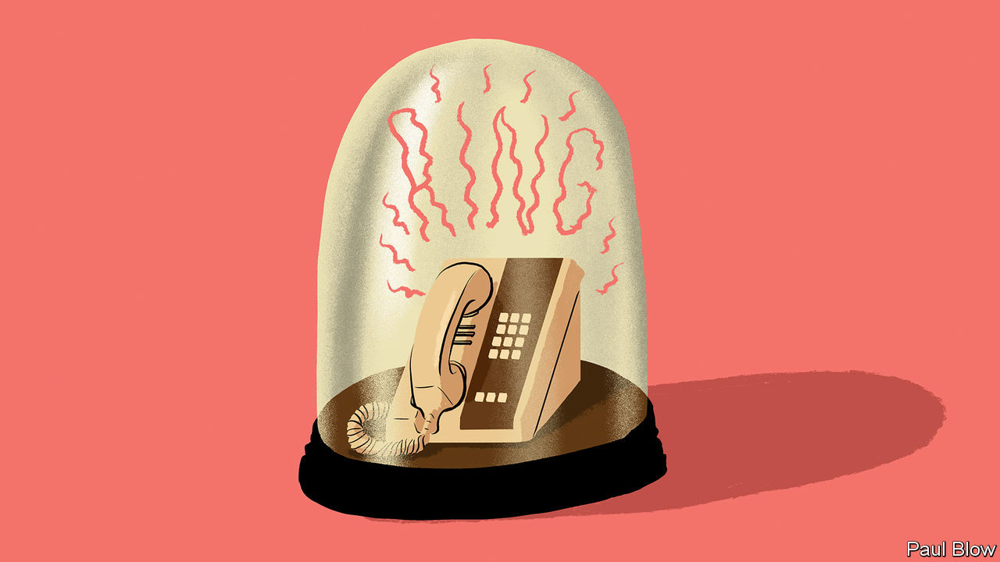

###### Bartleby

# The archaeology of the office 

##### A walk around the workplace is also a trip back in time 

 

> Oct 27th 2022 

The office is where colleagues meet, work and bond. But it is also a time capsule, a place where the imprint of historic patterns of working are visible everywhere. The pandemic has heightened this sense of the office as a dig site for corporate archaeologists. It isn’t just that covid-19 has left its own trace in the fossil record, from hand sanitisers to social-distancing stickers. It is also that items which were useful in the pre-covid world make less sense now; and that things which were already looking quaint seem positively antiquated. 

The most obvious artefact is the landline phone, a reminder of the days when mobility meant being able to stand up and keep talking. Long after people have junked them in their personal lives—less than 15% of Americans aged between 25 and 34 had one at home in the second half of 2021, according to the Centres for Disease Control and Prevention—landline phones survive in offices. 

There might be good theoretical reasons for this persistence: they offer a more secure and stable connection than mobile phones, and no one frets that they are about to run out of battery. In practice the habit of using them was definitively lost during the pandemic. Now they sit on desk after desk, rows of buttons unpressed, ringtones unheard, cords tellingly unknotted.

Landlines were already well on their way out before covid-19 struck. Flipboard charts have suffered a swifter reverse. These objects signal a particular type of torture—people physically crowded together into a room while an idiot sketches a quadrant with a marker pen and points meaningfully to the top-right-hand corner. The idiot is still making quadrants but is now much more likely to use a slide deck. The crowd is still being tortured but is now much more likely to be watching on a screen. The office still has flipboards, but they are stowed in corners and their topmost pages are slowly yellowing.

If your office still uses internal mail, with those special envelopes that have people’s names crossed out as they wend their way round an organisation, you are in a corporate period drama. But most offices still retain clues to the historical importance of paper. Photocopiers, scanners, shredders, guillotines and unfeasibly large staplers are echoes of a not-too-distant time when physical documents were a vital currency, when people assembled in a single room and shared ideas on pieces of paper. 

In-trays and out-trays are visible reminders of how information used to flow within organisations. Noticeboards and business cards were once the best ways to convey news and contact details. Forecasts of the paperless office have been around for decades; they are not about to come true now. But the stationery cupboard will be less well stocked in future. 

Meetings between people in the office and those working remotely rely today on platforms like Zoom or Microsoft Teams. Hunt around, though, and you may find an object that was seen as useful back in those dim and distant days of 2019: the conference-call speakerphone. Looking a bit like a small spacecraft, this phone had to be plugged into a socket to work. Lights would suddenly blink, and people would murmur in awe. Someone would dial in, each button-press a loud beep. They would inevitably hit the wrong one at some point and have to start again. These rituals and others are now rarely performed; the phones themselves are gathering dust on shelves, left behind by better technology and the abrupt rise of remote working. 

The very layout of many offices is a throwback to a pre-pandemic age. If you work in a place filled with identikit cubicles, still have your own nameplate or sit at a desk tethered to the floor by a digestive system’s worth of cabling, you are in an environment that made sense when the whole workforce came to the office every day, even if they just got on with their own work in silence. Now that the office’s comparative advantage is as a place to collaborate with other people, socialising, sofas and hot-desking are seen as the future. 

Real archaeologists need tools and time to do their painstaking work: paint brushes, trowels, sieves and picks. Corporate archaeology is easier: you just need eyes and a memory of how things used to be. But you also need to be quick. As more and more workplaces are revamped for the hybrid era, now is the time to take a careful look around the office. You may see something that will soon seem as dated as pneumatic tubes, typewriters and fax machines.


