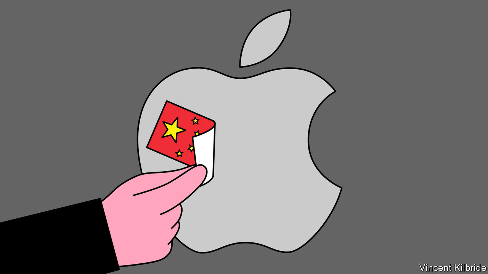
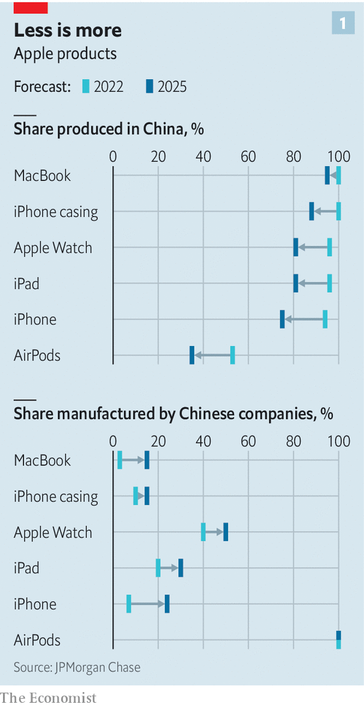
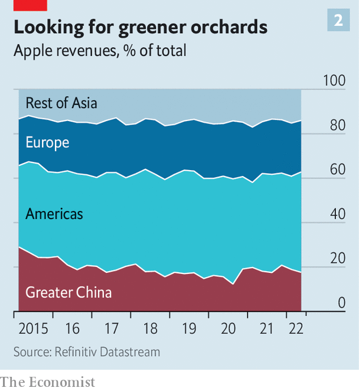

###### No longer so fruitful

# The end of Apple’s affair with China 

##### Covid-19, costs and geopolitics are driving the iPhone-maker to manufacture and sell its gadgets elsewhere 

 

> Oct 24th 2022 

By a dusty stretch of the deafening road from Chennai to Bengaluru lie three colossal, anonymous buildings. Inside, away from the din of traffic, is a high-tech facility operated by Foxconn, a Taiwanese manufacturer. A short drive away Pegatron, another Taiwanese tech firm, has erected a vast new factory of its own. Salcomp, a Finnish gadget-maker, has set one up not far away. Farther west is a 500-acre campus run by Tata, an Indian conglomerate. What these closely guarded facilities have in common is their client: a demanding and secretive American firm known locally as “the fruit company”. 

The mushrooming of factories in southern India marks a new chapter for the world’s biggest technology company. ’s extraordinarily successful past two decades—revenue up 70-fold, share price up 600-fold, a market value of $2.4trn—is partly the result of a big bet on China. Apple banked on China-based factories, which now churn out more than 90% of its products, and wooed Chinese consumers, who in some years contributed up to a quarter of its revenue. Yet economic and geopolitical shifts are forcing the company to begin a hurried decoupling. Its turn away from China marks a big shift for Apple, and is emblematic of an even bigger one for the world economy.

Apple’s packaging proclaims “Designed by Apple in California”, but its gadgets are assembled along a supply chain that stretches from Amazonas to Zhejiang. At the centre is China, where 150 of Apple’s biggest suppliers operate production facilities. Tim Cook, who was Apple’s head of operations before he became chief executive in 2011, pioneered the firm’s approach to contract manufacturing. A regular visitor to , Mr Cook has maintained good relations with the Chinese government, obeying its requirements to remove apps and to hold Chinese users’ data locally, where it is available to the authorities.

Now a change is under way. Big tech is showing strains. On October 25th Alphabet and Microsoft presented disappointing quarterly results. Meta, which lost another fifth of its value after reporting the second straight quarter of declining sales, is a shadow of its former self. Apple’s latest earnings, due out after  went to press on October 27th, may be dented by creaky Chinese supply chains and softening demand from Chinese consumers. So Mr Cook, who has not been seen in China since 2019, is wooing new partners. In May he entertained Vietnam’s prime minister, Pham Minh Chinh, at Apple’s futuristic headquarters. Next year Apple is expected to open its first physical store in India (whose prime minister, Narendra Modi, is a fan of gold iPhones). 

 


The two countries are the main beneficiaries of Apple’s strategic shift. In 2017 Apple listed 18 large suppliers in India and Vietnam; last year it had 37. In September, to much local fanfare, Apple started making its new iPhone 14 in India, where it had previously made only older models. The previous month it was reported that Apple would soon start making its MacBook laptops in Vietnam. Some of Apple’s newer gadgets show the way things are going. Almost half its AirPod earphones are made in Vietnam and by 2025 two-thirds will be, forecasts JPMorgan Chase. The bank reckons that, whereas today less than 5% of Apple’s products are made outside China, by 2025 the figure will be 25% (see chart 1). 

As Apple’s production system is shifting, its suppliers are diversifying away from China, too. One crude measure of this is the share of long-term assets that Taiwanese tech-hardware and electronics firms have located in China. In 2017 the average figure was 43%. Last year that had fallen to 31%, according to our estimates using company and Bloomberg data. 

The most urgent reason for the scramble is the need to spread operational risk. Two decades ago the garment industry beefed up its operations outside China after the sars epidemic paralysed supply chains. “sars made it very clear to everyone operating in China that you needed a ‘China+1’ strategy,” observes Dominic Scriven of Dragon Capital, an investment firm in Vietnam. Covid taught tech firms the same lesson. Lockdowns in Shanghai in the spring temporarily shut a factory run by Quanta, a Taiwanese firm, believed to be making most of Apple’s MacBooks. Avoiding this kind of chaos is the “primary driving force” for Apple’s supply-chain moves, says Gokul Hariharan of JPMorgan Chase.

Another motive is containing costs. Average wages in China have doubled in the past decade. By 2020 a Chinese manufacturing worker typically earned $530 a month, about twice as much as one in India or Vietnam, according to a survey by JETRO, a Japanese industry body. India’s ropey infrastructure, with bad roads and an unreliable electrical grid, held the country back. But it has improved, and the Indian government has sweetened the deal with subsidies. Vietnam offers tax rebates and holidays, too, as well as free-trade deals, including one recently signed with the eu. Bureaucracy around visas and customs remains a pain. But the work ethic is similar to that in China: “Confucius still gets them out of bed in the morning,” says one foreign executive in Vietnam.

Apple also increasingly sees locals as potential customers, particularly in India, the world’s second-largest smartphone market. Though iGadgets are too pricey for most Indians, that is changing. Apple said in July that its revenues in India had nearly doubled in the past quarter, year on year, driven by the “engine” of iPhone sales. 

 


This is diminishing China’s relative importance as a consumer market. At its high point in 2015, China accounted for 25% of Apple’s annual sales, more than Europe. Since then its share has steadily shrunk, to 19% so far this financial year (see chart 2). By the sounds of it Xi Jinping, China’s president, would like it to fall further. At a Communist Party shindig on October 16th he urged “self-reliance and strength in science and technology”, suggesting that foreign importers may face stiffer competition from Chinese national champions. He repeated the phrase five times.

An iWire act

This points to perhaps the biggest reason for Apple’s shift: geopolitics. Rising Sino-American tensions are making China an awkward place to do business. Heightened Chinese sensitivity is adding friction. This summer Apple reportedly had to ask Taiwanese manufacturers to label their products “Made in Chinese Taipei” to appease newly finicky Chinese customs officials (at the risk of angering Taiwanese ones). 

America, for its part, has become more aggressive in its competition with China’s domestic tech industry. On October 7th America announced a ban on “us persons” working for some Chinese chipmakers. On the same day it added 30 Chinese companies to a list of “unverified” firms its officials had been unable to inspect. Apple had reportedly been about to sign a deal to buy iPhone memory chips from one such company, ymtc, which can offer low prices thanks in part to Chinese government subsidies. Following America’s export controls that deal was put on ice, according to , a Japanese newspaper.

The question is whether shifting production out of China will be enough to avoid future crackdowns. Even as Apple makes more of its gadgets outside China, it is no less reliant on Chinese-owned companies to build them. Chinese manufacturers such as Luxshare, Goertek and Wingtech are taking an increasing share of Apple’s business beyond China’s borders. 

Luxshare and Goertek are reported to be making AirPods in Vietnam, helped by the fact that some Taiwanese rivals, like Inventec, have scaled back their work for Apple in recent years. In September press reports hinted that the Indian government might let some Chinese companies set up production facilities in India. Chinese companies’ share of iPhone electronics production will rise from 7% this year to 24% by 2025, believes JPMorgan Chase, which predicts that in the next three years Chinese companies will increase their share of production across Apple’s range of products.

Could Chinese manufacturers outside China be targeted by American sanctions? For now this is unlikely, believes Nana Li of Impax, an asset manager. “There are no handy alternative [suppliers] available with the same level of experience, efficiency and cost-effectiveness,” so cutting them off would hurt American firms, she notes. In time, that may change. Countries like India and Vietnam are keen to cultivate their own suppliers. Tata is reportedly in talks with Wistron, a Taiwanese manufacturer, about making iPhones in India. Indian firms report that “the fruit company” is discreetly on the hunt for local suppliers. 

Given the growing rift between America and China, it is sensible for Apple to place some side-bets, before restrictions go any further. Chinese firms outside China are safe for now, says one Western investor in Asia. But “the noose is tightening”. ■


