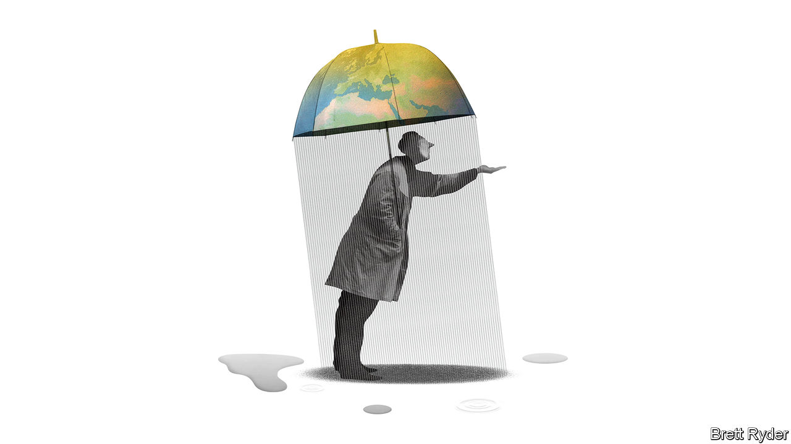

###### Schumpeter

# The reluctant rise of the diplomat CEO 

##### Elon Musk wants to be a statesman. Most bosses would rather not 

 

> Oct 27th 2022 

The corporate jets descended on Riyadh this week, ferrying chief executives to the Future Investment Initiative, a talkfest nicknamed “Davos in the Desert”. A feud between the American and Saudi governments over an oil-production cut by the opec+ cartel, a move which benefits fellow member Russia, was not enough to keep away the bosses of giant American banks like JPMorgan Chase and Goldman Sachs. Nor was the kingdom’s record of human-rights abuses. 

Like diplomats, chief executives often deal with unsavoury regimes. The two groups have other things in common. For one thing, both are invited to talk on panels with titles like “The New Global Order” (an example from this week’s junket). Both also spend lots of time jetting around the world. Some ceos even end up becoming statesmen. Rex Tillerson, the former boss of ExxonMobil, an oil giant, served as America’s secretary of state under Donald Trump. Others fancy themselves as latter-day Kissingers. Elon Musk, the world’s richest man, recently put forward a peace proposal for Ukraine and recommended that Taiwan become a “special administrative zone” of China. Jamie Dimon, boss of JPMorgan Chase, opined this week that America should stop pursuing an “everything our way” attitude towards Saudi Arabia.

While bosses are busy encroaching on foreign affairs, foreign affairs are gradually encroaching on them. The result is a tangle. Western politicians—along with consumers and employees—now want companies to speak out against issues like China’s treatment of its Uyghur minority in Xinjiang. Increasingly boycott-prone consumers in China, meanwhile, have become highly sensitive towards any perceived criticism of their government. A muted statement by Nike, a sportswear brand, noting that it was “concerned about reports of forced labour” in Xinjiang was enough to cause a social-media outcry in China and a temporary slump in sales. For H&amp;M, a fashion retailer that also stated concern and cut supply ties with the region, retaliation was even harsher. The business was purged from Chinese online retailers and its store locations removed from various map services, a blow from which its China business has still not recovered.

In the years after the Soviet Union’s collapse, the consensus in the West was that greater economic integration would bring prosperity and political liberalisation to countries with oppressive governments. In such a world, global expansion would not just be good for business; it would be good for peace and democracy, too. But reality has turned out differently. The share of global gdp accounted for by autocracies has gone the wrong way, up from around 10% in 2000 to 30% today, with China accounting for about half that increase. This has left bosses in the unenviable position of weighing the value to be gained from cosying up to oppressive regimes against the losses associated with the reputational risk and cost to their consciences.

Sometimes standing on principle is easy. Russia represents less than 2% of global gdp, a smaller share than Canada, and has grown sluggishly in recent decades. Few multinationals are reliant on it either as an end market or a production location, which explains the decisiveness with which many abandoned the country after its invasion of Ukraine. Jeffrey Sonnenfeld and colleagues at Yale University have identified over 1,000 companies that have curtailed their Russian operations beyond the minimum required by international sanctions. Saudi Arabia is faster-growing but an even smaller market. Some multinationals are present there, often because of its importance in global oil markets. But if Saudi-American relations were to sour further, more might leave.

Things get considerably more difficult when it comes to the planet’s second-biggest economy. China is not only the world’s manufacturer, but also an important consumer market. The fact that it represents nearly 40% of global car sales and is Volkswagen’s largest market helps explain why Oliver Blume, the German carmaker’s new boss, recently dismissed calls to close its factory in Xinjiang, a decision he described as “taking our values to the world”. In response, the , a Communist Party mouthpiece, praised Volkswagen’s “pragmatic spirit of win-win co-operation”. Jamie Dimon had to apologise (twice) for an off-the-cuff comment last year that JPMorgan Chase would outlive the Chinese Communist Party. 

The problem with easy cases like Russia is that they make the knotty Chinese case knottier still. ceos who play moralists with respect to Vladimir Putin are hard-pressed to justify—in ethical terms, if not financial ones—why they embrace realpolitik when it comes to Xi Jinping. Mr Putin’s war crimes are atrocious, but are they different in kind from the mistreatment of Uyghurs, which the Biden administration has called “genocide”?

Sitting out the great game

This is the sort of diplomatic conundrum that most ceos (possibly with the exception of Mr Musk) would rather leave to real Kissingers. Helpfully, the professionals are increasingly obliging. As Western governments re-evaluate their relations with autocracies like Russia and China, they are making more of the hard choices on bosses’ behalf, by enticing producers to their shores and prohibiting some activities abroad. On October 24th Pat Gelsinger, who runs Intel, described himself as an “advocate” of restrictions just placed by the American government on his industry to limit sales of advanced computing chips and chipmaking tools to China (the chipmaker also gets subsidies to shift production to America). The Uyghur Forced Labour Prevention Act, which empowers American border authorities to seize products made in Xinjiang, gives bosses an excuse for severing supply links to the region. Whatever their ethical or geopolitical merits, such policies are not necessarily the best outcome for bottom lines and shareholders. But for the harried diplomat ceo, they are a blessing. ■


