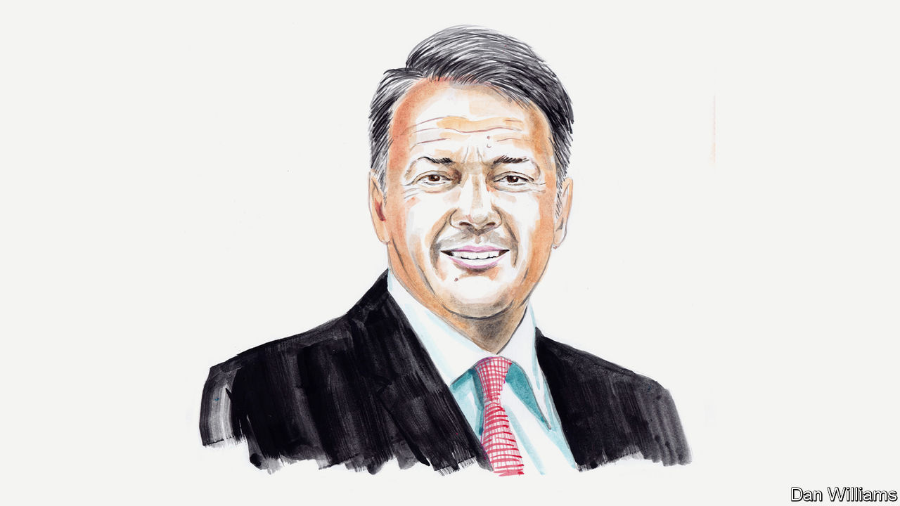

###### From Italy with love

# The bill for campaign populism is paid in office, warns Matteo Renzi 

##### Advice from Italy’s former prime minister to Britain’s new one 

 

> Oct 26th 2022 

ITALY IS A wonderful country. Personally, I think it is the most beautiful country in the world. Goods made in Italy have long been exported to all corners of the planet. From fashion to food, from mechanics to innovation, we have enjoyed success right across the globe. Yet, even an unconditional fan of Italy, such as myself, could never have imagined that one day we would also export the very worst of “Made in Italy”: political instability.

Unbelievably we have exported it to Britain, long a beacon of democracy and robust institutions. Amazingly, this has actually happened. I was Italy’s prime minister for almost three years, but my government is one of the longest-lasting in the history of the Republic, taking fourth place so far in the rankings of the 68 governments that have governed modern Italy. What we call “longevity” in Italy is known as “instability” in the rest of the world. 

This Italian political weakness seems to have found a home in the UK. We might take an ironic view of  covers, pizza and spaghetti, but the truth is the institutional similarities are striking. Since I took the reins in Italy eight years ago, the country has had five prime ministers. For political insiders, this is hardly earth-shattering news. What is surprising is that 10 Downing Street has also had five tenants: David Cameron, Theresa May, Boris Johnson, Liz Truss and now Rishi Sunak. 

London, do we have a problem? Yes. We have a problem. Your problem. 

But if we look closely, the real problem we need to deal with is the crisis of democracy—a global crisis, not just an Italian or British issue. From Japan to America, the signs of this profound erosion of democratic strength are clear. 

For those like me who grew up with tales of exporting democracy, it might be hard, but we must admit that democracy is struggling and, to borrow from America’s former secretary of state, Condoleezza Rice, “authoritarian envy” is real. Some non-democratic, but enlightened countries seem better able to deal with the challenges of the contemporary world. Like it or not, this is how things stand. 

We are living a paradox. Social media makes us put “likes” everywhere. We vote constantly, expressing ourselves on Twitter, on Facebook, on Twitter again. And then on Instagram, of course. This is the state of here and now. But votes, polls and likes—they last seemingly a mere second. Such interactions hurt our politics, however. Some politicians are increasingly focused on the day-to-day, the fleeting moment, the current instant. They look less and less to the long term. Some politicians no longer consider the next generation, or even the next election—only the next tweet. 

We desperately need political leaders, but we see so many, too many, political followers. We face a dilemma. Will Britain’s new government be able to restore meaning, value and prestige to the word democracy? 

Clearly Mr Sunak’s government will work on aspects that most directly interest citizens. It will also focus on the economic, military, demographic and cultural crisis enveloping Europe. Undoubtedly in Brussels (and in Paris and Rome) we will keep trying to guess what is going to happen in the years ahead. There is a divide between those who dream of Britain returning unexpectedly to a new, different, changed Europe with far less bureaucracy, and those who look forward to the consequences of any spectacular new Scottish referendum. 

In truth, each of us in Europe is watching the birth of the new British government with mixed emotions. Some see irony as Britain can no longer lecture others about stability. Others worry because if Britain is unable to face its problems, in a few years, its issues will no longer be democratic, but social and economic. And the difficulties definitely will not be confined to the other side of the English Channel. Strong voices say that without a thorough overhaul of its institutional rules, the EU—Italy included—has no future, merely a glorious past to mourn nostalgically. We want Europe to be more like a startup than a dusty old photo album. 

Many still believe in politics with firm conviction. That means not giving in to pessimism or leaving a future of regrets. It is about making choices right now that can affect everything around us, from fighting a microscopic virus to conquering infinite space. To do this we need politicians who bet on education, culture and research. Not populists who ride the momentum of the moment. 

The sad tale of Ms Truss teaches us that when campaigning, one can afford the luxury of populism. But once in power, populist choices have to be paid for. More often than not, it is the people who pay. This time they were landed with a prime minister who lasted a mere 45 days. This is such a staggering record that not even an Italian can top it. 

We need visionary leaders, not mediocre followers. Can democracies still recognise, select and appreciate people of such calibre? This is the big question of the next few years. And not only in London. ■

_______________


