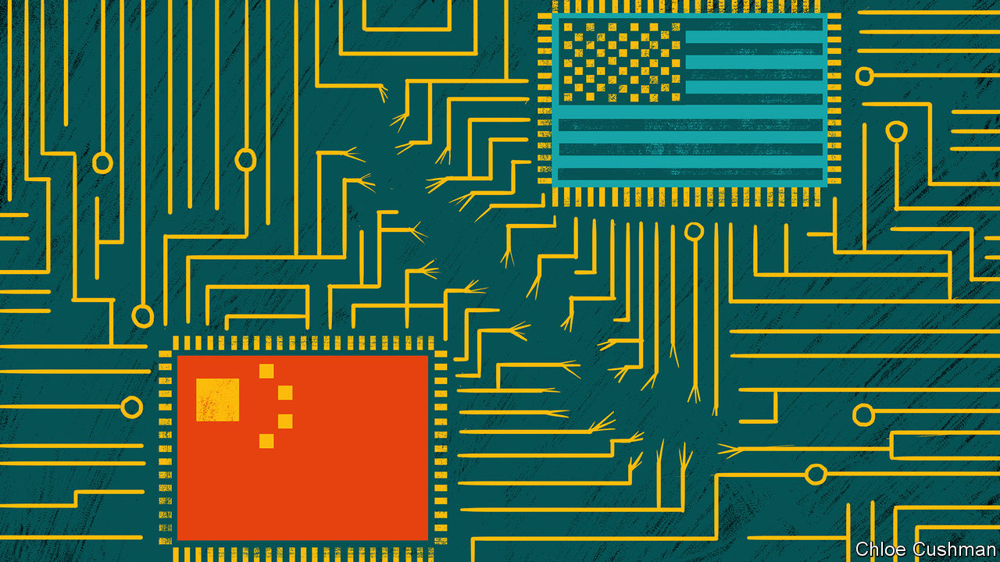

###### Chaguan

# China and America are barely speaking, though crises loom 

##### A comfortless calm reigns, but a storm is coming 

 

> Oct 27th 2022 

During Donald Trump’s four years in the White House, tempests buffeted relations between America and China. There was a , backed by presidential tweets “hereby” ordering American businesses to leave China. There was also mutual finger-pointing over the origins of covid-19, including conspiracy theories, promoted by Chinese diplomats, that the virus began in an American military laboratory. In 2020 Mr Trump’s secretary of state, Mike Pompeo, urged his country to see clearly its differences with the “bankrupt, totalitarian” ideology of the Communist Party, and to empower the Chinese people to “induce China to change”. That speech is not forgotten in Beijing, where party leaders heard a call for their overthrow.

Today, a chilly, comfortless calm reigns. The powers resemble rival battle-fleets, navigating seas filled with icebergs and other half-understood dangers. Fresh ice was sighted during the Communist Party congress which ended on October 22nd. A day later Xi Jinping was crowned as party chief for a third term, and possibly for life. Mr Xi’s report to the congress catalogued threats to national security, including attempts by unnamed forces (meaning America, above all) to sabotage, subvert and contain China’s rise. He stressed the need for China to show a fighting spirit and achieve greater self-reliance, especially in core technologies. 

Mr Xi’s  was months in the drafting. But it sounded like an echo of one delivered days earlier in Washington. President Joe Biden’s administration published a National Security Strategy that accuses China of intending to reshape the international order. The strategy’s unveiling was preceded by the announcement of  of advanced American semiconductors and chip-making technologies. The rules aim to stop China from using American products and know-how to build supercomputers and artificial intelligence (AI) systems that could help the People’s Liberation Army to create world-beating weapons, or China’s police state to perfect surveillance systems. Staying ahead of strategic competitors is no longer enough, Biden administration officials explained. From now on, America must maintain as large a technological lead as possible. 

To date, China has unveiled no countermeasures to these export controls, though domestic chip-making companies have been summoned to Beijing for emergency meetings. The new controls land in a sea of bilateral troubles. Since August, when Nancy Pelosi, the speaker of the House of Representatives, angered leaders in Beijing by  (which China claims for its own) Chinese officials have suspended talks with America about everything from drug-smuggling to avoiding collisions involving warplanes and naval ships. 

When American diplomats in China are summoned for meetings, rote talking points dominate and Chinese officials demand that America atone for its mistakes. Though COP27, a big climate-change conference, is days away, China is not letting its climate envoy, Xie Zhenhua, talk to his American counterpart, John Kerry. China has blocked UN resolutions condemning North Korean missile tests. Once Chinese envoys joined America in approving UN sanctions on North Korea. Now they blame sanctions for provoking tensions, and hint that co-operation over Korean security is conditional on better relations between China and America. 

Attempts to keep relations from a free-fall can be glimpsed. Officials from both sides are working on a possible meeting between Mr Biden and Mr Xi at the g20 summit of world leaders in Bali in mid-November. In Washington, there is talk of avoiding misperceptions and ensuring that competition with China does not descend into conflict. Efforts are under way to ensure that, as Mr Xi welcomes such foreign visitors as the German chancellor, Olaf Scholz, to Beijing for a post-congress victory lap, he hears consistent messages from Western leaders, notably about Vladimir Putin’s war in Ukraine, and Russian threats of escalation there.

In Beijing scholars suggest that things could be worse, noting that though the party congress heard a grim report about the international situation, there were no major changes in foreign and security policies, for instance over Taiwan. Da Wei, director of the Centre for International Security and Strategy at Tsinghua University, sees this moment as a “pause for reflection”, as China absorbs a “blunt and hostile” National Security Strategy.

In Professor Da’s telling, the mainstream Chinese view is that America’s high-tech controls are a selfish plan to control a lucrative industry. “From China’s perspective, the United States is trying to strangle China’s economy, or at least some sectors,” he charges. America’s aim is not to defend human rights or its national security, but “to strengthen its position in the global supply chain.”

Seeking a chokehold over Chinese high technology

For their part, American officials deny that export controls are a bid to contain China. Their denials refer to specific, cold-war definitions of containment, recalling George Kennan’s strategy of countering all forms of Soviet influence worldwide. In reality, America has come to see domination of high-end semiconductor manufacturing as vital to national security, says Gregory Allen, a former Pentagon official specialising in AI, now at the Centre for Strategic and International Studies, a think-tank in Washington. America aims to slow China’s technological progress not wreck its economy, he says. But an unspoken goal is “to preserve our ability to destroy their economy at a later time, should we need that tool.”

Should China come to the same view of America’s plans, the current glacial calm cannot last. Mr Biden’s team is more disciplined than Mr Trump’s band of hawks and ideologues, who lurched from one noisy clash with China to another. But, like an iceberg, America’s ambitions are larger and more disruptive than they at first appear. Nor will American allies escape being dragged into a contest that weaponises supply chains. Ice storms loom. ■


