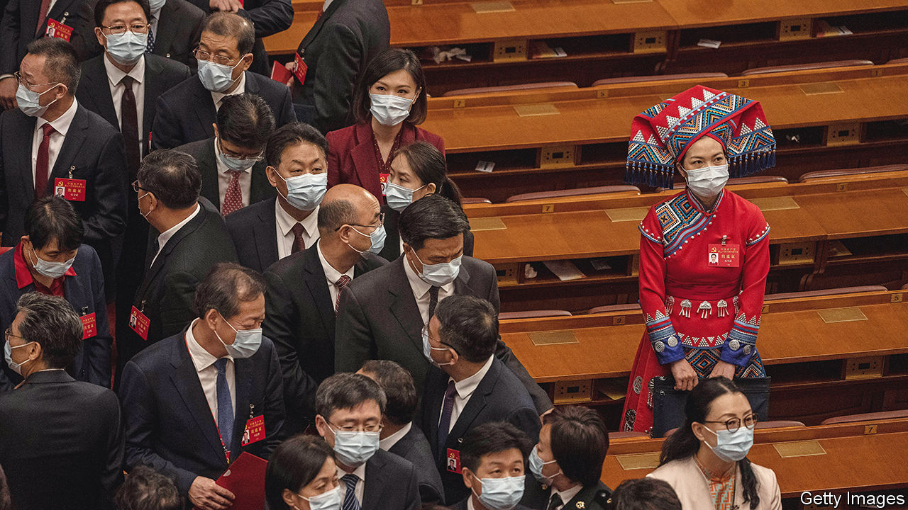
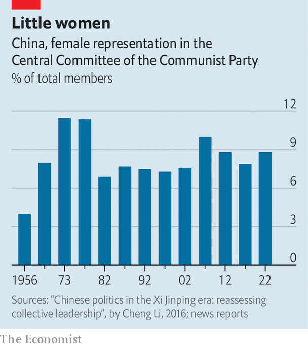

###### And then there were none

# China’s problem with female representation is getting worse 

##### Why there are no women on the Politburo 

 

> Oct 27th 2022 

In the 1980s Chen Muhua was one of China’s few female leaders at the national level, holding positions such as deputy prime minister. Later, as chair of the All-China Women’s Federation, a Communist Party-led body, she expressed dissatisfaction with the number of women in government—and promised that reforms would bring new opportunities. They have not. So in his report to the party congress on October 16th, President Xi Jinping echoed Chen’s promises, saying he would select and cultivate female officials. 

 


He has not. When the party’s  on October 22nd and 23rd, only a small number of women appeared on the lists. None had been expected to make the seven-member Standing Committee of the Politburo, which has never had a female member. But for the first time in 25 years, there is not a single woman on the Politburo either (it has 24 members). That body has usually had one woman, a convention that reeks of tokenism. On the larger Central Committee there are 33 women (out of 376 full and alternate members). There were 30 five years ago (see chart). 

Women make up nearly a third of the Communist Party’s membership. But they are also poorly represented on provincial and county bodies. Relative to other countries, China is falling far behind. According to this year’s “Global Gender Gap Report”, published by the World Economic Forum, China ranks 80th in terms of female representation in parliament, down from 57th a decade ago. When it comes to women in ministerial positions, China fell from 86th to 139th. And on a broad measure of women’s political empowerment, China slipped from 58th to 120th. 

Victor Shih of the University of California, San Diego, believes the explanation is straightforward: . “Gender equality is one of the lowest priorities in the Chinese government,” he says. Men move up through male patronage networks—just look at Mr Xi’s new team. Meanwhile, feminist activists are persecuted. China is a conservative country, where women are often expected to put their family before their careers. Even when they gain high-level jobs in government, they are often shunted into fields, such as health care or education, that don’t lead to the top. So the lack of representation on the Politburo did not surprise women. Still, many were outraged. “It’s so out of step with modern times,” says one in Beijing. “But I don’t see how it will ever change.”


