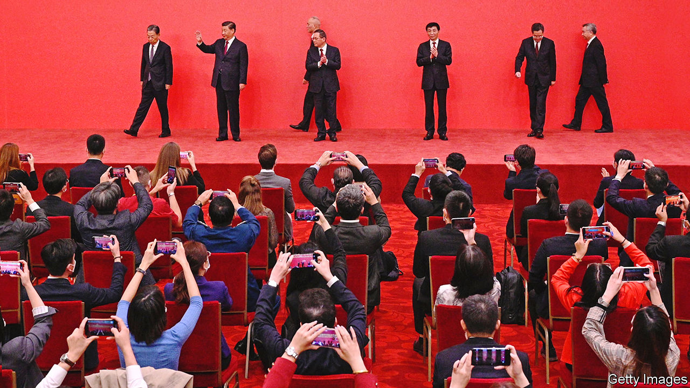
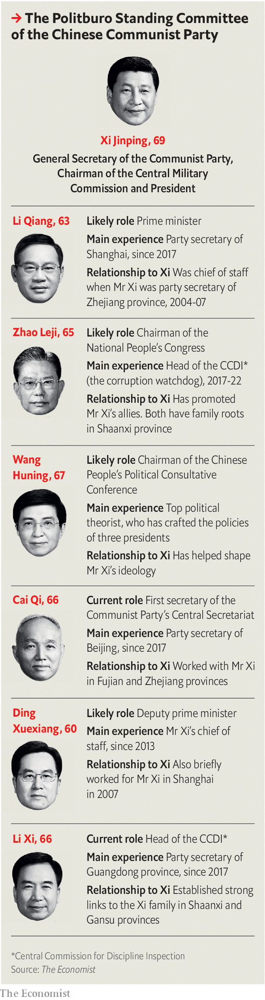

###### The people’s leader’s people

# Xi Jinping has surrounded himself with loyalists 

##### What will he do with them? 

 

> Oct 27th 2022 

Three times in the past decade, Xi Jinping has led the same ceremony in Beijing’s Great Hall of the People. With six men in single file behind him, he has walked through golden doors into a cavernous room, waving at seated journalists. In a carefully choreographed manoeuvre, he has stopped mid-podium, letting three of his colleagues take up positions on either side of him—equidistant and equally wooden, their arms kept still by their sides except to clap. The latest such unveiling of the country’s most powerful men, held on October 23rd, was no different. But it was unusually striking.

It was not surprising that Mr Xi, yet again, was at the centre of the red-carpeted stage. Since 2018  (though never officially confirmed) that he would be given another five-year term as the Communist Party’s general secretary and the armed forces’ commander-in-chief in 2022, despite a convention that these posts be held for only two terms. The biggest eye-opener was that so many of the men with him at this latest photo-op were clearly his people—their connections to Mr Xi dating back to long before he became the party’s boss a decade ago (see graphic). In the past there had been at least a pretence at balance, with members of the group—the Politburo Standing Committee, as it is formally known—representing a diversity of personal networks. No more. 

 


There had been signs aplenty in the preceding week that Mr Xi’s already immense power was about to get a fillip. On October 16th he had  of the party’s 20th congress, a five-yearly event attended by about 2,300 delegates (carefully vetted for their loyalty to Mr Xi). Participants had passed resolutions laced with fawning references to him and praise for the “two establishes”. The term, coined last year, refers to establishing Mr Xi as the party’s “core” and his thinking as part of its guiding ideology. They had rubber-stamped a sweeping shuffle of the party’s 376-member Central Committee. Gone from it were several leaders who had risen to power before Mr Xi took over, including some who had not yet reached the normal retirement age. 

An unusual scene in the Great Hall had also caught many observers’ attention. On October 22nd, the closing day of the congress, Hu Jintao, Mr Xi’s 79-year-old predecessor, who had been sitting next to him, was escorted away by two officials. He seemed reluctant to leave, fuelling speculation that he was being deliberately humiliated: some of those dropped from the Central Committee were linked to Mr Hu. Xinhua, a state news agency, tweeted that Mr Hu was led out because he was “not feeling well”. That may be closer to the mark. His behaviour looked consistent with a sudden episode of mental confusion. The expressionless gazes of people sitting near him looked like political cold-shouldering to some, but may have reflected embarrassment or a reluctance to cause disorder. There has been no attempt to erase Mr Hu from official accounts of the congress. But regardless of its cause, Mr Hu’s exit would have signalled to the audience that he was a spent political force and appeared symbolic of a clearing of threads between past leaders and Mr Xi’s team. 

There used to be several such threads attached to the Standing Committee. Until the recent reshuffle, its second highest-ranking member was Li Keqiang, a protégé of Mr Hu with a phd in economics. For the past decade he has served as prime minister. As required by China’s constitution, he will step down at next year’s annual session of the National People’s Congress (China’s legislature), which will probably be held in March. Mr Li was once widely viewed as a possible candidate for the top jobs, but after the 17th party congress, in 2007, it became clear that Mr Xi was the front-runner to lead China. In his current role Mr Li has found himself sidelined, with Mr Xi taking over work, such as overseeing economic policy, that had previously been the prime minister’s responsibility. At 67, Mr Li would have been just young enough by convention to remain on the Standing Committee or to take up another leadership role. But he is not a member of the new Central Committee. This means he is likely to retire from official duties. 

Lock down, rise up

The next prime minister seems likely to be the man who walked directly behind Mr Xi: Li Qiang. The younger Mr Li (this one is 63) is of a different stripe. He has no ties with past leaders, only to Mr Xi. In the 2000s, when Mr Xi was the party boss of the coastal province of Zhejiang, Li Qiang was his chief of staff. 

His elevation has raised eyebrows at home and abroad. Since 2017 Mr Li has served as the party chief in Shanghai, China’s commercial hub. Some residents blame him for the chaotic and harsh management of a  of the city earlier this year, aimed at crushing an outbreak of covid-19. There had been speculation that this would mar his career. Few had expected that not only would he be promoted, but also lined up for the prime minister’s job. The position has normally been reserved for people who have served as a deputy prime minister. Li Qiang has never held a central-government portfolio.

The three other newcomers to the Standing Committee are also clearly Mr Xi’s protégés. One is Cai Qi, the party chief of Beijing, who held senior positions in Zhejiang during Mr Xi’s time there, as well as earlier in Fujian province, where Mr Xi also served. Like Li Qiang, Mr Cai has a controversial record in the city he runs. He is remembered for a campaign late in 2017 to demolish ramshackle housing used by migrant workers from the countryside. Thousands were evicted with little notice. Officials called them “low-end” people who were not needed in Beijing. 

The last two in the line behind Mr Xi were Ding Xuexiang and Li Xi. Mr Ding has long been close to Mr Xi—first as his chief of staff when Mr Xi served briefly as Shanghai’s party boss in 2007, and in a similar role in Beijing since 2013. He is expected to be appointed next year as the most senior of four deputy prime ministers, despite never having held jobs at the national or provincial level involving management of the economy. Li Xi is the party chief of Guangdong province, which borders on Hong Kong. In the 1980s he served as a personal assistant to a protégé of Mr Xi’s late father, Xi Zhongxun, one of communist China’s founders. The Brookings Institution, a think-tank in Washington, says Mr Li and the younger Mr Xi “have remained friends ever since”. 

Apart from Mr Xi, there are two others in the new Standing Committee who are also holdovers. They are , his chief theoretician (author of such Xi-isms as the “Chinese dream” and, quite possibly, the two establishes), and Zhao Leji, who until this congress had been serving as his main enforcer of party discipline. That role has now passed to Li Xi. Mr Zhao is expected to become head of the legislature next year. Neither Mr Wang nor Mr Zhao had connections with Mr Xi earlier in their careers. (Mr Wang helped craft the ideologies of Mr Xi’s predecessors, too.) But both are thorough Xi loyalists.

In the build-up to the congress, few observers had expected to see the committee stacked with so many of Mr Xi’s men (no woman has ever been a member of it; for the first time in 20 years there is no woman who is an ordinary member of the Politburo, either). Many had thought that Hu Chunhua, a 59-year-old protégé of Hu Jintao, might get in, possibly as prime-minister-in-waiting (he is now a deputy prime minister). But he failed even to keep his seat in the Politburo. Another of Hu Jintao’s protégés, Wang Yang, who is 67, had been widely expected to keep his seat on the Standing Committee, but he has now lost all his party jobs. His remaining title as head of the legislature’s advisory body is likely to be taken next year by the ideologue, Wang Huning.

The Xi sell-off

It is not surprising, then, that analysts were quick to see political intrigue behind Mr Hu’s undignified exit from the congress, even though medical explanations are plausible. Mr Hu’s protégés are often referred to as members of the , or “league faction”, because early in their careers they held important roles in the Communist Youth League, which Mr Hu once headed. They are considered relatively pro-market. Mr Xi is much less so. Foreign investors were spooked by his new line-up. In Hong Kong and overseas markets, they China’s shares and currency. 

There had been little sign that the presence of Mr Hu’s men in the Politburo or its Standing Committee was constraining Mr Xi’s power. Having replaced them, it is far from clear that Mr Xi plans to steer China in any new direction. Few hints of any impending policy change emerged from the congress (it had long been looking grim for pro-market types). “This idea of competing factions has been severely overstated,” says Joseph Torigian of American University in Washington. He believes that even Li Keqiang, the outgoing prime minister, “was already a yes-man”. Mr Li’s probable successor, Li Qiang, though criticised by some citizens for his handling of covid, has a “pretty darn good reputation with businesspeople”, Mr Torigian says. 

Since the unveiling of the new Standing Committee, it has been business as usual. State media have been pumping out adulation of Mr Xi—the “people’s leader” as he is often now described. It is the “great luck of the party, great luck of the country, great luck of the army and the great luck of the people” that he remains “at the helm”, crowed the party’s mouthpiece, the . But the risk has grown that, behind closed doors, Mr Xi will be even less likely to hear views other than the echoing of his own. That is surely something for the world to worry about. ■


