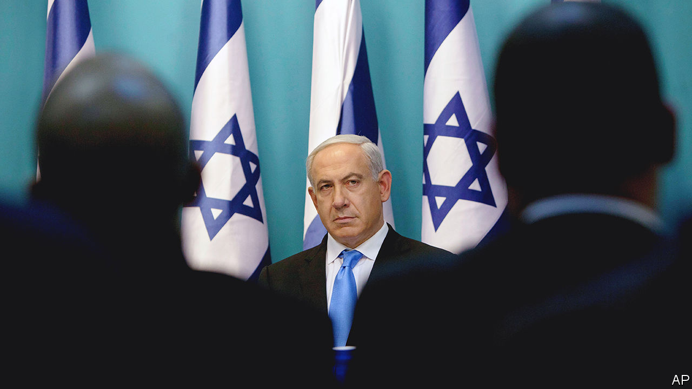

###### Israeli politics

# Binyamin Netanyahu’s memoir is a fascinating study of power 

##### It could reasonably be called “The Netanyahu Guidebook for Successful Populists” 

 

> Oct 27th 2022 

By Binyamin Netanyahu. 

IN THE EARLY 1970s a young Israeli special-forces officer was taking part in a diving exercise off the Mediterranean coast. As he floated in the sea, he looked to the shore and the ruins of Château Pèlerin, the last Crusader fortress in the Holy Land, abandoned in 1291. “Would we too suffer the fate of the Crusaders, who after two centuries yielded the Holy Land to the Muslims?” he wondered.

The officer’s conclusion was that Jews’ connection to their ancient homeland would prove more enduring, “yet the question of ensuring Israel’s power and permanence lingered in my mind”. Half a century later, that question is still troubling Binyamin “Bibi” Netanyahu, Israel’s  prime minister, who is currently the leader of the opposition (at least until the election on November 1st). He has taken advantage of what he calls a “hiatus” from office to write a memoir, published simultaneously in English and Hebrew. 

In “Bibi”, he tells his fascinating story both as a polemic and an election pitch. He seeks to convince the world that Israel must remain strong in pursuing a relentless campaign against Iran’s nuclear programme and unyielding over demands to compromise with the Palestinians. He also hopes to persuade Israelis to vote for him because he is the only man who can accomplish this mission and that, if they fail to restore him to power, they will be making a fatal mistake. 

Mr Netanyahu is the archetype of the modern populist-nationalist politician. He describes challenging what he calls “The Palestine Centrality Theory”—whereby Westerners see Israel’s treatment of Palestinians as the main issue in the Middle East—as early as 1974. As a student at the Massachusetts Institute of Technology, he became a public advocate for Israel’s case. He prepared a list of all the conflicts in the region that were not related to Israel. 

In retrospect, he can claim to have taken the Palestinian issue off the agenda, both in international diplomacy and in Israeli politics, where it has barely featured in election campaigns in recent years. He has done this while bringing off a rhetorical conjuring trick: arguing that Israel’s conflict with the Palestinians is not that important and, at the same time, that any concessions to the stateless Palestinians would be an existential threat to Israel. Indeed the first rule of what might be called “The Netanyahu Guidebook for Successful Populists” is that you can never have enough existential threats to your country. 

The second is that any leader, even one of a small nation, should not be scared of taking on the president of the United States. America offers many avenues to influence policy while bypassing the White House; Mr Netanyahu calls this “The Theory of Public Pressure”. He glories in telling how he used every means—media appearances, lobbying Congress and currying favour with evangelical pastors—to spar with presidents, notably Bill Clinton and Barack Obama, who differed with him on both the Palestinian and Iranian issues.

The third rule is to adopt the latest political techniques for domestic campaigns. Mr Netanyahu was one of the first non-American politicians to import the methods of Republican strategists. In 1996 he employed Arthur Finkelstein, who conducted surveys and focus groups to find the subjects that most aroused voters’ fears and hatreds (he is credited with making “liberal” a dirty word in America). As a result, Mr Netanyahu appealed to voters’ Jewish identities and accused his rivals of plotting to “divide Jerusalem”. 

A fourth rule is to reinvent yourself as the leader of the disenfranchised in opposition to a mythical elite. “To many in the ruling elites I had betrayed my social class. Educated and politically influential, I led the ‘plebeians’ to power,” Mr Netanyahu writes. “Worse, I led them in the wrong direction.” Mr Netanyahu, prime minister for a total of 15 years, can hardly be considered outside the ruling class.

A fifth dictum is to openly embrace power. After one bruising exchange with Mr Obama, who refused to launch a military strike on Iran, he muses that “soft power is good, but hard power is even better”. He cautions against nuance. The key thing in leadership, he insists, is to boil everything down to one uncomplicated sentence: “Say something clear or say nothing at all.”

Despite being an effective orator, his inability to take criticism has clouded his judgment. Over the years his attempt to suborn Israel’s free press has become an obsession. It recently landed him in court on corruption charges, including illegal dealings with local media barons; he emphatically denies these allegations and blames the media for pressing a weak attorney-general into filing them.

“I’ve always been a staunch believer in liberal democracy,” Mr Netanyahu avers. Yet throughout his book he names his favourite leaders: Silvio Berlusconi, Jair Bolsonaro, Xi Jinping, Narendra Modi, Hosni Mubarak, Viktor Orban, Donald Trump and Vladimir Putin. Mr Netanyahu never stops to wonder why he gets on best with decidedly illiberal counterparts. Neither does he ask himself why he was eventually  in June 2021 by a diverse coalition of nationalists, centrists, left-wingers and Islamists, led by Naftali Bennett, his former chief of staff.

In Israel the polls remain static, as they have been for the past four elections in  years. Mr Netanyahu has polarised opinion. Half the electorate is resolutely against his return; the other half is clamouring for it. It is hard to see an autobiography changing anyone’s views when Israelis feel they already know him all too well. His non-Israeli readers are also unlikely to budge from their entrenched positions. Yet for his admirers and critics alike, he has produced a compelling memoir and an intriguing study of power. ■

