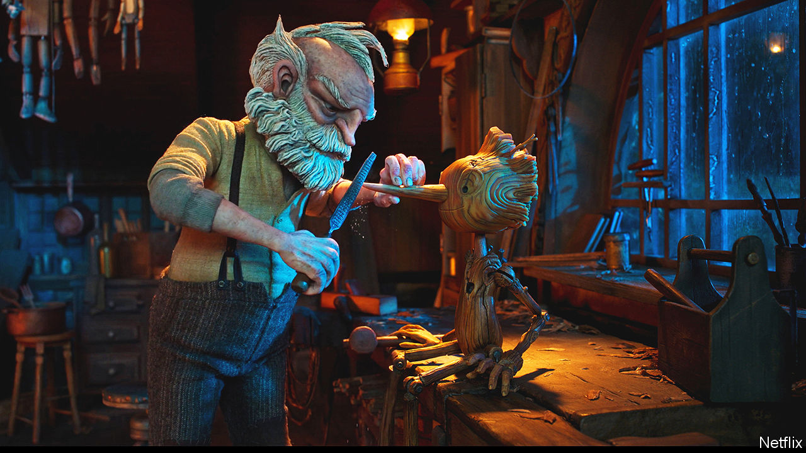

###### Back Story

# Pinocchio is the hero of our time 

##### He cannot hide his lies. He wants to be a celebrity. But is he a “real boy”? 

 

> Oct 27th 2022 

He lies (but is found out). He quits school to become a celebrity. A high-spec automaton powered by artificial intelligence (), he isn’t quite human though it is hard to say why. Truly, Pinocchio is the hero of our time. 

Imagine it: a leader denies going to a lockdown party, or that he lost an election when he did, or that he is about to invade Ukraine, and the fib is as plain as his lengthening nose. The fantasy of visible mendacity may help explain why “Pinocchio” is in vogue. Disney recently released a  of its cartoon of 1940, which stars Tom Hanks alongside a CGI puppet and assorted cutesy animals (including the weirdly flirtatious goldfish from the original). Guillermo del Toro’s stop-motion animated version had its premiere at the London Film Festival and is out on Netflix soon.

But it isn’t only the climate of impunity for lies that makes “Pinocchio” a fable for today. So does the eerie central conceit of the talking, walking puppet, lively yet not wholly alive, and the attendant issue of what makes a “real boy”. That question has never been more pressing, or more provocative.

Advances in ai are blurring the distinction between real people and latter-day puppets. Meanwhile a revolt against crude notions of masculinity—and against the orthodox binary of male and female—has complicated the “boy” part of the equation, too. “The Making of Pinocchio”, a stage show currently on tour in Britain, imagines a trans Pinocchio in flight from rigid categories of gender and sexuality. It revels in the phallic symbolism of his tumescent appendage, which adaptations for children tend to skirt.

And the character is a case study in another syndrome that can seem ever-more acute—the lure of fame and easy money. Temporarily, Pinocchio is seduced by the bright lights of the puppet theatre. “To be famous is to be real,” declares a villain in the new Disney film, diverting him from the straight and narrow with the prospect of being . 

Fun versus duty, autonomy and submission, innocence and experience: Carlo Collodi’s tale, first published in Italian in serial form in 1881, suggests many enduring themes and interpretations. In the shmaltzy Disney take, when Pinocchio goes to Pleasure Island, supposedly a carefree paradise, it looks a lot like Disney World—an odd sort of marketing, given all the visitors are turned into donkeys. As Geppetto, the puppet’s old man, Mr Hanks sets sail in a small boat, a sequence that could be an out-take from “Cast Away”, a desert-island movie he made with the same director, Robert Zemeckis. Geppetto brings the goldfish along in a bowl. You half-fear he might eat it.

Mr del Toro’s spin is deeper and darker. Strange as it is to say of an animated film narrated by a cricket (voiced by Ewan McGregor), there is little magic here. In a revamp set in Mussolini’s Italy, Geppetto fashions the puppet in a drunken fit of grief for a child he lost in the first world war. Instead of cavorting on Pleasure Island, Pinocchio is conscripted into a Fascist boot-camp; in his mistreated purity he is likened to Jesus Christ. The distinguishing feature of a real boy, in this telling, is that he can die. 

If that sounds bleak, try Collodi’s original text. Even by the standards of children’s classics, it is macabre. Almost the first thing Pinocchio does is kill the annoying cricket. He is stabbed, hanged, burned and enlisted as a farmer’s guard-dog; bandit weasels offer him a kickback to let them steal chickens. His is a world of violence, random death, corruption, hunger and penury. “When poverty is truly poverty, everyone—even kids—understands it,” says a zingy new translation by Anna Kraczyna and John Hooper (who also writes for ).

This delinquent Pinocchio is “a lazy bum”. Like many nagging offspring, he is both famished and a fussy eater. Selfish and rude, he makes Geppetto miserable. In a suitably modern revision, Mr del Toro’s moral lies less in what children do to parents than what parental strictures and expectations do to children. Defiance, as much as devotion, becomes the goal of Pinocchio’s odyssey.

Always, though, the crux of the drama is found in the belly of the beast—the sea monster which, after all their rows and misadventures, swallows both Pinocchio and Geppetto. Their reunion in its entrails blends biblical imagery with Freudian fever dream. It captures an eternal truth about troubled souls and their dearest, hardest relationships: sometimes you have to sink to the bottom before you can gasp your way back up.


