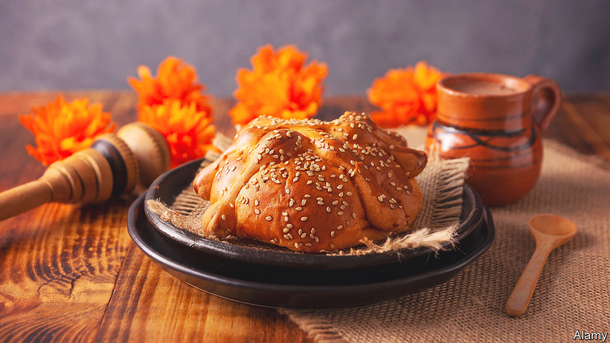

###### World in a Dish

# The joys of pan de muerto, a sweet tribute to departed loved ones 

##### The bread forms a crucial part of Día de los Muertos celebrations 

 

> Oct 27th 2022 

LET’S GET one thing straight from the start: (Day of the Dead) is not “Mexican Halloween”. Yes, the two events fall at similar times:  on October 31st, Day of the Dead on the subsequent two days. Their iconography overlaps, as both feature skulls, skeletons, graves and intimations of the dead returning. And eating sweet foods is an integral part of each holiday.

But Halloween’s origins are Celtic, and its original rituals of costuming and bonfire-lighting were designed to ward off ghosts. Today it is an anodyne and wholly commercialised event. Early next week, hordes of little terrors will pound on strangers’ doors to demand chocolates and other plastic-wrapped corn-syrup confections that keep dentists in Mercedeses. 

Day of the Dead, meanwhile, grew out of an Aztec festival that the Spanish wove into the Christian calendar. Though observed in much of Latin America, it is most closely associated with the vibrant celebrations across . Its rituals are designed to honour the dead by fondly remembering departed friends and family. It is a more interesting occasion, and its food much better.

Some of it is not eaten. Families set up  (the word means “offering”) for the deceased, which they decorate with marigolds—to guide the souls to the goods—as well as , decorated sugar skulls. The home altar will also bear late relatives’ favourite foods, which the living do not touch. 

Mexico’s  means that the dishes produced for the festivities vary from region to region. One item consumed nearly everywhere is , a bread enriched with butter and margarine, and flavoured either with orange zest and orange-blossom water, with aniseeds and sesame seeds, or with a mix. Fany Gerson, a Mexican chef and author now based in New York, says that it is “something that everyone has in one form or another…it’s super important to the holiday”. Usually it is baked in a  shape, topped with decorative bones and a ball (representing a skull) made from the same dough. It may be dusted with sugar.

Bakeries sell  but many people also make it at home, which is well worth the effort. Like most brioche-type doughs, it is supple and malleable, and when baking makes the kitchen smell wonderful, with the high, floral scent of orange blossoms complementing the rich yeastiness of fresh bread. Traditionally consumed with , a drink made from chocolate, spices and cornmeal, it also pairs well with coffee or strong black tea.

To some it may seem odd to commemorate the dead with sweet, rich foods—a far cry from sackcloth and ashes. But it is of a piece with the holiday itself, which is not sombre, but ebullient. “By remembering and celebrating” the deceased, explains Ms Gerson, “you keep them with us. People have whole parties on the tombstones. There’s mariachis, and food. They sit around with their loved ones and remember them. That’s a joyful thing.” ■

