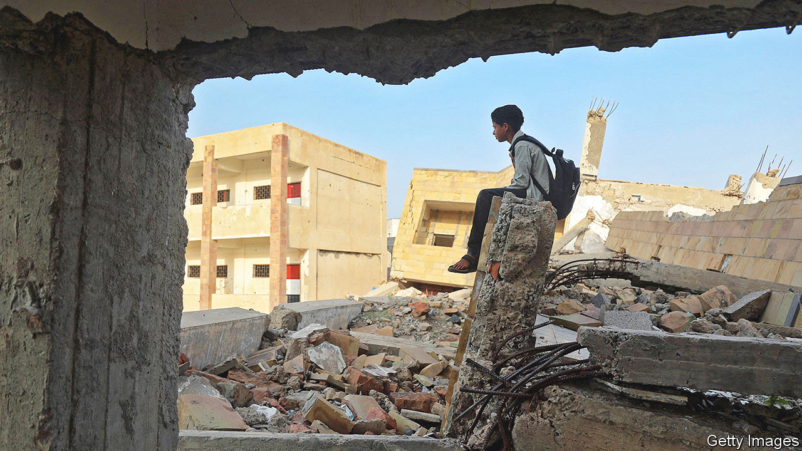

###### No heroes, only victims

# The war in Yemen, as seen by ordinary Yemenis 

##### Bushra al-Maqtari has collected their testimonies in “What Have You Left Behind?” 

 

> Oct 27th 2022 

By Bushra al-Maqtari. Translated by Sawad Hussain.

FOR a conflict that has caused arguably the world’s worst humanitarian crisis, the war in Yemen is often described in the most inhuman ways. It is another front in the long struggle between Saudi Arabia and Iran, or one of those bewildering civil wars that defies comprehension. It is a morality play for Americans frustrated with their country’s relationship with Saudi Arabia. It is a full-employment programme for foreign diplomats fond of banal statements about peace talks.

In “What Have You Left Behind?” Bushra al-Maqtari, a journalist, adds a human element to the conflict. This is not the sort of book you take to the beach or skim before bed. Ms Maqtari started touring her country in 2015 to collect testimonies from ordinary Yemenis. What emerged is simply a string of those testimonies, each one more horrific than the last.

Here is Adel Rassam, recounting his family’s flight from the port city of Aden as militias approached: “Panic filled the air like a restless spirit in the wind.” There is Hafsa Munawis, whose sister was killed when their workplace, a potato-chip factory in Sana’a, was hit by an airstrike. “The missile had landed in the fryer with all that boiling hot oil.” Tahani al-Qudsi’s daughters and niece were killed by militia shelling in Taiz. “Pain is engraved on our faces,” she says. “Just write what you see.”

Each chapter ends with a list of the names and ages of those killed in the events just recounted. The names are too many, the ages often far too young. Some were killed by the , a Shia militant group that seized the capital in 2014 and still controls much of the country. Others were killed by a coalition of Arab countries, led by , that invaded the following year to dislodge the Houthis.

The identities of their killers do not much matter: this is not a war story, as war stories are often told. There are no heroes. The antagonists are never glimpsed. No one delivers stirring paeans to freedom or the glorious nation. There is only death, suffering and fear. “Only victims are real in this war, victims crushed by violence,” Ms Maqtari writes in her introduction.

But even trying to humanise the war underscores its inhumanity. Some of Ms Maqtari’s subjects reminisce about the past. Rarely do they imagine the future. Neither the Houthis nor the coalition have grand plans for rebuilding a shattered country. The goal is simply to wield power. “What are they fighting over? What is worth all this death?” asks one interviewee, Munira al-Hamidi. She answers her own question: “Neither of them have a reason.”

These words ring true elsewhere in the region as well. In Libya and Syria killing became a goal in and of itself. In places like Iraq and Iran, state violence plays a similar role, albeit on a lesser scale: it is a way for corrupt, useless factions to stay in office. Too much of the Middle East is a zero-sum competition for power.

The war in Yemen is now in its eighth year. That it has dragged on so long is partly thanks to the input of external actors. No one in Ms Maqtari’s book mentions  or Iran directly. Even Saudi Arabia appears infrequently, and often as a footnote. Yet they loom large in every anecdote. The bombs dropped by coalition aeroplanes were probably made in America; the guns used by militiamen may have been supplied by Iran.

No one mentions the UN either. Since April, when it first brokered a two-month ceasefire, violence in Yemen has been ebbing. The truce was prolonged twice. Diplomats were optimistic that this might herald a lasting peace. Yemenis were not. 

Sure enough, earlier this month, the truce lapsed: the Houthis would not agree to another extension. Many Yemenis worry that the lull will soon end. The UN has raised less than half the money it needs for humanitarian aid; a new eight-man presidential council meant to broker an end to the conflict is busy arguing among itself. The combatants may no longer know why they are at war. But for the victims, the fighting is all too real. ■

