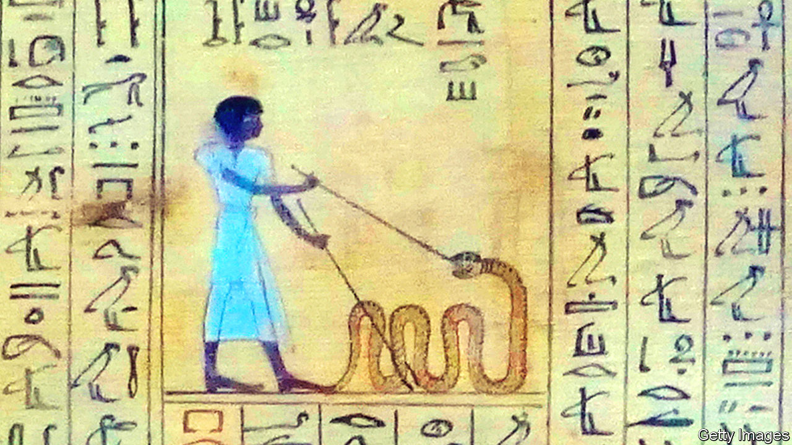

###### Paper trail

# “Papyrus” is a lively history of books in the ancient world 

##### Texts have long been dangerous and disruptive as well as pleasurable, Irene Vallejo argues 

 

> Oct 27th 2022 

 By Irene Vallejo. Translated by Charlotte Whittle.

Why do readers love books? For wisdom and wit, the lift of comedy and the noble pain of tragedy; for advice, comfort and entertainment. But content and sentiment apart, they are . Most fit into the hand like friends, crisply tight and new, or warm, worn and well-loved. There is satisfaction, as well as anticipation, in the turning of their pages. Like the wheel, or scissors, the design of the book is so perfect that from the first bound-and-paged versions, the codices of the 4th century or so, it has never needed changing. Despite the advent of Kindles and e-books, the original design continues to cascade from presses all over the globe. Every 30 seconds, a new book appears.

Irene Vallejo, a Spanish journalist and scholar, has a writer’s passion for books and a classicist’s fascination with the way they came to be. She is also imaginative, lively and contemporary. In her hands written texts are not only a sensual pleasure, but living and frequently disruptive. 

The first committing of words and spoken stories to papyrus scrolls was, she says, as unsettling as the coming of the internet, multiplying the communication of ideas and, at the same time, seeming to coarsen them and freeze their human spontaneity. Socrates thought written texts would increase forgetfulness, because human beings would cease to rely on memory to tell stories. Plato worried that they would rot the moral fibre of his Republic. On the contrary, they spread literary appreciation everywhere. More than 50 quotes from Virgil were scrawled on the walls of Pompeii.

Vesuvius immolated many texts. The Roman emperor Domitian burned far more; the Nazi “bibliocaust” in the 1930s saw the works of 5,500 authors go up in flames. Books were often dangerous. In the ancient world copies of great but contentious works were hidden to be copied again, or committed to memory, as friends in Stalinist Russia preserved in their minds the poems of Anna Akhmatova. Ms Vallejo’s father once found, in a secondhand bookshop, a copy of “Don Quixote” that also contained, clandestinely, writings by Karl Marx that were forbidden in Spain under Franco’s dictatorship. 

From the beginning, as scrolls, books were light, flexible and portable, certainly by comparison with the clay tablets of Babylon and Sumer that had carried information before. Compared with bound paper books, however, they were cumbersome. The average length of such scrolls was three metres or so; both hands were needed to cope with them.

, too, was like an impenetrable forest until, slowly, punctuation and spacing emerged. These were not needed at first because readers in the ancient world read aloud, feeling their way through by voice as well as eye. (St Augustine, in the 4th century, was astonished to meet a man who read silently.) For Ms Vallejo, much of the fascination of books lies in the fixing of puffs of air into visible letters and signs. 

I bring thee word

Fragile as they were, such books bound the ancient world together. The most famous author by far was Homer, even though his true identity is unknown, and the most popular work was his “Iliad”, which the great Alexander took on his campaigns and kept under his pillow. As ruler of Egypt, Ptolemy sent out book-hunters to every part of the known world to stock the great library at Alexandria, which was open to everyone and to every language. Mark Anthony sealed his romance with Cleopatra by donating 200,000 scrolls to the library. Demand for papyrus became feverish, and the price soared. 

From the “atlas” of writers and their works made by Callimachus, the father of librarians, in the 3rd century bc, it is clear how much was lost when Alexandria’s library burned to the ground 400 or so years later. His catalogue lists 73 plays by Aeschylus; only seven of them survive. Charred lumps that once were books have been recovered from the bottom of the Mediterranean, but deciphering them has proved almost impossible. Scholars (and readers) still dream of discovering a lost play by Euripides or new poems by Horace. But when some of  from Herculaneum were painstakingly picked apart and scrutinised by infrared light, nothing emerged but obscure philosophical treatises. 

The copying of scrolls and early books was an . In the Roman world it was often done by slaves, carefully reproducing books their masters wished to possess. They might well end up wiser than their owners; the cunning slave was a stock character of Roman plays, and many slaves ran libraries. Ms Vallejo compares this tellingly with the situation of slaves in the American South, who were often whipped or maimed if they showed any interest in reading. Illiteracy remained so common in the southern states that, in the 1930s, the government sent young women out on horseback to bring reading, and books, to people who barely knew them. 

This also fits Ms Vallejo’s agenda. She strives mightily to excavate hidden women, who were not supposed to have any role in the earliest history of books—or, indeed, of speaking. As Telemachus bluntly told his mother Penelope in Homer’s “Odyssey”, “Speech is for men.” But Ms Vallejo attributes to Sappho, the single substantial female voice from the Greek literary world, a revolution in thinking: open, written, personal defiance. (“Some say there is nothing finer on this dark earth than an army of horses, or an army of men...but I say that your lover is the most beautiful sight of all.”) At school it was a woman, tall, thin and nervous, who taught Ms Vallejo to love Greek. And it was her mother—as it is so often mothers and aunts—who told her the old stories, lulling her asleep with them. 

Readers will not snooze through this work. Ms Vallejo has a notable talent for evoking ancient scenes. Her description, for example, of the poet Martial returning to Spain from Rome, near the end of the book, is masterly. And her enthusiasm for classical texts quickly moves them to the top of any reading list. Who’d have thought that this reviewer’s latest Amazon order would be for Herodotus’s “Histories” and Hesiod’s “Works and Days”? ■

