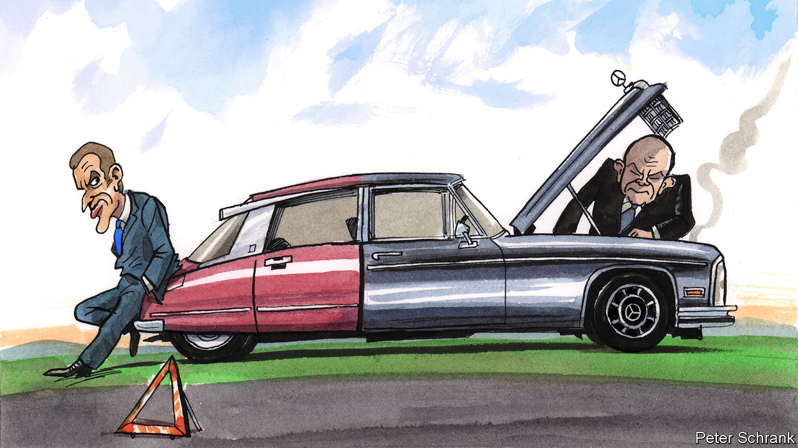

###### Charlemagne

# Europe has a problem: France and Germany have forgotten how to argue 

##### The EU’s traditional engine is spluttering 

 

> Oct 27th 2022 

The relationship between France and Germany is of such import to both that each side has home-grown analogies to describe it. For the romantics in France, the country of Charles Baudelaire and Victor Hugo, the alliance is often imagined as a couple, who bicker and occasionally dally with others. In no-nonsense Germany, home of Audi and Volkswagen, the duo forms an engine, a series of controlled explosions used to drive Europe forward. Whichever image one prefers, the current state of the relationship is dire. The ardour has cooled/the cylinders are misfiring. Previous bouts of Franco-German discord strained the EU but led to resolutions that forged European integration. Today’s squabble is nothing spectacular but it is worrying: nobody can see how it ends in productive compromise.

This week ought to have marked the annual renewal of vows/regular tune-up of the Franco-German motor. A joint cabinet meeting bringing together both countries’ ministers was due to take place on October 26th. Awkwardly for a symbolic show of unity, the confab was postponed at short notice. Officially a clash of diaries was to blame; a lunch between the German chancellor Olaf Scholz and Emmanuel Macron, France’s president, was hastily arranged instead. In truth Germany and France are on opposing sides on an unusually long list of topics. Neither side felt its ministers had much to chat about. Repeated assurances from both capitals that things are fine merely add to the feeling they are not.

Much of the latest strain is related to Ukraine. As regards the war itself, France and Germany broadly agree that Ukraine needs support but not at the cost of totally alienating Russia—an approach that has earned them both brickbats from hawks in central and eastern Europe. It is the handling of the war’s ripples that has deepened sometimes pre-existing rifts. France had hoped for more EU joint borrowing to finance the cost of more expensive energy, or for gas prices to be capped; Germany pushed a €200bn ($200bn) domestic-subsidy package instead. Germany wants to revert to pre-covid EU budget rules; France wants to keep spending. France wants joint EU procurement of military kit; Germany thinks that is a sop to French firms and prefers American materiel. The list goes on.

Strains in relations between France and Germany matter beyond Paris and Berlin. Though it may be resented in 25 of the EU’s 27 countries, the couple/engine sits at the heart of the endeavour. All the milestones of European integration, from the euro to free movement, enlargement or the single market, were the result of Franco-German compromises. Agreement between the two is usually a sufficient condition for European policy to be made: it is always a necessary one. In part that is because of their size. The two combined make up a third of the EU’s population and two-fifths of its gDP. But elemental differences between the two amplified the impact of any agreement they reached. A policy that was amenable to the heart-led French could be assumed to appeal to much of southern Europe. What hard-headed Germany found acceptable would also pass muster in anywhere from the Netherlands to Austria and eastern Europe, at least before the war. 

A division of labour worthy of an old married couple/a finely tuned machine has emerged over the years: France comes up with lots of new ideas, Germany accedes to a few of them. Mr Macron wanted a big euro-zone budget, for example, and the then chancellor, Angela Merkel, stalled for years and at last agreed to a big pandemic recovery fund. Disagreement has been a feature of the relationship, not a bug. These days France still buzzes with new schemes. But in its eyes Germany is not so much unresponsive as diplomatically comatose. In the past the finding of compromise could be dramatic. A decade ago Mrs Merkel was moved to actual tears of frustration when offered a French-infused plan to save the euro, a version of which she later agreed to. Mr Scholz in contrast seems completely unmoved by Parisian griping. It is not known whether he even has tear ducts. 

It does not help that Messrs Scholz and Macron have little in the way of a personal relationship. The two are different, and need different things from each other. The French president is a young risk-taker whose best route to a legacy as a reformer (having lost control of parliament back home) goes via Europe. Mr Scholz is a former regional politician near retirement, who will probably be remembered (or not) for his , a recasting of German defence and foreign policy that followed the invasion of Ukraine. Mr Macron needs Germany to achieve his aims; Mr Scholz is focused on keeping his two domestic coalition partners happy. 

Vorsprung durch Europa

Low-level issues like subsidies and budget rules aren’t usually enough to sour the Franco-German relationship. But the way Europe is changing means such irritants can gain a new dimension, says Luuk van Middelaar, a Dutch political writer. The war has rebooted the idea of an EU stretching to Kyiv and beyond—as Mr Scholz has noted. Geographically speaking at least, a pivot to the east would make Germany look central and France seem rather peripheral, especially after Brexit. Politically, in certain instances a more assertive Germany post could find ways to replace its age-old French ally if circumstances suit one day, though France has no appealing way of bypassing Germany.

That anyway seems a distant prospect at present: Germany is isolated in Europe and France is not. Mr Macron’s agenda of “strategic autonomy” has aged better than German dependence on Russian gas and exports to China. But things might change. A future where France is merely one of many potential partners for its bigger neighbour is a discomfiting possibility in Paris. A spat with Germany, followed by a make-up episode filled with new EU policies, would be a way for France to show it still matters. But you can’t fight someone who seems not to care. ■


