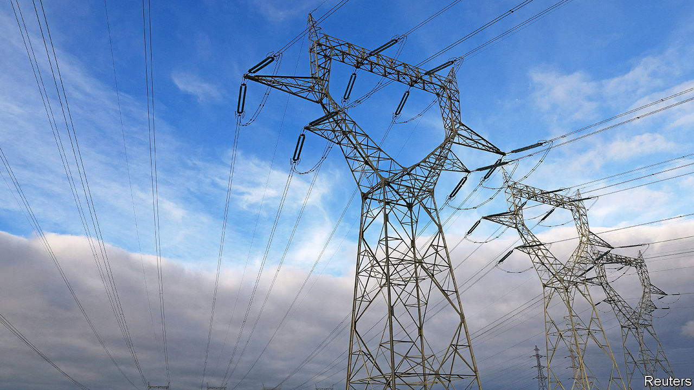
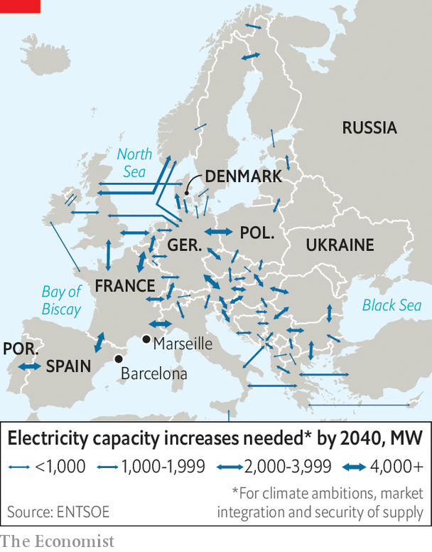

###### European energy links

# Europe’s gas and electrical grids need expanding 

##### The Ukraine war has shown the perils of market fragmentation 

 

> Oct 27th 2022 

THE EUROPEAN project is all about connecting countries. But when it comes to energy, that has often proved tricky. After years of discussion about MidCat, a gas pipeline through the Pyrenees aiming to bring imported Spanish natural gas to the rest of the continent, the plan was abruptly shelved on October 20th. France has its own energy plans, with a dominant nuclear-power industry and sufficient gas-import facilities for its needs, and saw little need to spend money on the project. As compensation, France’s Emmanuel Macron agreed to launch a new scheme—an undersea pipeline for natural gas and hydrogen from Barcelona to Marseilles, called BarMar. 

The logjam over MidCat is a good example of why Europe’s energy market remains fragmented. The continent’s energy system is undergoing its largest transformation yet. It needs to slash carbon emissions through increasing the share of renewables in electricity generation, while producing more juice for an increasingly electrified population of cars, and to run heat pumps that replace gas. Meanwhile the gas market, which in Germany and its eastern neighbours has long been dominated by Russia, now needs to adapt to receiving more liquefied natural gas (LNG) through ports for distribution across Europe. 

This new reality requires more comprehensive European energy grids. Start with electricity. Solar and wind power are intermittent, so large amounts of electricity need to be moved from where wind and sun happen to be plentiful to where electricity is needed. “It is a lot cheaper to make a power market more flexible across space, through the grid, than to make it more flexible across time by storing electricity,” says Christoph Maurer of Consentec, an energy consultancy. To avoid overloading a grid that is not able to distribute power widely, renewable energy sometimes just has to be switched off, which is a waste.

 


Denmark, for instance, is a large supplier of wind energy. It would like to send more power southward. But there is too little transmission capacity within Germany, mostly out of NIMBYism, as few people enjoy living next to large power lines. When there is too much wind along both countries’ coasts, Germany shuts down the interconnector in order to prioritise its own wind power. As a result, Danish turbines have to stop turning. Europe’s transmission operators reckon that a proper continent-wide grid (see map) could be saving 110 TWh in renewable energy a year this way by 2040, which amounts to about 10% of current renewable generation. 

As for Europe’s gas grid, it was designed to bring in gas through pipelines from the north and east, and to connect countries so that some of it can be distributed further. It was also meant to increase competition between different gas providers. Now that Russian supplies have evaporated, Spain’s six regasification terminals for LNG—a third of the EU’s entire capacity—would come in handy to bring in more gas and diversify Europe’s supplies. Yet just as Germany declined to build costly LNG terminals before the Russian invasion of Ukraine, France was never keen on Spanish competition. In fact, the only pipeline connecting Spain and France was originally built to export North Sea gas to Spain, not the other way around. 

With politics standing in the way of decent grids, the EU’s energy market remains incomplete. The EU has done much to set energy-market rules. But its members retain the final say over the building and approval of the physical kit—pipelines, power lines, wind-parks, solar farms and LNG terminals. To speed things up, the EU has set targets for more interconnectors. However grid projects in Europe, either within countries or between them, take time. 

Things could get worse before they get better. Though there is now a drive to fast-track the approval and construction of renewable-energy sources, the EU’s electricity grid may not expand fast enough. Long-distance, high-voltage lines take a decade or more to plan and build, while wind-parks typically take only five years and solar plants even less. 

Grid planners have now started to respond. An offshore wind-park in the German North Sea will not be connected to the local grid at all. Instead, its operators plan to build a 250km underground cable to the northern Ruhr area. In effect, they plan to bring the power to the grid as if the offshore park were handily in the middle of Germany’s industrial heartland. Bruegel, a think-tank, reckons that 16bn cubic metres’-worth of EU gas interconnection will come online in 2022, about a tenth of the loss from Russia, because some countries such as Poland did prepare and diversify. More will follow.

As for sun-soaked Spain, bringing its vast solar-power potential to the continental market requires high-capacity connections to France. But the countries have been at loggerheads for years, if not decades, over French resistance to opening its market to Iberian power. As part of the deal over BarMar, the countries also agreed to speed up a planned undersea electrical connector to run beneath the Bay of Biscay. That is a start. In Denmark, interest in connecting the country’s large wind-parks to Germany, the Netherlands and Belgium is high, says Klaus Thostrup from Energinet, the Danish grid operator. 

And the BarMar project itself may get lucky. It is intended to transport hydrogen produced with renewable power to the European market. Since producing and using “green hydrogen” at scale is still a long way off, BarMar may be one of the few energy-infrastructure projects in Europe that is completed in good time. ■

