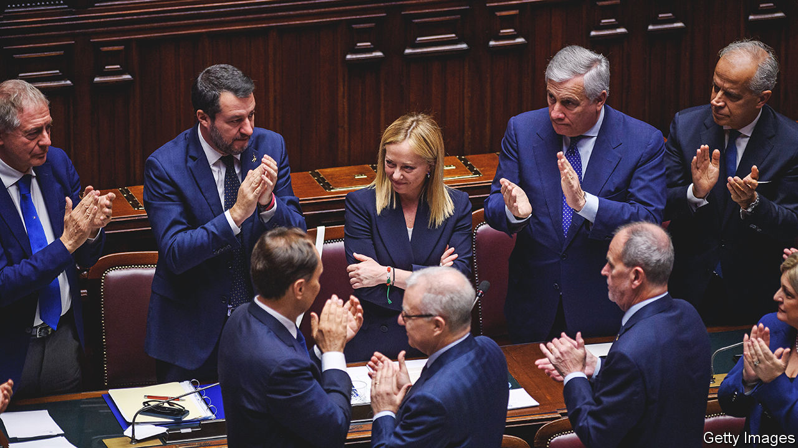

###### Enter Giorgia

# Giorgia Meloni takes office as prime minister of Italy 

##### She leads the most right-wing government since the war 

 

> Oct 27th 2022 

A reason commonly given by voters for choosing Giorgia Meloni and her Brothers of Italy (FdI) party in last month’s general election was her consistency. In her eight years leading the party, she had never wavered in her advocacy of hardline conservative policies, even resisting the lure of office in 2021 by refusing to join Mario Draghi’s outgoing government of national unity.

However, on the evidence of Ms Meloni’s moves since becoming Italy’s first woman prime minister on October 21st, the last thing anyone should expect of her is consistency. Fated to govern with two fractious coalition partners and seen in much of Europe as a far-right Eurosceptic, she has too many balances to strike and fears to allay to remain dogmatic.

In her first speech to parliament, on October 25th, Ms Meloni went to unprecedented lengths to dispel the misgivings that arise from her and her party’s erstwhile allegiance to neo-fascism. “We shall combat all forms of racism, anti-Semitism, political violence and discrimination,” she declared. Using stronger language than ever before, Ms Meloni said the anti-Jewish laws passed under Benito Mussolini’s dictatorship in 1938 were “a disgrace that will taint our people for ever”. Less convincingly, she claimed she had never felt sympathy for undemocratic regimes (even though, in a filmed interview as a young activist, Ms Meloni praised Mussolini).

Her speech will have found favour in Washington. Acknowledging that Russia’s invasion had brought higher energy costs that would ruin companies and cost jobs in Italy, she insisted that “those who believe Ukraine’s freedom can be bartered for our peace of mind are wrong”. In Brussels and Frankfurt, observers may be more wary. True, Ms Meloni made no mention of the wholesale revision of the EU’s treaties that once featured in her party’s manifesto. But she reserved the right to criticise its workings, vowing to “make [Italy’s] voice heard loudly”. And she took a swipe at the ECB over its interest-rate policy. 

Italy stands to receive almost €200bn in grants and cheap loans from the EU’s post-pandemic recovery fund. But the flow of cash depends on the introduction of structural reforms, and Ms Meloni made no commitment in her speech this week to implement them (though self-interest suggests that she will have to). That, however, was all of a piece with the uncertainty that clings to much of her government’s economic direction. The Brothers inherited from their political forebears a taste for state intervention that is anathema to the other main parties in the coalition, the Northern League and Silvio Berlusconi’s Forza Italia. Apparently embracing economic liberalism, Ms Meloni declared that her government would embark on a programme of simplification and deregulation to ensure the least possible interference with business. Yet she also appeared to foreshadow a renationalisation of Italy’s strategic infrastructure, starting with communications. The ownership of key networks would be public, she said, while the operators would continue to compete freely on them.

In what looked like an attempt to upstage and pre-empt Ms Meloni, the leader of the League, Matteo Salvini, held an “economic summit” on the eve of her big speech to agree his party’s line on the policies the government should adopt. Mr Salvini is also the infrastructure minister, a post that offers him control of Italy’s ports and coastguard. That in turn gives him a say in dealing with the handling of migrants rescued from the Mediterranean. But the infrastructure ministry also provides him with a chance to revive his party’s waning popularity by authorising costly investments that generate jobs and profits (he is already pressing for a bridge to link Sicily to the mainland). Ms Meloni, by contrast, has nailed her colours to the mast of fiscal prudence. How this tug-of-war will play out may also depend on the new finance minister, Giancarlo Giorgetti, a respected moderate, but also subordinate to Mr Salvini in the League.

Some things are clear. Ms Meloni intends to spend most, if not all, of a handy €10bn surplus left by Mr Draghi on further measures to offset the burden of energy costs. More controversially, she plans a moratorium on fines for the non-payment of taxes. She also committed herself to other measures to stimulate growth, including income- and employment-tax cuts and the extension of a flat rate for the self-employed. But these, like a reform of the pension system, would either be phased in gradually or introduced later.

Ms Meloni wants to open unexploited offshore-gas fields and remove bureaucratic obstacles to the development of renewables, particularly in the south. Both measures are bound to run into opposition, though. An important reason for the red tape surrounding wind and solar farms is that Italy’s mafias have proved adept at securing the contracts to build them. As Ms Meloni is doubtless aware, Italy is not an easy country to govern. ■

