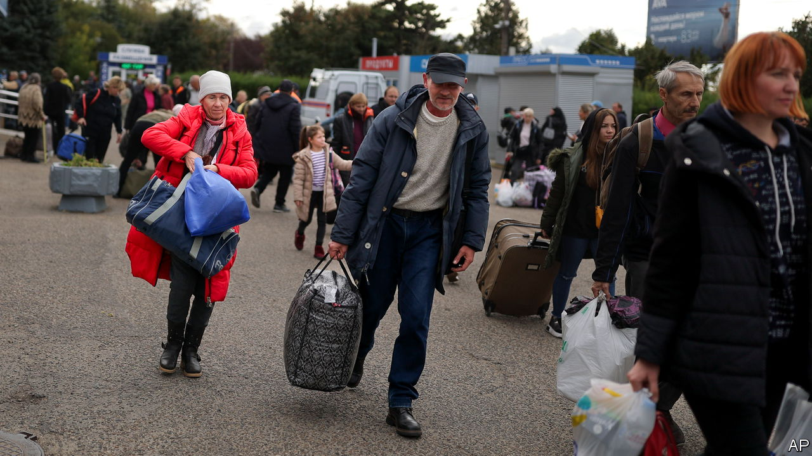
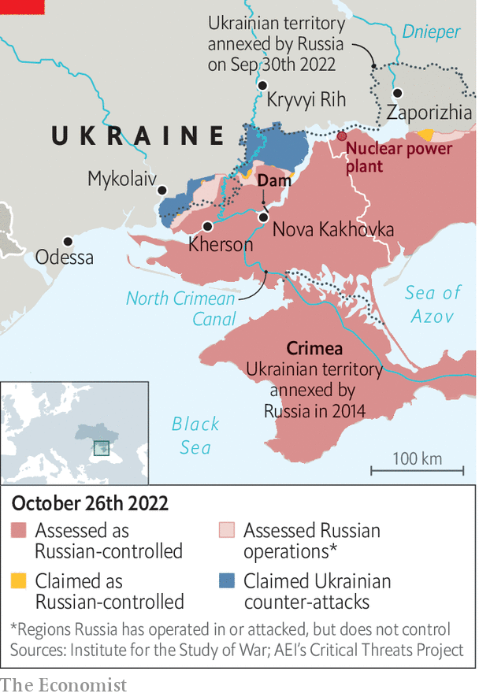

###### Fighting dirty

# Russia braces for a battle over Kherson 

##### It is the gateway to Crimea 

 

> Oct 27th 2022 

Even the statues are leaving. For decades, the stone and bronze busts of Fyodor Ushakov and Alexander Suvorov, a pair of 18th-century Russian commanders, looked over the centre of Kherson, a city in Ukraine’s south. In late October, under the cover of darkness, they disappeared, presumably carried off by the Russian troops who have occupied the city since March. The living are on the move, too. The puppet authorities installed by the Russians are evacuating thousands of the city’s remaining residents across the Dnieper river, deeper into Russian-controlled territory. Some Russian officers are following in their footsteps. They are not packing light. Ukrainian officials say cash has been removed from the vaults of Promsvyazbank, the biggest Russian bank in the city. Looting has become common.

 


Months of Ukrainian artillery strikes seem at last to have paved the way for advances on the ground in surrounding Kherson province. Since early October, Ukrainian forces have broken through Russian defences in the province’s north-east, recapturing more than 500 sq km of territory. But the evacuation of the city, and the withdrawal of some troops, does not mean Russia is about to give it up. The advancing Ukrainians want to avoid an urban battle, which would risk leaving the city in ruins. But they may have no choice. 

Kherson is the gateway to Crimea, which Russia has occupied since 2014. In September, a month after Ukraine launched its southern counteroffensive, the Russians formally annexed Kherson province, along with three others: Luhansk, Donetsk and Zaporizhia. Heavy Ukrainian shelling, and the use of American HIMARS artillery systems capable of hitting targets deep behind enemy lines, have destroyed Russian bases and supply routes, including bridges over the Dnieper. 

But this has not softened up Russian defences as much as expected. “We believed they would try to move their bases far away to save their officers and armour,” says Volodymyr Omelyan, an army captain and former government minister, who recently came back from the Kherson front. “But after we destroy one base, they move more people into place and we hit once again.” Mr Omelyan says that Russian commanding officers are indeed being moved back to the eastern bank of the river, but are being replaced by ordinary troops, including new conscripts. 

The Russians are pulling back their most capable troops to refashion them into units that would be able to go on the offensive early next year, says a Ukrainian intelligence source. The defence of the Russian strongholds will be left mostly to newly mobilised troops. At least for now, the Russians are not retreating, but regrouping. Russia cannot afford to abandon the Dnieper’s western bank to the Ukrainians, says Oleg Zhdanov, a military expert. “The defence in the Zaporizhia direction would collapse. They would lose the nuclear power plant, the North Crimean Canal, meaning the water supply to Crimea, and the land corridor to Crimea,” he says. But the Russians are keenly aware that Ukraine has the momentum. 

Meanwhile, Russia has begun to talk up the threat of a dirty bomb or an attack on the nuclear plant in Zaporizhia, which it would blame on the Ukrainians. Volodymyr Zelensky, the Ukrainian president, claims Russia is planning to blow up the dam at Nova Kakhovka, upriver from Kherson. The resulting floods would prevent Ukrainian troops from pursuing the Russians across the Dnieper. They would also displace hundreds of thousands of people. 

Russia’s warnings are directly related to the situation in Kherson. Vladimir Putin is hoping to put pressure on Ukraine and its Western partners to accede to negotiations and a ceasefire, says Mr Zhdanov. “Putin needs to stop Ukraine’s armed forces at any cost,” he says, “because he understands that his army is not holding what they have captured.” The Ukrainians are not likely to give in to such blackmail. In Kherson, Mr Putin and his commanders may soon face some difficult choices indeed. ■


