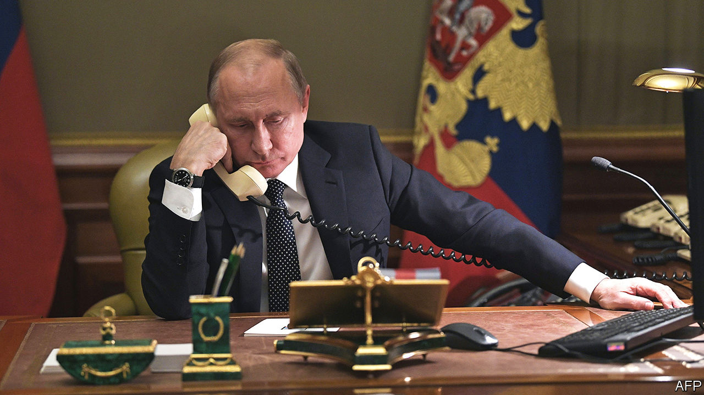

###### Life after Vladimir

# Russia’s elite begins to ponder a Putinless future 

##### Once unthinkable, the president’s removal can at least be contemplated 

 

> Oct 26th 2022 

“WHAT IS NEXT? Is there life after Putin? How does he go and who replaces him?” Such are the questions that weigh heavily these days on the minds of the Russian elite, its bureaucrats and businessmen, as they observe the Ukrainian army advancing, talented  and the West refusing to back down in the face of  energy and nuclear blackmail. “There is a lot of swearing and angry talk in Moscow restaurants and kitchens,” one member of the elite says. “Everyone has realised that Putin has blundered and is losing.” 

This does not mean that Mr Putin is about to bow out, be overthrown or fire a nuclear weapon. It does mean that those who run the country and own assets there are losing confidence in their president. Russia’s political system appears to be entering the most turbulent period of its post-Soviet history. Western governments, too, are starting to worry that  could become ungovernable. 

“Never before has Vladimir Putin been in such a situation in the 23 years of his rule,” says Kirill Rogov, a Russian political analyst. In the past, when confronted by difficult situations such as the loss of the submarine and its 118 crew members in 2000or an appalling school siege in 2004 that ended with the deaths of 333 people, he managed to deflect responsibility and retain his image as a strong leader. “Now he is planning and executing operations that are visibly failing.”

The invasion of Ukraine on February 24th was a shock to the Russian establishment, which had persuaded itself that Mr Putin would not risk full-scale war. But the mixture of his initial, if limited, military advances, the absence of an economic collapse in Russia, and early attempts at peace negotiations calmed nerves. (Heavy drinking may also have helped; it became so acute that Mr Putin started to complain in public about alcoholism.) Some members of the elite even, for a while, persuaded themselves that Mr Putin could not lose.

This view has been shattered by Mr Putin’s “partial” mobilisation. It showed that his “special military operation” was faltering; and, by drafting more troops, he was seen to be dragging the country deeper into the conflict. And as a mass exodus and extensive draft-dodging have shown, his attempt to turn his venture into a new “Great Patriotic War” has so far failed. The mobilisation has broken the basic premise of the public’s acquiescence to the war: that it would not demand its active participation. In Moscow, Russia’s richest city, where men were being press-ganged in the streets, the mayor, Sergei Sobyanin, felt compelled on October 17th to announce that conscription was over. Other regions, with less lobbying power, will have to make up the shortfall. 

Mr Putin cannot win his war, for from the very start it had no clear goals; and, having lost so much, he cannot end it without being deeply humiliated. Even if the fighting in Ukraine were to cease, a return to peaceful pre-war life is all but impossible under his belligerent presidency. Meanwhile, the economy is starting to show the effects of sanctions and of the exodus of the most skilled and educated members of the workforce; consumer confidence is on the slide.

A ceremony on September 30th, in which, after a ranting speech against the West, Mr Putin annexed four provinces in Ukraine that he does not actually control, was so absurd that it probably undermined his aura of strength even within Russia. As Tatyana Stanovaya, a political consultant, puts it: “Until September, the Russian elites had made the pragmatic choice to support Putin…but matters have progressed so far that they may now have to choose among various losing scenarios.”

A military defeat might well lead to the collapse of the regime, with all the associated risks for those who have supported it. Mr Putin’s bellicosity meanwhile “raises the question of whether the Russian elites are prepared to stick with Putin until the bitter end, particularly amid growing threats to use nuclear weapons,” Ms Stanovaya notes. Mr Putin has gone from being a perceived source of stability to one of instability, and danger. This week Ksenia Sobchak, reputed to be Mr Putin’s god-daughter, fled ahead of arrest, a sign that the elite is now devouring its own.

Abbas Galyamov, a political analyst who has spent time in the Kremlin, argues that in the next few weeks and months the elite, whose members have always trusted Mr Putin’s ability to preserve his regime (and them), will realise that it is up to them to save it and even their own lives. This, he says, will intensify the search for a possible successor within the system. 

Mr Galyamov’s list of potential candidates includes Dmitry Patrushev, the son of Nikolai Patrushev, who is the head of the Security Council and one of the chief ideologues of the regime. Mr Patrushev junior is a former minister. Though part of the family, he could be seen as a fresh face because of his youth. More familiar possibilities include Sergei Kiriyenko, the deputy chief of staff at the Kremlin; Mr Sobyanin, the mayor of Moscow; and Mikhail Mishustin, the prime minister, who could make an alliance with some of the security men and play the role of a moderate negotiator with the West. 

Yet, as Alexei Navalny, Russia’s jailed opposition leader, argued recently in the , the hope that “Mr Putin’s replacement by another member of his elite will fundamentally change this view on war, and especially war over the ‘legacy of the USSR’, is naive at the very least.” The only way to stop the endless cycle of imperial nationalism, Mr Navalny argued, is for Russia to decentralise power and turn itself into a parliamentary republic. In what looked like an appeal to the Russian elite, Mr Navalny argued that parliamentary democracy is also a rational and desirable choice for many of the political factions around Mr Putin. “It gives them an opportunity to maintain influence and fight for power while ensuring that they are not destroyed by a more aggressive group.”

This “more aggressive group” has already started to emerge. It includes Yevgeny Prigozhin, a former criminal known as “Putin’s chef”, who runs a group of mercenaries called the Wagner group, and Ramzan Kadyrov, the strongman of Chechnya, who has his own private army. Both men are seen as personally loyal to Mr Putin. Ekaterina Schulmann, a political scientist, has likened Mr Prigozhin’s men to —a corps of bodyguards established by Ivan the Terrible—who have plunged the country into chaos. Russia’s dictator wants to turn Ukraine into a failed state. Instead, he is fast turning Russia into one. ■


