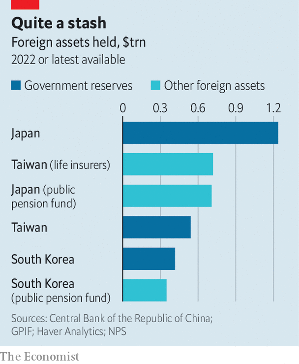

###### Currency colossi

# Asia’s vast financial institutions are being enlisted to defend currencies 

##### Will Japan join in? 

 

> Oct 27th 2022 

Taiwan’s life insurers and Japan’s Government Pension Investment Fund (GPIF) sound like sleepy organisations—hardly the sort to play a role in international markets. But over the past decade they have become vast institutions. They now look after hoards of foreign assets as big as national foreign-exchange reserves (see chart). In the middle of this year, the gpif alone held more than $700bn in foreign bonds and stocks. 

 


As the dollar strengthens, policymakers are looking covetously at these foreign assets. The greenback is up by 16% in 2022 against a basket of currencies. Outside America, depreciation is raising import costs. Japan and South Korea have followed the conventional path of selling their own foreign-exchange reserves to shore up their currencies. Japanese officials do not say when they do so, but a sudden strengthening of the yen on October 21st bore telltale signs of intervention. Analysts reckon 5.5trn yen ($37bn) has been spent on such manoeuvres this month.

Will domestic financial institutions be enlisted to the fight? China is not shy of doing so. It tweaks foreign-reserve requirements on commercial banks to manage the yuan, and majority state-owned lenders sometimes intervene on the central bank’s behalf. Things are not so easy in countries with more open capital accounts and less high-handed governments.

In the early 2000s, the last time the dollar was as strong, the question of intervention by financial institutions did not arise, simply because the funds were much smaller. As recently as 2010, South Korea’s pension fund was a third of its current size. Since then, populations have aged and sought higher returns—and portfolios have ballooned. The firms’ sales of domestic currencies to buy foreign assets has kept the yen, won and Taiwanese dollar weak, which was welcome until recently.

The level of influence that officials can exert over institutions varies. The Bank of Korea and the country’s pension fund entered a $10bn currency-swap deal last month. The fund agreed to borrow dollars from the central bank in exchange for won, rather than selling the currency on the open market, relieving a potential source of pressure on its market value. 

Taiwanese life insurers, unlike South Korea’s pension fund, are private firms. Even so, they can be prodded in the right direction. Taiwan’s central bank now allows life insurers to remit $100m-150m a day to the country, according to Reuters, a news agency. When the local currency was stronger, the central bank had been reluctant to allow such transfers.

Japan’s gpif has not been recruited to combat the weakening yen, but that has not stopped speculation that it might be eventually. The fund could hedge more of its assets in yen, which could have the effect of strengthening the currency, says Brad Setser of the Council on Foreign Relations, a think-tank. “On pure financial-management grounds, there’s a question of whether the gpif should have such a large share of its foreign-currency holdings held on an unhedged basis,” he adds. 

Although the dollar has slipped a little in recent days, that does not change the picture for Asian officials, who are still dealing with far weaker currencies than they would like. They will probably continue intervening. And they may be tempted to bring outside assets into play. ■


