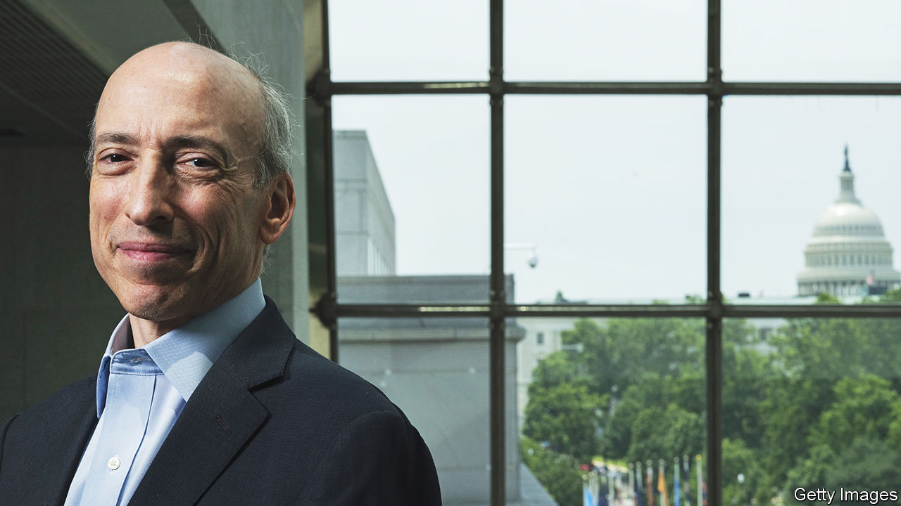
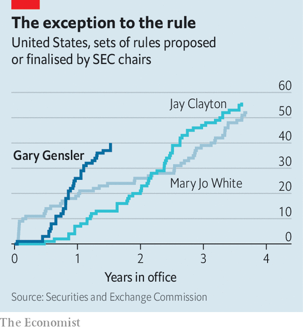

###### Super-regulator

# Can Gary Gensler solve every problem in American finance? 

##### The lofty aims of the chairman of the Securities and Exchange Commission 

 

> Oct 26th 2022 

Everyone in finance has an opinion of . To many, the chairman of the Securities and Exchange Commission (sec), America’s main financial regulator, is meddlesome and overreaching. Mention him in crypto circles and you invite a convoluted description of a token or project, followed by the speaker hissing: “How can  be a security?!” His  have raised the eyebrows of other policymakers, alarmed lobbyists in Washington and panicked much of Wall Street. One bank boss sneers that his agenda is ridiculous. So broad are his aims, “he must think he is an Avenger,” assuming he can “swoop in and fix every problem in finance.”

 


It is impressive to have made such an impression after 18 months at the helm. In Mr Gensler’s brief time in office he has made filings to propose or finalise 40 sets of rules. At this point Jay Clayton, his Republican predecessor, had made just a third as many, and Mary Jo White, the Democrat who preceded Mr Clayton, around two-thirds (see chart). Mr Gensler is keeping his speechwriter busy, too. Since assuming office he has given 60 speeches, twice as many as Mr Clayton in his whole tenure. Mr Gensler has even found the time to charge Kim Kardashian for unlawfully touting a crypto security.

Yet Mr Gensler does not seem the type to court controversy. He speaks with the precision of a central banker and avoids talking about specific firms or rules his agency has not opined on. When discussing thorny problems in an interview with  he frequently appeals to first principles—such as fairness for investors, level playing fields between market institutions, and safe investing—which he wants to be the legacy of his time in office. 

Perhaps Mr Gensler’s critics are driven to ad hominem attacks because it is hard otherwise to undermine his authority. No one can accuse him of being underqualified in finance or regulation. Mr Gensler cut his teeth on Wall Street, joining Goldman Sachs at 22. By 30 he was one of the bank’s youngest-ever partners. He then worked at the Treasury during Bill Clinton’s presidency, and ran the Commodities and Futures Trading Commission under Barack Obama. “He wrote a lot of Dodd-Frank. He is a very smart man,” says the boss of a big firm, referring to America’s post-financial-crisis legislation. “He is not someone I would want to go up against.” 

He even understands crypto, much to the chagrin of those who wish to paint him as someone who does not “get it”. In 2018 he taught a course on blockchains for the Massachusetts Institute of Technology’s business school, which is available in its entirety on YouTube. It reveals both a deep knowledge of the tech and the fact that years in regulation have not dulled Mr Gensler’s capitalist instincts. In his first lecture he quizzed students on what they wanted from the class. When reviewing the results the next week, he revealed that five people had admitted their aim was to make money: “And I applaud those who said that because: Own it. You’re in a business school. Why not?” he grinned.

Mr Gensler’s frenetic activity partly reflects the chaotic time he started the job. He was appointed in April 2021, a year after the Treasury market—the world’s most important financial market—seized up during a pandemic-induced dash for cash. A financial boom was roaring. Beeple, an artist, had just sold a non-fungible token for $69m, kicking off a frenzy for crypto assets. Special-purpose acquisition vehicles (spacs) were raising billions of dollars a week. And retail traders, enabled by new apps, were kicking off a 50-fold increase in shares of GameStop, an electronics-retail firm, pushing short-sellers, brokers and the stock-settlement system to the brink. 

Little surprise, then, that Mr Gensler has grand plans. He wants to change the settlement system to reduce the risk facing retail brokers. He also thinks the Treasury market should be centrally cleared, so that a single institution stands between buyers and sellers, taking counterparty risk. This, he explains, is because central clearing promotes competition. In doing so, it also “enhances and expands access, lowers counterparty risk, helps broaden the market...and on the margin, results in a bit more liquidity.” 

His ideas do not stop there. Mr Gensler has proposed rules to force spacs to match the disclosure requirements of initial public offerings, the mere suggestion of which was enough to quell fundraising. His suggestions for climate disclosure would force firms to measure and report on emissions in regulatory filings. New rules are imminent on the structure of stockmarkets and the process by which retail brokers direct stock orders to intermediaries (known as payment by order flow). The sec seems fixated on levelling the playing field between the exchanges, which are limited in how they make and quote prices, and the wholesalers, which are not. “I can’t prejudge where we’ll come out,” says Mr Gensler. “But our goal is about enhancing the competition and lowering the costs.”

Many of these suggestions, such as reducing settlement times or centrally clearing Treasuries, are sensible and have support from market participants. But Mr Gensler has not shied away from topics, such as environmental rules or stockmarket structure, that are controversial and surely will attract legal challenges. Nor is he inclined to let accusations of overreach impede him. Congress has proposed several bills to clarify the authority the sec has over the crypto industry. Mr Gensler does not appear to believe they are necessary. “I think it’s pretty clear. I think that nearly 90 years ago Congress painted with a broad brush”, when defining the powers of regulators, he says. “And I’m quoting Thurgood Marshall there, the famous Supreme Court Justice, who wrote that in the 1970s.”

Cynics think this sweeping agenda is a ploy to draw attention. “Clearly he has got his eye on higher office,” says one, referring to gossip he wants a top government job. But Mr Gensler’s more controversial plans—in crypto, say, or the structure of stockmarkets—do hew to the principles by which he is most animated, such as fairness and consumer protection. Perhaps the idea that Mr Gensler will soon move on is nothing more than wishful thinking. He has plenty of power where he is. ■


