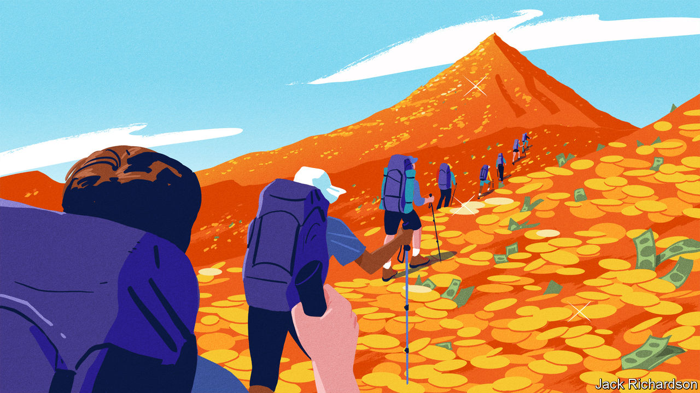
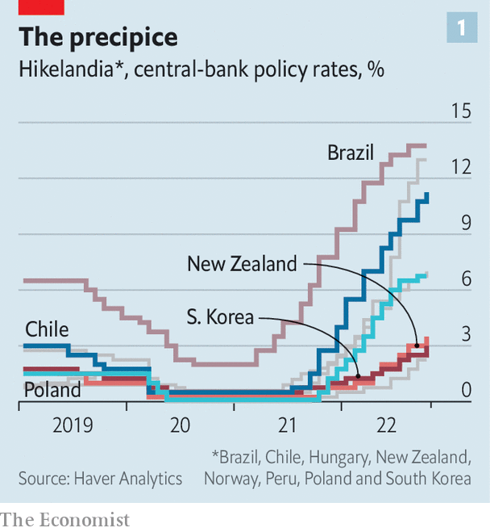
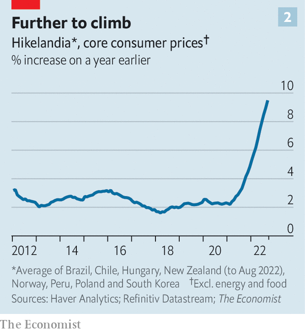

###### What next?

# Even super-tight policy is not bringing down inflation 

##### Welcome to Hikelandia, where price growth just won’t cool 

 

> Oct 23rd 2022 

It feels a little unfair. In July 2021, as rate-setters in America and Europe dismissed the risk of entrenched inflation, the Central Bank of Chile got its act together. Worried that inflation would rise and stay high, its policymakers voted to lift rates from 0.5% to 0.75%. The bank has since raised rates again and again, outpacing investors’ expectations and taking the policy rate all the way up to 11.25%. Perhaps no other central bank has pursued price stability with such dedication. 

Has the star pupil been rewarded? Hardly. In September Chile’s prices rose by 14% year on year. The central bank’s preferred measure of “core” inflation, which excludes volatile components like energy and food, jumped to 11%. 

Chile’s example speaks to a wider problem. Many pundits say that if only the , the European Central Bank and others had “got ahead of the curve” by quickly raising rates last year, the world would not be struggling with high inflation today. The experience of Chile, and other places that tightened early and aggressively, casts doubt on that argument. All over the world, it is proving extraordinarily difficult to crush price rises. 

 


 has gathered data on Chile and seven other countries in which the central bank started a tightening cycle at least a year ago, and did so after having slashed interest rates to an all-time low early in the covid-19 pandemic (see chart ). The group includes Brazil, Hungary, New Zealand, Norway, South Korea, Peru and Poland. Although Russia would have qualified, we have excluded it because its circumstances are unique. 

Call the unlikely gang “Hikelandia”. In the year to October the median economy in Hikelandia raised rates by six percentage points. If as expected the Fed raises rates by 0.75 percentage points on November 2nd, America’s cumulative increase over the past year will still be nowhere near as big. 

Unsurprisingly, turning the monetary screws has slowed Hikelandia’s economy. The property market has come off the boil as mortgage rates have risen. House prices are drifting down in New Zealand. South Korea’s pandemic housing boom has ended. Goldman Sachs, a bank, produces a “current-activity indicator”, a real-time measure of economic strength. Using its data, we find that Hikelandia’s economy is weakening relative to the global average. And there is worse to come. Chile’s central bank expects gdp to shrink next year. 

 


Inflation, however, remains stubborn (see chart 2). Central banks often focus on the rate of core inflation, which better reflects domestic inflationary pressures. In September core inflation in Hikelandia hit 9.5%, year on year, up 3.5 percentage points from March. Worse still, the gap between global core inflation and Hikelandia’s reading seems to be widening, not shrinking.

Dig into the national statistics of Hikelandia, and the trends become even more concerning. Chile’s wage growth continues to accelerate. In September South Korea’s inflation rate in the labour-intensive service sector was 4.2% year on year, its highest since the early 2000s. In the past six months Hungary’s service-sector inflation has climbed from 7.2% to 11.5%. Across the club, inflation is becoming more dispersed, affecting a wider range of goods and services. In September the price of 89% of the components in Norway’s inflation basket rose by more than 2% year on year, up from 53% six months before. In research on Poland, published in late September, economists at Goldman Sachs found evidence that “underlying inflation momentum has picked up again”. 

Hikelandia’s struggles raise three possibilities. The first is that it is currently unrealistic to expect inflation to fall. Research suggests that there are lags, sometimes long ones, between tighter monetary policy and lower inflation. It is also tricky to control inflation when almost every currency is depreciating against the dollar, making imports more expensive. All this may be true. But after being surprised again and again by inflation, you would be brave to bet that Hikelandia’s inflation will soon be anywhere near central banks’ targets, even if conditions begin to improve.

The second possibility is that policymakers, including those in Hikelandia, have not been sufficiently courageous. Perhaps central banks should have . This is an argument stridently made by Chile’s remaining “Chicago Boys”, libertarian economists who spearheaded the country’s free-market reforms in the 1970s. 

Governments might also do more to help out. After ramping up spending when the pandemic struck, the median budget deficit in Hikelandia has fallen, but is still wide at 3% of gdp. Further increases to taxes or cuts to public spending would help reduce demand. Yet this strategy carries risks, too. Implementing austerity during a cost-of-living crisis would be deeply unpopular. And Chile, which has nonetheless taken the plunge and is forecast to run a budget surplus this year, is still seeing little payoff in terms of lower inflation.

That leads to a third possibility—and the most worrying one. Perhaps inflation is simply harder to stop than anyone could have predicted a year ago. A report published in the summer by the Bank for International Settlements, a club for central banks, hinted at this possibility. In a “low-inflation regime”, the norm before the pandemic, no one paid much attention to prices, ensuring they did not rise quickly. But in a “high-inflation regime”, such as in the 1970s, households and firms start to track inflation closely, leading in time to “behavioural changes that could entrench it”. If the world has shifted from one norm to another, then different tools may be needed to cool prices. ■


