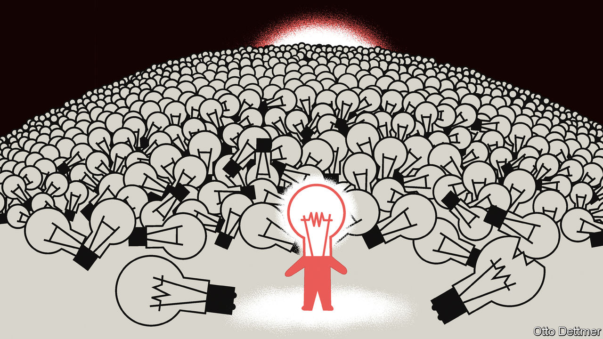

###### Free exchange

# How to escape scientific stagnation 

##### A number of billion-dollar experiments suggest a path 

 

> Oct 26th 2022 

In 2008 ben jones of Northwestern University formalised a simple yet powerful observation. The more knowledge humans have, the longer it takes a budding researcher to get to the frontier, and thus to push things forward. In a paper provocatively titled, “The burden of knowledge and the death of the Renaissance man”, Mr Jones argued humanity’s growing knowledge would slow scientific progress and thus economic growth. More recent research has solidified this view. In 2020 economists at Stanford University and the Massachusetts Institute of Technology (mit) published another provocatively titled paper, “Are ideas getting harder to find?” which concluded that in areas from crop yields to microchip density, new ideas were indeed getting harder to find.

The slowdown has spurred academics and policymakers looking to bolster scientific enterprise. Many are turning to darpa, a cold war outfit which funds high-risk “moonshot” research, for inspiration. Last year the National Institutes of Health (nih), America’s largest science funder, launched a new arm with an annual budget of $1bn called arpa-h. Other countries, including Britain and Germany, have set up their own versions. In July America’s Congress authorised nearly $200bn in new scientific funding over the next decade (although it is yet to stump up the cash), in the process creating a branch of the National Science Foundation (nsf) for applied science and tech. Philanthropists are joining the action, too: their funding of basic research has nearly doubled in the past decade. All these efforts aim to help science get back its risk-loving mojo. 

In a working paper published last year, Chiara Franzoni of the polimi Graduate School of Management and Paula Stephan of Georgia State University look at a number of measures of risk, based on analyses of text and the variability of citations. These suggest science’s reward structure discourages academics from taking chances. The most common way research is funded, through peer review—in which academics in similar fields score proposals—deserves some blame. In 2017, using a data set of almost 100,000 nih grant applications, Danielle Li, then of Harvard University, found that reviewers seem to favour ideas similar to their own expertise. If a project must satisfy a committee, it is not surprising that unorthodox ideas struggle to make it through.

This suggests that breaking bad funding habits should make a difference. The dARPA model, which has more in common with venture capital than traditional funding structures, is an attempt to do just that. It empowers programme directors to finance high-risk, high-reward projects with a bent towards real-world use. But though it has proved successful in the defence industry—funding groundbreaking technologies from the early internet to gps—it may not be quite as successful elsewhere. A book chapter published in February by Ms Li and Pierre Azoulay at mit notes that the darpa model does best when its programme directors have a clear understanding of the sort of breakthroughs that are needed. This is often the case at darpa itself, where both the funder and user of new tech is the defence department. In areas like energy or health care, things are rather less straightforward. The end users are many and dispersed rather than a single government department. Indeed, other work by Mr Azoulay and colleagues notes that although arpa-e, an energy-focused outfit launched in 2009, is still in its relatively early days, it is yet to produce advances on a par with its defence-orientated predecessor.

Another approach in vogue is to fund “people not projects”. Most conventional grants fund specific projects for a specific amount of time, usually a few years, which researchers worry prevents them from pivoting to new ideas when old ones do not work out and fails to allot enough time for risky ones to come to fruition. A study in 2011 compared researchers at the Howard Hughes Medical Institute, where they are granted considerable flexibility over their research agendas and lots of time to carry out investigations, with similarly accomplished ones funded by a standard nih programme. The study found that researchers at the institute took more risks. As a result, they produced nearly twice as much highly cited work, as well as a third more “flops” (articles with fewer citations than their previously least-cited work). These results may be hard to replicate elsewhere. Researchers at the Howard Hughes institute are selected for attributes that suggest they will thrive in such a flexible environment. But the gap is big enough to indicate that others may also benefit from more freedom.

The science of science

Despite the uncertainty about exactly how best to fund scientific research, economists are confident of two things. The first is that a one-size-fits-all approach is not the right answer, says Heidi Williams of Stanford University. darpa models, the Howard Hughes Medical Institute’s curiosity-driven method, and even handing out grants by lottery, as the New Zealand Health Research Council has tried, all have their uses. Evaluation of them can then build knowledge of what works, says Matt Clancy, an economist who curates a continuously updated online literature survey on innovation, itself an experiment in how to improve science. 

The second is that this burst of experimentation must continue. The boss of the nsf, Sethuraman Panchanathan, agrees. He is looking to reassess projects whose reviews are highly variable—a possible indication of unorthodoxy. He is also interested in a Willy Wonka-style funding mechanism called the “Golden Ticket”, which would allow a single reviewer to champion a project even if his or her peers do not agree. Mr Clancy notes that many venture-capital partnerships employ similar policies, because they prioritise the upside of long-shot projects rather than seeking to minimise failure. Thus far, there is little quantitative evidence on whether Golden Tickets produce Golden Outcomes. All the more reason to try them. ■


