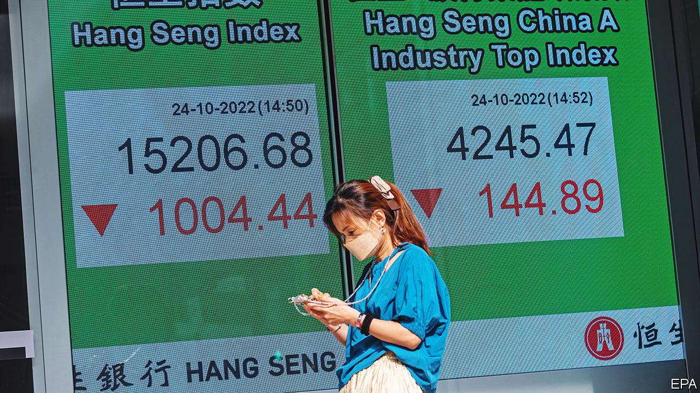
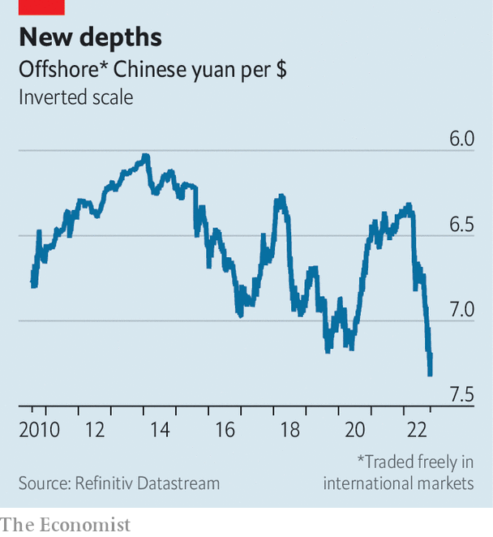

###### The fleeing committee

# Xi Jinping provokes a spectacular sell-off in China’s markets 

##### Investors must now choose between value and values 

 

> Oct 25th 2022 

On october 23rd China’s ruler, Xi Jinping, asked the Central Committee of the Communist Party to endorse him and his  to run the country for the next five years. He had no trouble in securing their support. But the next day, he had a lot more difficulty with the highly decentralised committee that is the global financial market. 

Foreign investors dumped China’s shares and its currency in spectacular fashion. Hong Kong’s Hang Seng stockmarket index, dominated by mainland firms, fell by over 6%. The sell-off was even worse in New York. The Golden Dragon index of Chinese companies listed on the tech-heavy Nasdaq, which includes giants like Alibaba and Baidu, fell at one point by 20%, reaching levels last seen before Mr Xi took power ten years ago. The offshore yuan, which fluctuates more freely than its onshore counterpart, weakened to its lowest value against the dollar since the market began in 2010, before recovering a little in subsequent days.

 


Mr Xi’s third term as leader was no surprise. But he disappointed investors with his picks for the party’s new Politburo and its powerful seven-member Standing Committee. Investors had hoped these bodies would include market-friendly officials, recognised for their ability as well as their loyalty. When China’s financial markets plunged in March, investors were reassured by soothing words from Liu He, a Politburo member and respected economic authority. No one of his stature could voice the same lines today. The upper echelons of China’s communist party now lack policymakers whose expertise and experience might provide a check on Mr Xi’s economic instincts.

These instincts have become clearer over time. The word “security”, for example, appeared 91 times in Mr Xi’s  on October 16th. Mr Xi is determined to fortify China against America’s strategy of economic containment. He seems less interested in keeping foreign companies happy so that they will speak up against this strategy at home. Faced with “external attempts to blackmail, contain, blockade, and exert maximum pressure on China”, he said, “we have shown a fighting spirit and a firm determination to never yield to coercive power.”

Mr Xi’s calls for  also worry foreign investors. His goal of broadening wealth and narrowing inequality has some economic, as well as social, justification. Increasing the share of national income paid to workers could help rebalance China’s economy away from investment towards consumption. Indeed, increasing labour’s slice of the cake is one of the indicators tracked by the imf on its “rebalancing scorecard” for China. But investors fear new taxes on wealth or capital gains. And “common prosperity” has become associated with a clumsy crackdown on some of China’s most successful tech firms. 

Mr Xi has shown little interest in reducing the role of state-owned enterprises to give private firms more room to prosper. Instead of urging the state to retreat, he wants the party to advance. “Party-building” will be stepped up in private firms, he said in his report to the congress. Colin Hawes of the University of Technology Sydney has argued that private firms have, for the most part, successfully co-opted the party organisations within them. These organisations are often led by the firm’s boss. Their members know that it is the firm not the party that pays their salaries. There is, though, no guarantee this modus vivendi will last, especially in some of the bigger companies favoured by foreign investors.

China’s faltering markets have become “disconnected” from improving fundamentals, according to investment strategists at JPMorgan Chase. Economic data released on October 24th showed that China’s gdp grew by 3.9% in the third quarter, compared with a year earlier. The figure, which appeared later than scheduled, was also faster than expected. Like all Chinese data, it was met with scepticism. But it was not obviously out of line with several lower-profile indicators, like electricity production, which grew by more than 6% over the same period. ubs, a bank, raised its forecast for China’s growth this year from 2.7% to 3.2%. Chinese shares also regained some ground. 

Nevertheless, the reshuffle of China’s leadership may be provoking a reshuffle of China’s investor base. Given Mr Xi’s growing power and declining pragmatism, investors must ask whether or not they can stomach his philosophy. For investors who can’t, getting out is the only course of action. For those who can, Chinese companies now look cheap relative to their earnings prospects. The future of China’s markets will thus be determined by the tug-of-war between value and values. ■


