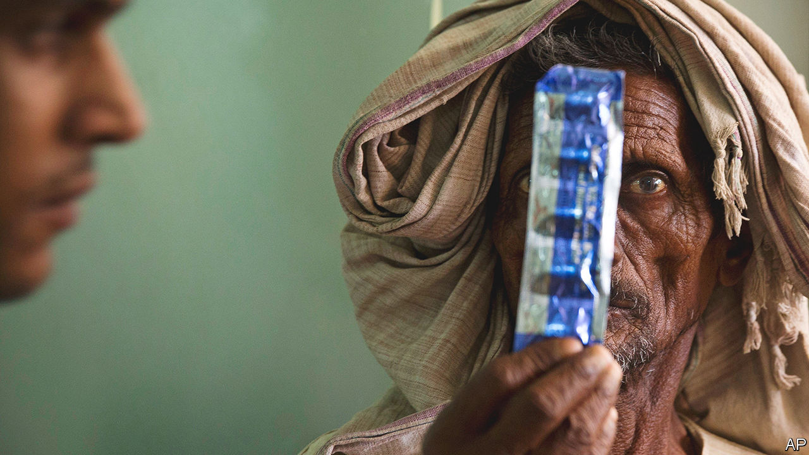
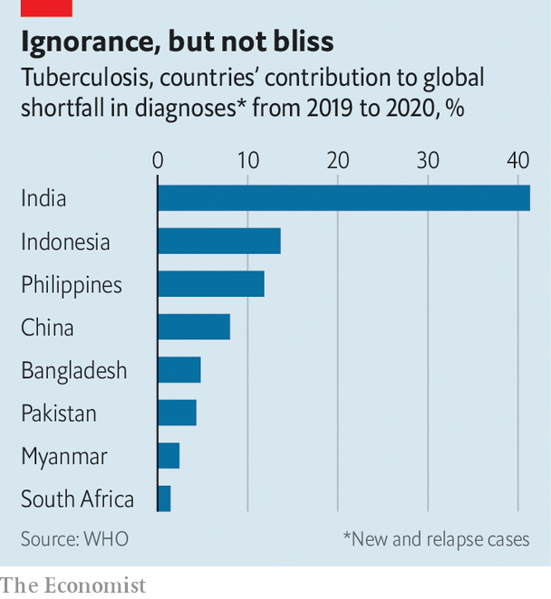
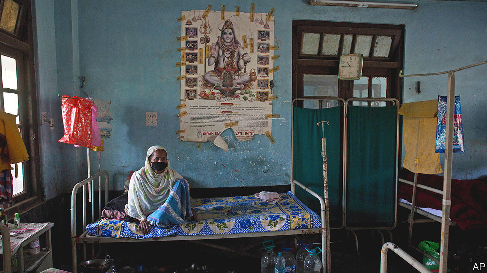

###### A baleful legacy

# How one pandemic made another one worse 

##### Covid-19 set back the battle against tuberculosis. But it also points the way forward 

 

> Oct 27th 2022 

Earlier this year, Antônio Carlos Lombardi Peixoto went to his doctor complaining of fever and an endless cough. He thought it was something to do with his diabetes. Instead, he was told he had a disease he had never heard of: tuberculosis.

In fact, in the slums of Rio de Janeiro where Mr Peixoto lives, tb is common. The treatment was almost as bad as the disease. Mr Peixoto’s tablets gave him crippling pain in his joints and made him dizzy and anxious. “I couldn’t get up. I was scared of everything, scared to even look out of the window.” His thrice-weekly visits to the clinic meant taking time off from his job at the local bakery, pushing him into poverty. Worst of all, his friends and family avoided him for fear of catching the disease. 

He thought about quitting the drugs. But the sight of another patient who had done that, had relapsed, and was now untreatable, persuaded him to keep going. At his three-month check-up, he could barely produce enough phlegm for testing. After six months of gruelling treatment, he was able to go back to his previous life. 

Not everyone is as lucky. Before covid-19, TB was the deadliest pathogen in the world, killing around 1.4m people a year. The official covid death toll so far is around 6.6m (though ’s own , based on excess-death figures, suggests the true figure is between 17m and 28m). And the new pandemic has made the old one worse. After many years of slow but steady decline, the number of deaths from TB is rising again. According to figures published on October 27th by the World Health Organisation’s Global tb Programme, the death toll from tuberculosis was 1.6m in 2021, a rise of 14% since 2019. A paper published last year predicts that number will increase by another 5% to 15% over the coming half decade. The WHO reckons that covid has set back progress against TB by many years. 

Tuberculosis is an ancient affliction. Traces of , the bug that causes it, have been found in Egyptian mummies more than 2,500 years old. These days around 1.8bn people are thought to be infected. But 90% of them will never develop symptoms. In the rich world, with clean, well-ventilated homes and abundant food, most infections remain latent and unthreatening. 

Those who get sick are mostly people with weak immune systems. Diabetics, smokers and alcoholics are at higher risk. Almost 15% of people who die of TB every year are HIV-positive. Poverty and its associated ills, such as malnutrition and overcrowding, raise the risk considerably. Just eight countries, including China, India, Indonesia and Nigeria, account for two-thirds of the world’s symptomatic cases.

Unintended consequences

Covid caused a cascade of problems for anti-TB efforts, especially in poorer countries with less robust health systems. Initially, the hope was that lockdowns and mask mandates might help keep the disease in check. Like covid, TB is transmitted by airborne particles emitted by the sick when they cough, sneeze or even speak. But the overall effect seems to have been negative. As poor families spent more time in small, badly ventilated homes, the bacterium spread more quickly. Economic disruption meant that poverty and hunger rose. The WHO reckons that the number of people given preventative treatment fell by around 10% at the height of the pandemic, between 2019 and 2020.

 


Diagnoses fell more sharply, from 7.1m in 2019 to 5.8m in 2020, especially in poorer countries where the disease is most common (see chart). That was not because fewer people were falling sick, but because fewer could get to a doctor or a clinic. Some who fell ill were nervous about violating lockdown rules by leaving home. Many confused the signs of TB—which generally attacks the lungs, leaving patients exhausted, breathless and coughing—with the symptoms of covid. 

Those who did manage to obtain a diagnosis often struggled to get treatment. Health systems were clogged with covid patients, leaving little room for others. TB patients suffered more than most, since doctors and medical facilities with expertise in respiratory diseases were among the first to be diverted to treat coronavirus patients. Worldwide spending on TB, which was already less than half the global target, fell further, from $6bn in 2019 to $5.4bn in 2021. Tereza Kasaeva, the director of the who’s Global tb Programme, is blunt: “we are badly off track.”

The effects of all this are now being felt. As lockdowns have lifted, patients are at last able to reach doctors and clinics. Diagnoses are beginning to rise again, reaching 6.4m in 2021. But months or years of delays have left some too sick to be treated. Efforts to ensure that patients complete treatment—home check-ups, for instance, or having health-workers watch as patients swallow their pills—had to be suspended during lockdowns. That will have stored up problems of its own, for abandoning treatment mid-way, as Mr Peixoto almost did, encourages the bacterium to evolve resistance to the antibiotics used to treat it. 

At best, such resistance means an even longer course of treatment with even less pleasant drugs. Between 3% and 4% of people who are diagnosed with tuberculosis for the first time suffer from a drug-resistant form of the disease. That rises to between 18% and 21% among those who have previously been treated. 

But while covid has been bad for tuberculosis sufferers, some doctors and officials argue that the world’s response to the newer pandemic shows how it could tackle the older one too. Perhaps covid’s biggest impact, says Lucica Ditiu, head of the Stop TB Partnership, a UN body, was to show just what can be accomplished. Huge quantities of money and effort were poured into developing and assessing treatments. Quick and convenient diagnostic tests were invented, refined, mass-produced and shipped worldwide within months. “It became very clear,” says Ms Ditiu, “that money is not an issue if there is the will.”

A similar effort is not on the cards for tb, which frightens few people in rich countries. However, even a much smaller one would make a big difference. In a paper published in April in the , researchers calculated that more than $100bn was spent developing covid vaccines during the first year of the pandemic, producing more than a dozen candidates. At around $0.1bn per year, investment in new TB vaccines has been a thousand times lower. The only existing vaccine, the Bacillus Calmette–Guérin, or BCG, is more than 100 years old. Although it is mostly effective in preventing severe disease in children, in adults the protection it offers varies greatly, for reasons that are not well understood. 

 


Diagnosis is just as primitive. The most widely used method is the rough-and-ready one used in the 1880s, when  was first identified: putting sputum under a microscope and looking for the bacteria by eye. When it comes to treatment, just three new drugs have been approved by American regulators over the past four decades. Existing treatments are slow, lasting between six and 30 months, and have severe side-effects, including all the ailments Mr Peixoto suffered, as well as kidney failure and hearing loss.

Even before covid, new tests for TB were , as were a clutch of new vaccines. One, first developed by gsk, a British drug firm, and then by the Bill &amp; Melinda Gates Foundation, a charity, is in advanced clinical trials. Now, some of the technology that was used to combat covid is starting to be applied to TB too. mRNA vaccines are a new and powerful technology that forms the basis of several successful covid jabs. BioNTech, a German firm that, along with Pfizer, an American one, introduced one of the first mRNA vaccines against covid, plans to start trials of a TB mrna vaccine later this year. 

In a paper published in the  earlier this year, a group of prominent tb researchers from all around the world called for the establishment of real-time data dashboards for TB, inspired by those developed to track covid. Apps designed to screen and track those infected with covid are already being adapted for those with TB. In South Africa, for instance, the government has developed a service that uses text and WhatsApp messages to ask users a handful of questions, evaluate whether they could have tuberculosis and refer them to local testing services. 

The genetic-surveillance apparatus established to track new variants of covid, such as Alpha, Delta and Omicron, could also be turned towards monitoring TB, says Josefina Campos, the director of Argentina’s national genomics laboratory. Her team had been doing something similar before the coronavirus came along. But during the covid pandemic, investment in gene-sequencing capacity ramped up suddenly, she says. That extra capacity is proving useful in tracking TB too. 

The experience of covid has changed patient behaviour as well. Back in the slums of Rio, Selma Geraldo da Silva, a health worker, says more patients come to see her when they develop a cough or a fever now, rather than waiting for it to pass and hoping for the best. Since the pandemic, they have realised it might be cause for worry. For those who have contracted TB rather than covid, that will help ensure they get treated early. 

The world’s unprecedented response to the covid pandemic has done its job. Vaccines, experience and better drugs to treat the sick have brought the death rate sharply down. ’s tracker estimates worldwide deaths so far in 2022 at around 4.5m. If that fall continues, tb could soon regain its baleful crown as the world’s most lethal infectious disease. For now, the lessons of covid remain fresh in policymakers’ minds. The aftermath of one pandemic seems the best time in decades for a renewed effort to tackle another. ■


