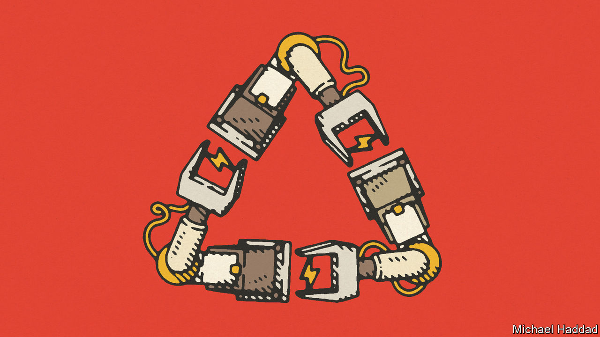

###### A virtuous circle

# Battery-makers are powering a circular economy 

##### “Gigafactories” are being designed to recycle raw materials 

 

> Oct 27th 2022 

Manufacturing is a one-way business. Raw materials go into a factory and finished products come out. Once those goods are sold, producers (initial guarantees apart) usually wash their hands of them. Certainly they do not worry, unless compelled to by law, about how the products are disposed of. Most are burnt or rot in landfill, which pollutes the planet. In only 50 years the world’s consumption of raw materials has nearly quadrupled, to more than 100bn tonnes, according to the latest Circularity Gap Report from the World Economic Forum. Less than 9% of this is reused, resulting in a big waste of materials.

Industry does talk about sustainability and recycling, but much of that is greenwashing intended to improve brand images. Yet in the circular economy the bottom line, too, can benefit from greenery. This is especially so in the case of “gigafactories”, so called because their output of batteries for electric vehicles (EVs) is measured in gigawatt hours (GWh).

Every carmaking country wants gigafactories. Batteries are the costliest part of an EV, so making them is lucrative. But they contain materials such as lithium, cobalt, manganese and nickel that are pricey and can be hard to obtain. Supply chains are long and complicated. Buyers risk being tarnished by their suppliers’ (or suppliers’ suppliers’) poor environmental and labour standards. Reusing materials makes sense.

Being new, most gigafactories are designed with recycling in mind from the start. The result is a circular production process, not a linear one. The idea is that once batteries reach the ends of their lives, they should go back to a factory, where their ingredients can be recovered and put into new batteries.

Gigafactories are not yet exemplars of the circular economy, but they are laying the foundations. Northvolt, a Swedish battery-maker, aims by 2030 to produce 150GWh of batteries—enough to power some 2m EVs—from the three gigafactories it is completing. By then, around half its raw materials should come from . Northvolt is not alone. Using recycling, renewable power and other measures, CATL—a Chinese firm and the world’s biggest producer of EV batteries—thinks it should eventually be possible to shrink the carbon footprint of a battery towards zero.

Carmakers such as the Renault Group and Stellantis, owner of brands that include Fiat, Chrysler and Peugeot (and whose big shareholder, Exor, also owns a stake in ’s parent company), are both setting up circular-economy businesses. This is not just for batteries, but also for repairing and reconditioning parts and vehicles. Each of these operations will, bosses hope, have annual revenues of more than €2bn ($2bn) by the end of the decade, and be profitable. Renault reckons around 85% of a car is recyclable, but only 20-30% of the materials in new vehicles are recycled, often from other goods. Circular manufacturing would greatly increase that share.

Could other industries do something similar? Fast fashion is a notoriously wasteful business in which little-worn clothes are burnt or dumped. America’s Environmental Protection Agency estimates that the recycling rate for clothing and footwear is just 13%. A big part of the reason is the use of mixed textiles, which are hard to recycle. Clothing companies could, like gigafactories, re-engineer their processes to employ fibres that are easier to handle. Consumer electronics is another business that creates heaps of waste, despite electronic circuits containing precious materials such as gold and silver, and electric motors being made from rare-earth metals like neodymium and dysprosium. Fortunes could yet be made in the urban mining of last year’s gadgets and yesterday’s togs. ■

