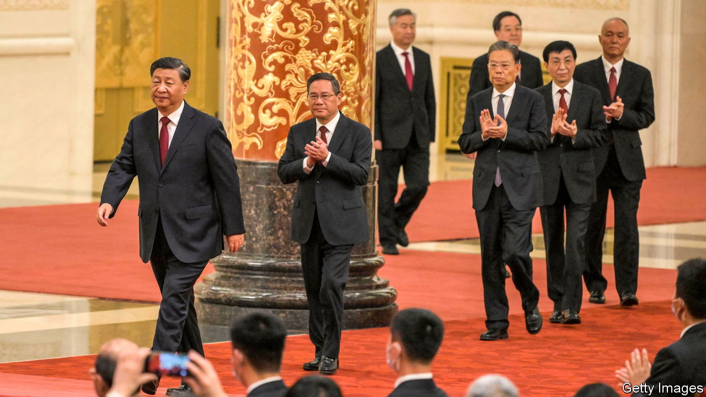
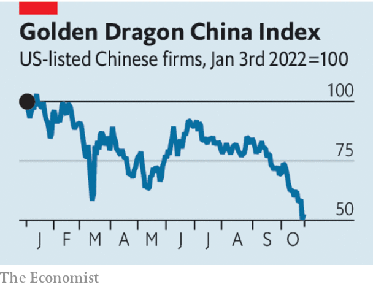

###### Meritocracy with Chinese characteristics

# For Xi Jinping, loyalty trumps ability 

##### China’s president has assembled a top team of yes-men 

 

> Oct 27th 2022 

The day after President Xi Jinping was granted a precedent-trampling third term as chief of the Communist Party on October 23rd, state media had nothing but praise for him. China was embarking on a “new journey”, said the papers, one “full of glory and dreams”. Alas, the journey has got off to a rough start. On October 24th global financial markets were full of worry and disappointment. Foreign investors  China’s shares and its currency.

Mr Xi’s re-coronation at the end of the party’s five-yearly congress came as no surprise. What shocked investors were the men surrounding him in the new leadership team (there were no women). He has  the Politburo and its powerful seven-member Standing Committee with apparatchiks whose primary qualification is not their expertise, but their loyalty. Before the congress there had been few checks on Mr Xi’s  economic instincts or his authoritarian urges. Now there are almost none. Investors are right to be worried.

 


Gone from the Standing Committee are officials who were not close to the president, such as Li Keqiang, the prime minister. Market-friendly reformers had once invested their hopes in Mr Li, but he was never much of a counterweight to Mr Xi. Nor was Wang Yang, once seen as a possible successor to Mr Li. He was removed, too. Then there is Hu Chunhua, a deputy prime minister and ally of Mr Li, who some thought might ascend to the committee and even be made prime minister if Mr Xi felt the need to foster unity. Apparently, Mr Xi did not. Mr Hu was not only left off the Standing Committee, he was booted from the Politburo. 

Of the men moving up to the Standing Committee, Li Qiang stands out. He had been the party’s leading man in Shanghai, China’s commercial hub. Earlier this year he oversaw a months-long lockdown in the city to stem an outbreak of covid-19. It did not go well. There were shortages of food and medicine. Parents were separated from their covid-positive children. Residents were outraged. International firms, angry at their operations being disrupted, reconsidered their investments in China. Mr Xi rewarded Mr Li, a close ally, by promoting him to the number-two spot on the Standing Committee; he is poised to become prime minister.

China’s defenders like to claim that it is a model of good governance, more responsive to the people’s wishes and more meritocratic than Western democracies. The elevation of Li Qiang suggests otherwise. The most important quality that leads to advancement seems to be obedience to Mr Xi—call it “meritocracy with Chinese characteristics”. In the face of criticism, Mr Li faithfully and ruthlessly implemented the president’s “zero-covid” policy. This impressed Mr Xi, who says “perseverance is victory” when it comes to the virus. What Shanghai residents thought of it counts for little. 

Surrounded by yes-men, Mr Xi will encounter little resistance to his agenda. This includes a larger role for the state in the economy, more “party-building” in private businesses and stronger links between China’s tech firms and its armed forces and security agencies. Fearing such links, America has tried to hobble Chinese giants such as  and launched a broader campaign to cripple China’s technology sector. Mr Xi has signalled that he will respond by giving the state an even greater say in directing innovation.

That is a risky bet for China. Mr Xi’s policies in his first two terms have dampened private-sector dynamism, cut China off from the world and locked it in a  with America. But no one will tell Mr Xi that he is wrong. ■


