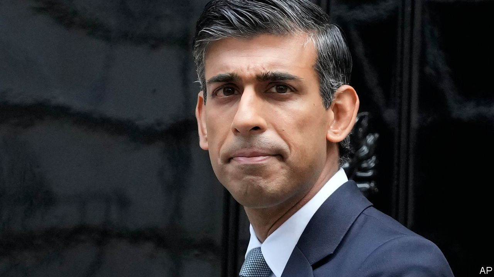

###### The shortest term

# Rishi Sunak’s promise of stability is a low bar for Britain 

##### Reasons to be cheerful are scant 

 

> Oct 26th 2022 

The  of Rishi Sunak as Britain’s latest prime minister is at least a source of relief. In contrast to Boris Johnson, whose serial dishonesty led to him being turfed out of office in the summer, Mr Sunak can offer personal decency and a grasp of detail. After the fiscal recklessness of Liz Truss, whose  ended on October 25th, the country is now led by a former chancellor with a liking for , who warned that her plans for unfunded tax cuts would lead to disaster. After three years of dishevelled bombast and a six-week spasm of revolutionary fervour, a period of wonkish orthodoxy beckons.

The markets like what they see: gilt yields fell when Mr Johnson decided he could not pull off a remarkable comeback and withdrew from contention. Mr Sunak has retained the reassuringly level-headed figure of Jeremy Hunt as chancellor. It is good that Tory MPs managed to make their  rather than again handing the decision to the party membership. As well as relief, there is justified pride at the country’s first British-Asian leader. 

But the sense of respite is overdone. Mr Sunak has good qualities but many flaws. The Conservatives know they need to unite but remain fractious. The relief is also damning. Competence ought to be a given, not an ambition. Even if his government provides stability, that is nowhere near enough. Productivity growth has disappointed for years; Britain is the only G7 economy still below pre-pandemic levels of output. Impoverished expectations lead to a more impoverished country.

Mr Sunak is regarded by those who have worked with him as a good administrator. His prescriptions for growth are broadly sensible: investment incentives, higher public spending on R&amp;D and a proper skills agenda. But he is still inexperienced. He would not have become prime minister within seven years of becoming an MP if tests of ideological purity had not cleared much of the field for Brexiteers like him. The taboo that stops the Tories from thinking rationally about how to take advantage of Brexit is unlikely to end under him; it is ominous that a deeply thoughtless bill to get rid of all EU legislation by the end of 2023 continued to make its way through Parliament this week. 

During the summer leadership campaign against Ms Truss he conspicuously dodged the hard choices around planning and housebuilding that are required to unlock growth. He was quickly bounced into making promises of his own to cut taxes. He has a tin ear: a row over the tax status of his wife, an heiress who saved herself millions while Mr Sunak was running the country’s accounts, seemed to take him by surprise. He also has a . 

As for the party he leads, talk of Tory unity is wildly premature. MPs did coalesce around Mr Sunak, but picking him over Mr Johnson and Penny Mordaunt is hardly the stuff of Solomon. The fissures in the party run deep and in many directions. The new prime minister is still regarded with suspicion by some for his role in bringing down Mr Johnson. Members of the Eurosceptic right are drawing lines in the sand over Northern Ireland’s trading arrangements with the European Union. The reappointment of Suella Braverman, a hardline Brexiteer, as home secretary, less than a week after she was forced to resign for breaching the ministerial code, is a clear victory for expediency over ability. Big tents are also for circuses. 

And this is before the real pain bites. On November 17th Mr Hunt is due to lay out a medium-term plan that will combine tax rises and spending cuts. Although Ms Truss’s tax cuts have been systematically undone and the fall in gilt yields has helped bring down the government’s debt-interest costs, a fiscal hole of £30bn-40bn ($34bn-46bn, or 1.4-1.8% of gdp) remains to be filled. Whatever Mr Sunak does, the coming months will be a grim saga of high inflation and rising interest rates, falling living standards and uncertainty over energy bills, widespread industrial action and creaking public services. His personal wealth, his Davos-man aura and the manner of his arrival in office are obvious lightning-rods for voter discontent. If Tory MPs become convinced that they are doomed to heavy defeat in the next election, the incentives to toe the party line will weaken again. 

Another bout of Tory infighting would make the case for an early general election unarguable. If the malcontents stay quiet, the Sunak government may usher in a period of calm. A credible fiscal plan would mean lower interest rates than would otherwise have been the case. Thoughtful policies on skills and investment, two of the big platforms for economic growth, could make a real difference. In the mid-1990s John Major and Ken Clarke acted as responsible stewards of the economy after a disastrous brush with the financial markets, and even though heavy defeat beckoned for the Conservatives at the next election. If it is Mr Sunak’s fate to emulate them, that would now be counted by many as a job well done. 

This is a tragedy in itself. Expectations have been so reduced that not imploding is seen as the mark of a grown-up. Ms Truss is a contender for the title of Britain’s worst prime minister. On a damage-done-per-day basis, she has no peers. Incredibly, she still seems unaware of how badly things went. She wanted to arrest declinist talk; under her, Britain became an object of ridicule. Yet she is not responsible for all that ails the country. The dysfunction in government, the years of slow growth, the inability to talk honestly about the costs of Brexit and the failings of the National Health Service—these problems all have deep roots. 

Heaven can wait

Mr Sunak inherits an economy whose indicators are all flashing red. Instead of a jolt to growth from lower taxes, the tax burden is rising and the public services are set to deteriorate further. With memories of cartoon radicalism still fresh (cut taxes, stand back, self-immolate), all forms of unorthodoxy have become less palatable. But Britain needs more than stability. To break out of its low-growth rut, it also needs change: a bolder approach to building, a reimagined relationship with the EU and meaningful devolution of power to local authorities. Mr Sunak may be able to restore calm. Further sclerosis is likely to be the price. ■


